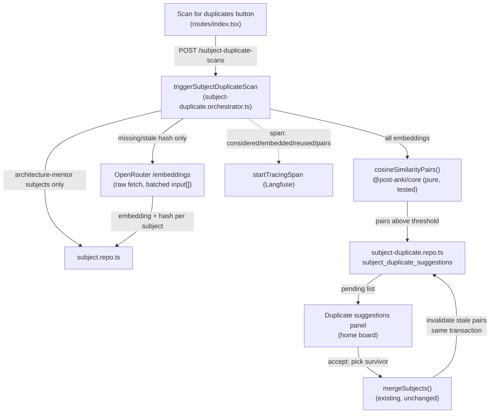

# Architecture: AI-assisted duplicate detection

## What changes structurally

A new `subject-duplicate` module in `apps/api/src/subject-duplicate/` owns the scan: an orchestrator that (1) reads every `architecture-mentor` subject, (2) selects a **capped** subset of those whose cached `embedding`/`embeddingHash` is missing or stale to (re-)embed this run — the cap bounds only the paid embedding call, never the comparison step (see "Cap exceeded" below, corrected after red-team review found the original wording implied the cap also shrank the comparison set), (3) calls OpenRouter's embeddings endpoint directly via `fetch` for that capped subset (not through a Mastra `Agent` — there's no chat/generation step, just a vector), (4) persists each fresh embedding+hash back onto its subject row, then (5) hands **every** `architecture-mentor` subject that now has *any* cached embedding (both freshly embedded this run and previously cached, reused subjects — comparison is free, so it is never capped) to a pure `@post-anki/core` function that computes all pairwise cosine similarities and returns the pairs above threshold. Suggestions above threshold are persisted (skipping any pair with an existing `pending` or `rejected` row) and returned.

This is the first embedding call in the codebase — everywhere else an "AI call" means a Mastra `Agent.generate()` (chat completion). The orchestrator therefore does its own bounded retry (`p-retry`, max 2 attempts), its own request timeout (`AbortController`, 45s — matching `tech-research-grounding.ts`'s `TIMEOUT_MS` precedent, the codebase's only other raw-fetch-to-OpenRouter call), its own manual `OPENROUTER_BASE_URL` override (`tech-research-grounding.ts`'s `endpointUrl()` pattern — a raw `fetch()` bypasses Mastra's `resolveAgentModel`, which is what normally applies this override for e2e mocking), and its own tracing span (`startTracingSpan`, since it bypasses Mastra's agent-level tracing), rather than inheriting any of these from the agent framework.

The accept path reuses the existing `mergeSubjects`, extended with one optional parameter (see "Failure modes" below for why), and additionally invalidates every other pending duplicate-suggestion row referencing either merged subject id, inside the same transaction — the same pattern `domain-map.repo.ts:280` already applies for stale priority suggestions on a domain-node merge. `deleteSubject()` (the plain, non-merge delete path) gets the identical stale-invalidation treatment — a red-team finding: the original plan only wired this into `mergeSubjects`, leaving a subject deleted via the ordinary "Delete subject" button (unrelated to this feature) as a dangling reference in any pending suggestion row.

**Corrected diagram note**: the `Embed` step in the flow above only ever receives the capped `toEmbed` subset from `selectSubjectsForScan`; the `Cosine` step receives the full `architecture-mentor` set that has *any* embedding (cached + freshly embedded this run).

## New infrastructure

None. `EMBEDDING_MODEL` is added to `apps/api/src/shared/env.ts` with a default (`openai/text-embedding-3-small`, same optional-override shape as `CURRICULUM_MODEL`), and the embedding call reuses the existing `OPENROUTER_API_KEY` secret and `OPENROUTER_BASE_URL` override. No new Pulumi resource, no new secret, no new deploy step.

**Assumptions flagged, not yet verified — all must be confirmed by the implementation's first real call before the rest of the orchestrator is built on top of them** (expanded after red-team review; the original plan only flagged API-key access):
1. Whether the existing OpenRouter API key has embeddings access at all.
2. Whether OpenRouter's `/embeddings` endpoint, for `openai/text-embedding-3-small` specifically, accepts a batched `input: string[]` and returns results in strict positional order matching the input — this is load-bearing for the entire subject-id-to-vector mapping (the orchestrator assumes response index N corresponds to input index N) and was asserted in an earlier draft of this document without a citation; OpenRouter's docs confirm the endpoint exists and is OpenAI-schema-compatible but not that batch-array behavior is faithfully proxied for every model it fronts.
3. Whether OpenRouter enforces a max batch size or aggregate token limit on `/embeddings` that a 200-subject, up-to-2000-char-description batched request could hit — unverified against OpenRouter's actual proxy limits, which may differ from the underlying vendor's native API limits.

If any of these turn out false, `embeddings-client.ts` sends subjects one-at-a-time instead of one batch (still bounded by the same per-scan cap, just more HTTP calls) rather than the design silently mismapping vectors to the wrong subject.

## Data model evolution

`subjects` table gains three nullable, additive columns (no backfill migration needed — every existing row simply starts with no cached embedding, which the first scan fills in):
- `embedding` (`jsonb`) — the vector as a plain `number[]`, no pgvector extension. Cosine similarity over a few hundred subjects is cheap in application code; adding a Postgres vector extension for a first cut this small is scope creep.
- `embedding_hash` (`text`) — hash (e.g. SHA-256, first 16 hex chars) of the exact `name + "\n" + (description ?? "")` string that produced the embedding. A scan re-embeds a subject only when this hash no longer matches the subject's current name+description — this is the real cost bound (a repeated click with nothing changed costs zero embedding calls), not just a subject-count cap.
- `embedded_at` (`timestamptz`) — when the cached embedding was last written; surfaced in tracing/debugging, not used for cache invalidation logic (the hash is).

New table `subject_duplicate_suggestions`, sibling in shape to `domain_priority_suggestions`/`domain_topic_suggestions` (`source` discriminator, `status` pending/accepted/rejected + a fourth status this feature introduces — `stale`, for a pair invalidated by an unrelated merge/delete rather than resolved by a human):
- `id`, `subject_a_id`, `subject_b_id` — an unordered pair, but **stored in a canonical order** (the repo always writes the lexicographically-smaller subject id as `subject_a_id`) specifically so a plain two-column index can enforce uniqueness regardless of which subject a caller happens to name first; text, no FK, matches this schema's existing convention — `similarity` (real, the raw cosine score), `reason` (text — a short generated string like "similarity 0.93 between name+description embeddings"), `source` (default `embedding-similarity`), `status` (default `pending`), `created_at`, `resolved_at`.
- **DB-level partial unique index, not just an app-level check-then-act guard** (red-team finding: the original draft relied only on a repo-level "query before insert" check, which this schema has an explicit precedent against — `curriculum_structure_turns_pending_assistant_unique` in `schema.ts:432-434` is annotated exactly because "a check-then-act read in application code can't close this race... the constraint itself is what makes a second concurrent [insert] fail atomically," and this feature has the same shape of race: a human double-clicking the scan button, or two browser tabs, both reading "no existing pending row for this pair" before either insert commits). Add `uniqueIndex("subject_duplicate_suggestions_pending_pair_unique").on(table.subjectAId, table.subjectBId).where(sql\`${table.status} = 'pending'\`)` — partial, same pattern as the precedent above. A second concurrent insert for the same pair fails at the DB; the repo catches that specific constraint violation and treats it as "already suggested, nothing to do" rather than surfacing an error.
- Insert-time app-level check (kept, now a *pre-check* for the common case, with the DB index as the actual race-closer): skip inserting if a row already exists for that pair with status `pending` OR `rejected` — a rejected pair is a standing human judgment and must not be re-surfaced by a later scan just because the embeddings still look similar; `accepted`/`stale` rows are excluded from this check entirely since they reference a deleted subject and structurally cannot recur as a scan candidate.

## Failure modes

- **Embedding API failure (network, quota, invalid model id, or a 45s timeout) after 2 bounded retries** → orchestrator throws, controller returns 502 with a clear message (mirrors `triggerDomainPriorityReview`'s deliberate no-silent-fallback choice). No embedding/hash is written for any subject whose call failed — a retried scan later still tries them, never silently treats them as "already embedded, nothing to compare."
- **Partial batch failure** — the embeddings call is one HTTP request with the capped `toEmbed` subjects' text in `input: string[]`; if OpenRouter's positional-ordering assumption (flagged above, unverified) turns out false, the fallback is one-request-per-subject instead of a single batch — either way, a request-level failure fails only the subjects in that request, not previously-cached subjects, and nothing is persisted until each response parses successfully (no partial/corrupt write).
- **A merge (via this feature's accept, or the pre-existing manual "Merge into…" control) or a plain subject delete (the pre-existing "Delete subject" control) removes a subject referenced by other pending suggestion rows** → those rows are resolved to `stale` in the same transaction as the merge/delete, never left dangling. `stale` is distinguished from `rejected` so a future analytics/debug pass can tell "a human said no" from "the pair became moot." Red-team finding: the original draft only wired this into `mergeSubjects`; `deleteSubject()` needed the identical treatment or a plain delete would leave a suggestion row permanently pointing at a nonexistent subject, which the panel's frontend name-lookup couldn't resolve.
- **Accept must be atomic, not two sequential writes** — red-team finding: an earlier draft had `resolveSubjectDuplicateSuggestion` on accept call `mergeSubjects` (which, per the rule above, sets *every* pending row referencing the deleted source — including the very row being accepted — to `stale`), then issue a *separate* follow-up update setting that row to `accepted`. A crash or thrown error between those two writes would leave a suggestion the human explicitly accepted permanently marked `stale`, which contradicts `stale`'s whole purpose (distinguishing "moot" from "a human resolved this"). Fixed by giving `mergeSubjects` one new optional parameter, `resolvingSuggestionId?: string`: when present, the same transaction that performs the stale-invalidation sweep additionally sets that one specific row to `accepted` (overwriting the `stale` it would otherwise get), immediately after the sweep, still inside the transaction. Either both effects commit or neither does. The parameter defaults to `undefined`, so the pre-existing manual "Merge into…" control (which has no suggestion to resolve) is unaffected.
- **Resolving an already-resolved suggestion** (a duplicate/late-arriving accept or reject request after the first one already processed) → the resolve handler loads the current row first and returns a 409/`already_resolved`-style response if `status !== "pending"`, rather than flipping a resolved row's status backward. Red-team finding: neither this draft nor its precedent (`resolvePrioritySuggestion`) originally guarded this.
- **Scan invoked with zero or one `architecture-mentor` subject** → returns an empty result, no error (there's nothing to compare).
- **Cap bounds the embedding call only, never the comparison** — corrected after red-team review: an earlier draft capped the *entire comparison set*, which meant that once total subject count exceeded the cap, "never-yet-embedded first" ordering would permanently push older, already-embedded subjects out of every future scan's comparison window — a real duplicate pair among older subjects could go undetected indefinitely, with no error signal (the "capped: true" flag would just stay true forever while the pending-suggestion count silently plateaued). Corrected design: the cap limits which subjects get a *fresh* embedding call this run (capped, deterministic ordering, subjects never yet embedded first); the comparison step always runs over *every* `architecture-mentor` subject that has *any* cached embedding (free, no cap) — so coverage genuinely converges: each scan's capped embedding budget fills in more of the backlog, and once a subject has any embedding it is compared in every scan forever, regardless of cap. The response still reports whether the embedding step was capped ("embedded 200 of 340 subjects needing a refresh this run") so the UI is honest about ongoing backfill, but this is a cost signal, not a coverage gap.

## Rollout

No feature flag, no phased rollout — this is a personal single-user app behind an on-demand button; the migration is additive (new nullable columns + new table) and ships in one deploy. `EMBEDDING_MODEL` gets its default in `env.ts` so no manual env var setup is required before the first scan.
