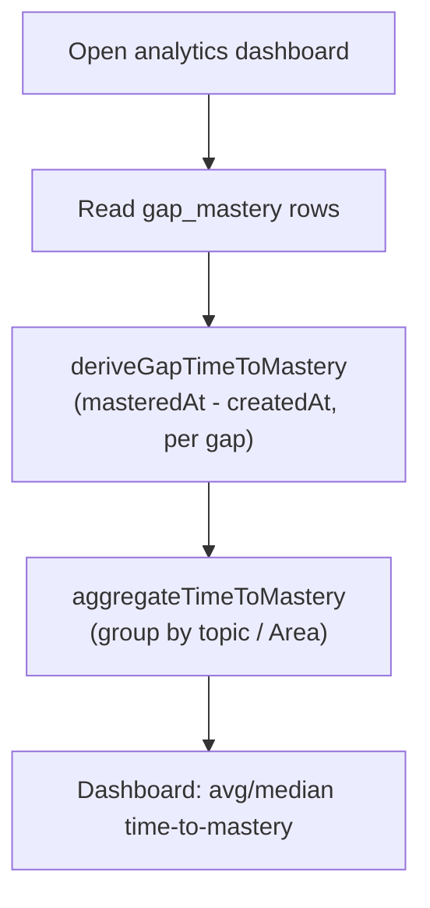

# Scenarios: analytics and reporting

## Business Scenarios

### SCENARIO 1: Time-to-mastery is computed per gap from existing mastery-tracking rows

Ilya opens the analytics dashboard. For every `gap_mastery` row with a `masteredAt`, the dashboard
shows how long that gap took to master — `masteredAt − createdAt` — aggregated per topic and per
Area, with count/average/median.

What to verify:
- A gap not yet mastered (`masteredAt` null) is excluded from the aggregate, not counted as zero.
- Aggregation groups correctly even when a topic has zero mastered gaps (empty group, not an error).
- No new column or table is touched — `gap_mastery.createdAt`/`masteredAt` are read as-is.

### SCENARIO 2: Retention rate reflects answers AFTER a gap was first mastered

A gap mastered two weeks ago resurfaces in a later probe session. Whether that later answer was
correct feeds a per-gap and aggregate retention rate — answers before mastery don't count.

What to verify:
- Only `probe_session_questions` rows with `answeredAt > gap_mastery.masteredAt` for that `gapId`
  count toward retention.
- A gap with zero post-mastery answers reports `null` retention, not 0% or 100%.
- Retention aggregates the same way time-to-mastery does — per topic, per Area.

### SCENARIO 3: Time-to-mastery data source is the mastery table, not the language-practice attempts table

A first-time implementer reading "existing attempt history" in the task brief reaches for
`attempts`. It doesn't apply here — `attempts` (`subjectId`/`phraseId`/`userAnswer`/`score`) is the
phrase-bank/language-practice grading table, structurally unrelated to gaps or topics.

What to verify:
- No file in `packages/core/src/analytics/` or `apps/api/src/analytics/` imports from
  `packages/core/src/phrase-bank/` or reads the `attempts` table.
- This is documented as a Fact in `spec.md`'s Decisions, not left implicit.

### SCENARIO 4: Coverage report reuses the domain map's own subtree rollup, once per Area

The coverage report lists every `domain_nodes` row with `kind: "area"`, each showing the same
percent `domainNodeProgress` would already compute for that node on the domain map.

What to verify:
- `buildCoverageReport` calls `domainNodeProgress` unmodified, once per Area node — no second
  rollup implementation.
- An Area's coverage percent in this report exactly matches what the domain map page shows for the
  same node.
- `domainMasteryStatus` (gap/progress) is attached per Area using the same 0%-boundary rule
  everywhere else in the product.

### SCENARIO 5: Coverage v1 only covers Web Development's fixed Areas

Ilya opens the coverage report for a domain that hasn't gotten fixed Areas yet (e.g. a language-
practice subject). No Area rows exist for it, and the report shows nothing for that domain rather
than fabricating a placeholder grid.

What to verify:
- `buildCoverageReport`'s input is exactly `domain_nodes` rows with `kind: "area"` — every other
  domain's ordinary taxonomy nodes are excluded, matching `learning-paths`' identical v1 scope call.
- No error, no empty-state crash — a domain with zero Areas simply produces zero rows.

### SCENARIO 6: The weekly digest assembles four existing signals into one read, with no stored history

Opening the digest shows: trailing-7-day time-to-mastery, trailing-7-day retention, current
coverage percent per Area, the existing cross-cutting concern rollup, and the current streak — one
request, computed fresh, no "improved by X% since last week" claim anywhere.

What to verify:
- `buildWeeklyDigest` performs zero DB access itself — it is pure assembly of results already
  fetched by the service layer.
- `summarizeConcerns` and `getStreak` are called unmodified — no second concern or streak
  implementation.
- No comparison to a prior digest exists anywhere in the response shape.

### SCENARIO 7: The digest is never delivered — it is read only when the dashboard is opened

The digest exists solely behind `GET /analytics/digest`. It never appears in `/daily-push`, the
Telegram bot, or any other proactive channel.

What to verify:
- `apps/api/src/push/` carries no reference to `apps/api/src/analytics/` anywhere.
- Opening the dashboard is the only way the digest is ever computed — no scheduled job pre-computes
  or caches it.

### SCENARIO 8: Web — the coverage heat map is the one new visual surface

Ilya sees a grid: rows are Web Development's three sub-subjects, columns are their ten Areas plus
"Other", each cell colored by mastery percent (gap/progress status, then percent band).

What to verify:
- The heat map renders directly from `GET /analytics/coverage`'s Area rows — no client-side rollup
  recomputation.
- An Area with zero mapped curricula (percent 0, `domainMasteryStatus: "gap"`) renders distinctly
  from an Area with partial progress — never visually identical to "fully mastered."

## Technical/Architectural Scenarios

### SCENARIO 9: Every deriver is a pure function over already-fetched rows

None of `deriveGapTimeToMastery`, `deriveRetentionRate`, `aggregateTimeToMastery`,
`buildCoverageReport`, or `buildWeeklyDigest` performs its own DB read — each takes plain data and
returns plain data, matching every other `packages/core` deriver in this codebase.

What to verify:
- Zero imports from `apps/api/src/db/` anywhere under `packages/core/src/analytics/`.
- Every deriver has a fixture-based unit test with no DB, no HTTP, no LLM call.

### SCENARIO 10: Retention silently under-counts for non-probe-session answer paths — flagged, not hidden

A gap mastered via the single-gap probe endpoint and later re-tested only through Socratic sessions
never accumulates a `probe_session_questions` row, so `deriveRetentionRate` reports `null` for it
even though the learner genuinely re-engaged with the material.

What to verify:
- This is stated as a flagged assumption in `spec.md`'s Decisions, not silently absorbed into an
  aggregate percentage (a `null`-heavy aggregate reads honestly as "limited data," never as "0%
  retention").
- No attempt is made in this module to backfill or infer a per-answer event for those paths — that
  would be new schema, out of scope here.
