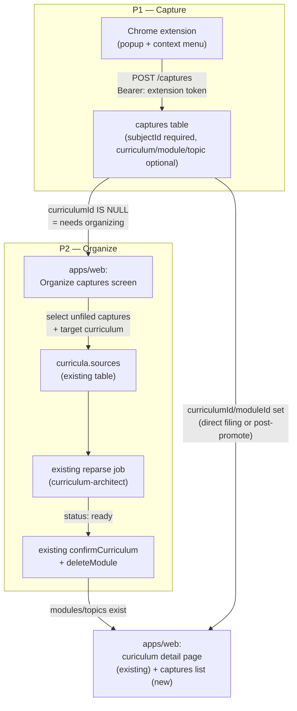
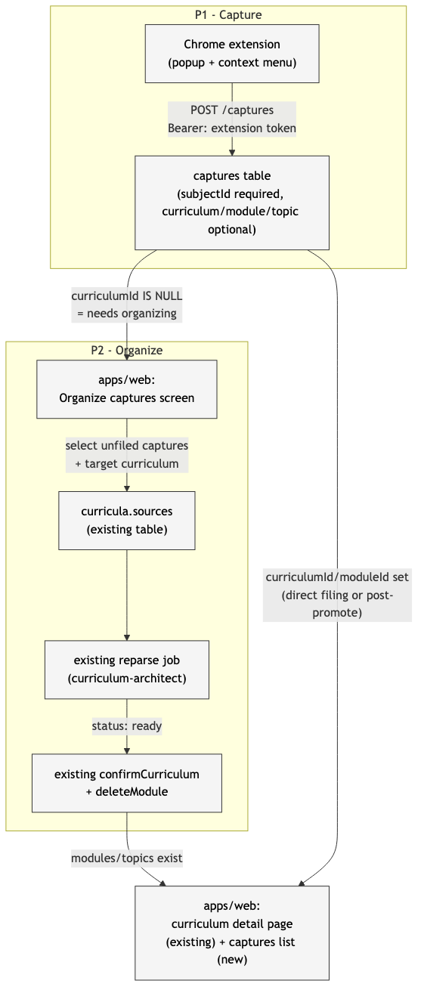

# Architecture: Chrome extension note capture

## What changes structurally

A new client (the Chrome extension) gets a narrow, scoped way to write into
`apps/api` directly — the first client other than the `apps/web` BFF to talk to
the API from outside the server-to-server boundary. This requires two new
boundary mechanisms that don't exist today: per-install token auth, and CORS.

Everything downstream of that boundary reuses existing infrastructure as much
as possible — the AI curriculum-generation pipeline (`sources` → reparse →
`confirmCurriculum`) is untouched and reused rather than duplicated.

## Why `captures` and `sources` both exist

They serve different moments in the lifecycle and must not be merged:

- **`captures`** is a subject-level inbox. It can exist before any curriculum
  does — a note tagged only "Webdev" with no curriculum yet is a valid,
  common state. `sources` cannot represent this: every `sources` row requires
  a non-null `curriculumId`.
- **`sources`** is curriculum-scoped raw material for the AI pipeline. A
  `captures` row becomes a `sources` row only at the moment of promotion
  (P2/SCENARIO 10) — that's a deliberate, one-way conversion, not a
  duplication. Once promoted, the `captures` row keeps its own identity
  (`promotedAt` set) as a record of "this URL/note is what fed that
  curriculum," which `sources` alone doesn't preserve as a personal capture
  history.

## New infrastructure

**Auth — per-install extension token, additive to the existing shared secret.**
`apps/api/src/shared/env.ts` / `server.ts`'s `authorized()` function gains a
second check: alongside the existing `Authorization: Bearer <API_SHARED_SECRET>`
path (used by `apps/web`'s BFF and `apps/bot` — full route access, unchanged),
a token that hashes to a non-revoked row in a new `extension_tokens` table is
accepted, but only for an explicit route allowlist:

- `listSubjects`, `createSubject`
- `listCurricula`, `getCurriculum`, `createCurriculum` (lightweight branch only
  — see below)
- `createModule` (existing, already AI-free)
- new: `listCaptures`, `createCapture`, `updateCapture`, `deleteCapture`

Every other route (`deleteSubject`, `deleteCurriculum`, `deleteModule`,
`updateTopic`, `deleteTopic`, all probe/socratic/gap/daily-push routes) is
rejected for an extension token even if valid — 403, not a silent no-op.

**CORS — new, scoped to the extension's origin only.** `apps/api` currently
sends no `Access-Control-*` headers at all. Add a single allowed origin,
`chrome-extension://<EXTENSION_ID>`, where `EXTENSION_ID` is a new env var set
once the extension is packed and its ID is known. No wildcard
`chrome-extension://*` — that would let any installed extension probe the API
using a stolen token from local storage on someone else's machine.

**Curriculum creation gets an explicit lightweight branch, not a new route.**
`createCurriculum`'s controller currently always sets `status: "curating"` and
kicks the orchestrator (`curriculum-parse.orchestrator.ts`). It gains an
explicit branch: when `sources` is empty/omitted, skip the orchestrator
entirely and set `status: "ready"` directly (no AI ever runs on an
empty-sources curriculum). This is a deliberate code path, not reliance on the
orchestrator happening to tolerate zero sources.

## Data model evolution

**New table `captures`:**
| column | type | notes |
|---|---|---|
| id | uuid | |
| subjectId | uuid, NOT NULL, FK→subjects | only hard requirement |
| curriculumId | uuid, NULL, FK→curricula | set at capture time (direct filing) or at promote time (P2) |
| moduleId | uuid, NULL, FK→modules | set at capture time only (direct filing or escape-hatch module creation) |
| topicId | uuid, NULL, FK→topics | set at capture time only, optional |
| text | text, NULL | at least one of text/sourceUrl required (deriver-enforced) |
| sourceUrl | text, NULL | |
| pageTitle | text, NULL | |
| capturedAt | timestamp, NOT NULL | when the browser captured it |
| promotedAt | timestamp, NULL | set only by the P2 promote action |
| createdAt | timestamp, NOT NULL | row insert time |

**Delete cascade behavior** (grill-me catch): `subjectId` is `ON DELETE CASCADE`
— deleting a whole subject is a deliberate, rare act and its captures go with
it. `curriculumId`/`moduleId`/`topicId` are `ON DELETE SET NULL` — deleting a
curriculum/module/topic (already cascades to its own modules/topics/gaps
today) must not silently destroy a personally-saved note/link; it falls back
to unfiled (visible again in the P2 organize screen) instead.

**New table `extension_tokens`:**
| column | type | notes |
|---|---|---|
| id | uuid | |
| label | text, NOT NULL | user-chosen name, e.g. "MacBook Chrome" |
| tokenHash | text, NOT NULL | sha256 of the token; plaintext shown once at creation, never stored |
| createdAt | timestamp, NOT NULL | |
| lastUsedAt | timestamp, NULL | updated on each successful auth |
| revokedAt | timestamp, NULL | revocation is soft-delete, not row removal (audit trail) |

Both are additive migrations — no existing table is altered.

## Failure modes

- **Extension token leaked/stolen**: revocable immediately via the admin
  screen (SCENARIO 9); route allowlist bounds the blast radius to
  create/read on captures and lightweight hierarchy nodes — no deletes, no
  access to probe/socratic/gap data.
- **CORS misconfigured (wrong extension ID)**: fails closed — browser blocks
  the request client-side, extension shows a clear "can't reach post-anki"
  error rather than a silent drop.
- **Reparse triggered on a curriculum with captures mid-promotion and the API
  restarts (scale-to-zero cold start)**: unchanged from today's existing
  curriculum-parse orchestrator behavior — this task does not change that
  job's reliability characteristics, only what feeds it.

## Rollout

1. Migration: `captures`, `extension_tokens` tables.
2. `apps/api`: extension-token auth path + route allowlist, CORS, lightweight
   curriculum-creation branch, captures CRUD routes.
3. `apps/web`: admin-settings "Extension Access" section (SCENARIO 9); captures
   read surface on curriculum detail page (SCENARIO 6); P2 organize screen
   (SCENARIO 10/11) ships after P1 is live.
4. Extension: build, load unpacked locally (personal use — not published to
   the Chrome Web Store), generate a token from the admin screen, paste into
   extension options.
5. Seed script (SCENARIO 12) run against production once its `DATABASE_URL` is
   available (tracked in `todo.md`).
