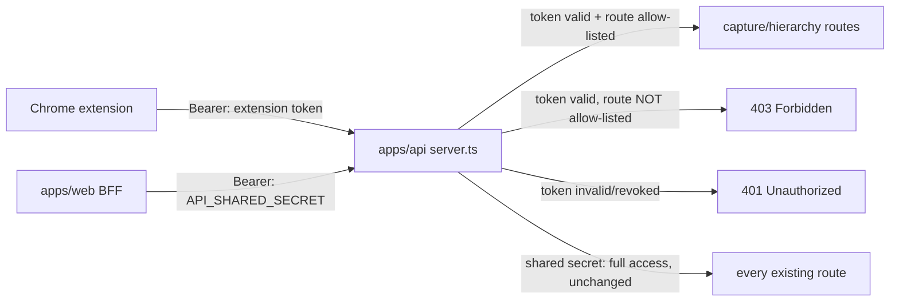
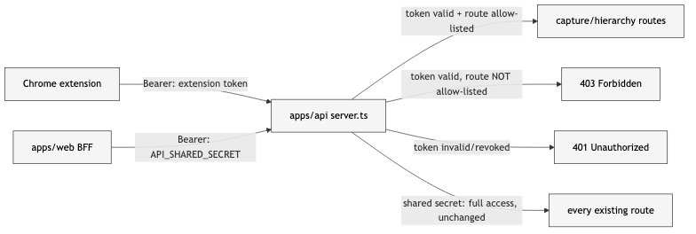

# Scenarios: Chrome extension note capture

## Phasing

**P1 — capture, file, auth, read surface, seed.** Ships a working extension:
capture a note/link, file it (existing or newly-created subject/curriculum/module,
optional topic), see what you filed, and initial content exists to file into.

**P2 — organize/promote.** Depends on P1 shipping first — needs real unfiled
captures to exist before the organize screen is useful.

## Business Scenarios

### SCENARIO 1: Capture a highlighted selection from any page (P1)

Highlighting text on any webpage and right-clicking offers "Save to post-anki";
picking it opens the extension popup pre-filled with the selection, page title,
and URL.

What to verify:
- Context menu item only appears when text is selected
- Popup opens with text/title/URL pre-filled and editable
- Works on arbitrary third-party pages (no page-specific integration needed)

### SCENARIO 2: Capture a link or freeform note via the popup (P1)

Clicking the toolbar icon with nothing selected opens an empty popup with the
current tab's URL and title auto-filled; the user can save the link as-is, add a
short note, or clear the URL and type a freeform thought with no link at all.

What to verify:
- Text field is optional if a URL is present, and vice versa — at least one of
  the two is required to save
- Attempting to save with both empty is blocked with an inline message, not a
  failed network request

### SCENARIO 3: File a capture under an existing hierarchy path (P1)

The popup's cascading pickers (Subject → Curriculum → Module → Topic) let the
user select an existing path for the note. Topic (the DB's leaf node) stays
optional throughout.

What to verify:
- Curriculum dropdown only loads after a subject is picked; module dropdown
  only loads after a curriculum is picked; topic dropdown only loads after a
  module is picked
- Saving with only Subject picked (nothing below it) succeeds
- Saving with the full path picked succeeds and the capture is attributed to
  exactly that subject/curriculum/module/topic

### SCENARIO 4: Create a new subject or curriculum inline while filing (P1)

At the Subject or Curriculum level, the picker offers "+ Create new…" — typing
a name and confirming creates it immediately (no page navigation) and the popup
carries on with that new node selected.

What to verify:
- A newly-created curriculum is created via the lightweight path: no `sources`,
  no AI trigger, lands directly in a non-`curating` status (see
  `architecture.md`)
- The new subject/curriculum is immediately usable for module/topic selection
  in the same capture (or in the next one)

### SCENARIO 5: Create a new module inline as an escape hatch (P1)

At the Module level, the picker also offers "+ Create new…" for cases where the
user already knows the structure and doesn't want to wait for the AI-promote
flow (SCENARIO 10). This reuses the existing manual `createModule` endpoint —
no AI involved, no `sources` row created.

What to verify:
- Manually-created modules behave identically to AI-generated ones for every
  other feature (visible in apps/web's existing curriculum detail page, can
  receive topics, etc.)
- A capture filed directly under a manually-created module shows up in
  SCENARIO 6's read surface — this path must not produce write-only data

### SCENARIO 6: See what you've filed, without leaving apps/web (P1)

The existing curriculum detail page in apps/web gains a "Captured notes & links"
list per module (and per topic, when set) showing every capture filed there —
text, link (clickable), and captured-at date.

What to verify:
- A capture filed via SCENARIO 3/4/5 appears here, not just in the extension's
  own storage
- Empty state reads clearly when a module has no captures yet
- This is a read surface only — no promote/edit actions here (that's P2)

### SCENARIO 7: Same-site hierarchy memory (P1)

Capturing a second note from the same site (same origin as a prior capture)
pre-selects the hierarchy path used last time for that site, while still
allowing every level to be changed or a new node created.

What to verify:
- Pre-fill is keyed by page origin (hostname), stored in `chrome.storage.local`
  on the extension side — not server state
- Capturing from a different, never-seen origin opens with nothing pre-selected

### SCENARIO 8: Save feedback (P1)

Hitting Save shows a brief inline confirmation naming where the note landed,
then the popup auto-closes after ~1s.

What to verify:
- Network or auth failure keeps the popup open with the note text intact and a
  retry action — no silent data loss
- Success confirmation names the actual filed path (e.g. "Saved to Webdev / AI
  Dev / RAG & Vector Search")

### SCENARIO 9: Generate and manage an extension token (P1)

The admin-settings page (currently a placeholder toggle on this branch) gains
an "Extension Access" section: a button generates a new token, shown in
plaintext exactly once, plus a list of issued tokens (label, created date, last
used date) each with a Revoke action.

What to verify:
- The plaintext token is never retrievable again after the generation screen is
  dismissed — only a hash is stored server-side
- A revoked token is rejected on the very next request that uses it

### SCENARIO 10: Batch-promote unfiled captures into a curriculum (P2)

A new "Organize captures" screen in apps/web lists captures that have a subject
but no curriculum yet. Selecting a batch and choosing a target curriculum
(existing, or newly named) converts the selection into that curriculum's
`sources` rows and triggers the existing reparse pipeline.

What to verify:
- Only captures with `curriculumId IS NULL` and `promotedAt IS NULL` appear as
  "needs organizing"
- After promotion, `curriculumId` and `promotedAt` are set on the source
  captures — they disappear from the unfiled list and stop appearing here again
- The target curriculum enters the existing `curating` status and the existing
  AI curriculum-architect job runs unchanged

### SCENARIO 11: Review and finalize AI-proposed structure (P2)

Once SCENARIO 10's reparse completes (curriculum status `ready`), the user
reviews the AI-proposed modules/topics on the existing curriculum detail page
and either accepts the whole structure (existing `confirmCurriculum` action) or
prunes individual modules they don't want (existing `deleteModule` action)
before confirming.

What to verify:
- No new confirm/reject UI is required — mechanism is existing
  `confirmCurriculum` (whole-curriculum accept) composed with existing
  `deleteModule` (per-item reject)
- **Open question** (tracked in `todo.md`): does whole-confirm + per-module
  delete actually satisfy "AI suggests, I click a button to finalize or
  reject," or does the user expect true per-suggestion accept/reject before
  anything is written? Resolve in grill-me before this scenario's acceptance is
  final.

### SCENARIO 12: Seed the initial "Webdev" hierarchy (P1)

A one-off seed script creates the subject and curricula/modules listed in
`seed-data.md` (1 subject, 13 curricula, ~46 modules), using the same
lightweight curriculum-creation and manual module-creation paths as SCENARIOS 4
and 5 — proving those paths work before the extension UI does.

What to verify:
- Running the seed script twice does not create duplicates (idempotent on
  subject+curriculum+module name)
- Every seeded curriculum is immediately visible and pickable from the
  extension's Subject → Curriculum dropdown

## Technical/Architectural Scenarios

### SCENARIO 13: Extension token scoped auth (P1)

Requests bearing a valid extension token succeed only against an explicit
allowlist of routes (subject/curriculum/module/topic read + lightweight
create, capture CRUD); requests to any other route (delete, probe, socratic,
gaps, daily-push) are rejected even with a valid token.

What to verify:
- `API_SHARED_SECRET` auth path is unchanged — this is purely additive
- CORS allows only the specific `chrome-extension://<id>` origin (the
  installed extension's ID, set via env var) — not `chrome-extension://*`

### SCENARIO 14: Capture validation rejects empty content (P1)

A `POST /captures` with neither `text` nor `sourceUrl` set is rejected at the
API boundary (deriver-level validation), not silently stored as a blank row.

What to verify:
- Same rule enforced both client-side (popup disables Save) and server-side
  (API returns 4xx) — client-side alone is not sufficient since the token could
  be used outside the extension UI
