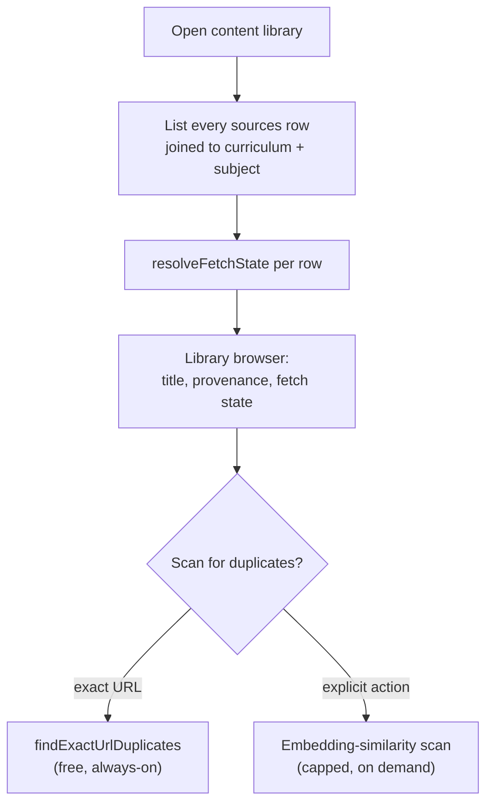

# Scenarios: content library

## Business Scenarios

### SCENARIO 1: Every source across every curriculum is listed in one place, with provenance

Ilya opens the content library. Every `sources` row from every curriculum appears — title/URL,
which curriculum and subject it belongs to, its kind (link/text/video), and its fetch state.

What to verify:
- The listing is a single joined query (curriculum name, subject name) — no per-row follow-up call.
- A source's provenance always resolves to a real curriculum; an orphaned `curriculumId` (should
  never happen, cascade-deleted with its curriculum) is excluded rather than crashing the listing.

### SCENARIO 2: Provenance never claims a source belongs to more than one curriculum

Two curricula each captured the same article independently — two separate `sources` rows, each
correctly attributed to its own curriculum. The library shows both, distinctly.

What to verify:
- Cross-curriculum listing never deduplicates rows by URL on its own — that's the duplicate-
  detection feature's job (Scenario 3), not the listing's.
- Each row's provenance is its own `curriculumId` — no shared/merged identity.

### SCENARIO 3: Exact-URL duplicates are detected for free, on every listing read

Two `sources` rows normalize to the same URL (differing only by trailing slash or a tracking query
param). Both appear flagged as an exact-URL duplicate pair, with no embedding call made.

What to verify:
- `normalizeSourceUrl` strips query string, fragment, and trailing slash before comparison.
- `findExactUrlDuplicates` runs on the listing read itself (or a cheap pre-scan) — no LLM/embedding
  cost incurred for this tier.
- Two sources with genuinely different URLs never match this tier, regardless of content similarity.

### SCENARIO 4: Near-duplicate content at different URLs is detected via a capped embedding scan

Ilya triggers "scan for duplicates." Two sources with different URLs but near-identical fetched
text (a syndicated/mirrored article) surface as an embedding-similarity duplicate suggestion.

What to verify:
- The scan reuses `findDuplicatePairs`/`selectSubjectsForScan`/`cosineSimilarity` from
  `@post-anki/core`'s `subject-duplicate` module unmodified — no second implementation of the same
  math.
- A source whose `embeddingHash` already matches its current `hashSourceContent` output is not
  re-embedded (`selectSubjectsForScan`'s reuse path).
- The embedding call itself is capped; the comparison step is not (same "cap bounds the paid call
  only" rule `subject-duplicate` already established).

### SCENARIO 5: Resolving a duplicate suggestion never merges or deletes anything

Ilya reviews a duplicate suggestion and marks it "acknowledged." Both source rows, and every topic
whose `sourceId` points at either of them, are completely untouched.

What to verify:
- `resolveSourceDuplicateSuggestion` only ever writes `source_duplicate_suggestions.status`/
  `resolvedAt` — no write anywhere else.
- No code path in this module calls `DELETE /sources/:id` or writes to `topics.sourceId`.
- A "dismissed" suggestion is kept, never deleted, matching the audit-trail convention every other
  suggestion table in this schema already follows.

### SCENARIO 6: Re-fetch goes through the existing guarded fetcher — never a bare `fetch`

Ilya re-fetches a source whose content may have changed. The re-fetch uses
`resolveSourceText`/`guarded-fetch.ts` — the same SSRF-allowlisted, size-capped, timeout-bounded
path every other fetch in this codebase already uses.

What to verify:
- `content-library.service.ts::refetchSource` calls `resolveSourceText` — no new `fetch()` call is
  introduced anywhere in this module.
- A private/link-local target URL is rejected by the same `isSafeSourceUrl` check `guarded-fetch.ts`
  already enforces — no second, weaker URL check.

### SCENARIO 7: A failed re-fetch preserves the previously-fetched body

A source with good `fetchedText` from months ago is re-fetched; the target now 404s. The re-fetch
records the failure, but `fetchedText` keeps its old, still-usable value.

What to verify:
- `lastFetchedAt` and `lastFetchOutcome` (`"http_error"`) are written on every re-fetch attempt,
  success or failure.
- `fetchedText` is overwritten only when `lastFetchOutcome` is `"ok"` — a `blocked`, `http_error`,
  or `network_error` outcome leaves the existing `fetchedText` exactly as it was.

### SCENARIO 8: Fetch state is a real, readable field — not inferred from a null check

A source that was fetched and failed is distinguishable in the library from one that was simply
never fetched at all.

What to verify:
- `resolveFetchState` returns `"never_fetched"` only when `lastFetchedAt` is null.
- A source with `lastFetchedAt` set and `lastFetchOutcome !== "ok"` returns `"stale_failed"`, never
  conflated with `"never_fetched"`.
- A source with `lastFetchOutcome: "ok"` returns `"fetched"`.

### SCENARIO 9: Fetch-state derivation is a pure function, unit-tested independent of the DB

`resolveFetchState` takes a plain `{fetchedText, lastFetchedAt, lastFetchOutcome}` object and
returns one of three states — no DB call, no side effect.

What to verify:
- The deriver lives in `packages/core/src/content-library/`, importable and testable with zero
  infrastructure.
- All three states are covered by fixture-based tests, including the "fetched successfully, then a
  later re-fetch failed" transition (state must read `"stale_failed"`, not `"fetched"`, once the
  most recent attempt failed).

### SCENARIO 10: Same URL in two curricula is real duplication signal, but not evidence of a mistake

The library correctly distinguishes "you captured the exact same URL twice" (informational — you
already have this) from "these are near-identical content at different URLs" (worth reviewing,
possibly redundant capture effort). Both are duplicate suggestions, but with a different `matchKind`.

What to verify:
- `source_duplicate_suggestions.matchKind` is `"url_match"` for Scenario 3's tier and
  `"embedding_similarity"` for Scenario 4's tier — never conflated in the UI or the data.
- A `"url_match"` row carries `similarity: null` (no embedding was computed for it); an
  `"embedding_similarity"` row always carries a real float.

## Technical/Architectural Scenarios

### SCENARIO 11: Web — the library browser and duplicate review are one screen, re-fetch is one action away

Ilya opens `/content-library`, sees the full cross-curriculum list with fetch-state badges, reviews
any pending duplicate suggestions inline, and can trigger a re-fetch per source without leaving the
page.

What to verify:
- `GET /sources` (listing), `GET /source-duplicate-suggestions` (pending review), and
  `POST /sources/:id/refetch` are all reachable from one route, `apps/web/src/routes/content-library.tsx`.
- No new route is added for duplicate review alone — it's a section of the same browser, not a
  separate page.
