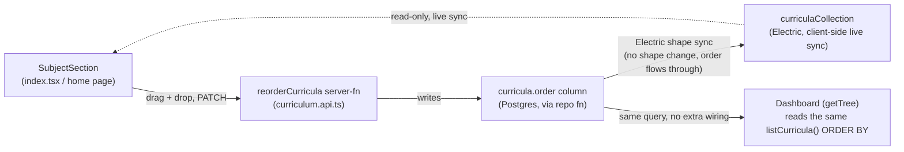

<!-- Consistency gate: PASS — promoted from draft to confirmed 2026-07-31. -->
# Architecture: Course-level priority reordering (drag-and-drop)

## What changes structurally

Today, "priority order" as a stored, reorderable concept exists only one level below
where this issue needs it — on `modules` and `topics` (rows nested inside a single
curriculum), each with `order`/`priority` integer columns and a full reorder path:
pure ordering helpers in `@post-anki/core`, a repo function
(`reorderModules`/`reorderTopics`) that rewrites `order` sequentially, a PATCH
endpoint, and an up/down-button UI (`shape-controls.tsx`'s `moveInOrder` +
`ReorderButtons`). Curricula themselves — the "course" level the issue is about — have
no order column and no reorder path at all; the home page and dashboard just render
whatever order the database happens to return them in.

This change adds the same shape of mechanism one level up: an `order` column on
`curricula`, a `reorderCurricula` repo function scoped to "courses within one
subject" (mirroring "modules within one curriculum"), a new PATCH endpoint, and —
where it structurally departs from the modules/topics precedent — a drag-and-drop UI
instead of up/down buttons, since this is the first interaction in `apps/web` that
needs a drag gesture rather than a discrete click.

The read side has a wrinkle the modules/topics precedent didn't need to deal with:
curricula on the home page (`apps/web/src/routes/index.tsx`) are read two ways —
once via a normal SSR loader call (`getBoard()` → `api.listCurricula()`) and, once the
client mounts, via a live Electric-sync collection (`curriculaCollection` in
`board.collection.ts`) that keeps the page updated in real time without a manual
refresh. Both paths need to agree on order: the SSR/loader path gets it from an
`ORDER BY` clause added to `listCurricula()`'s query; the live-sync path gets it from
a client-side sort by the `order` field, since Electric's shape sync does not
guarantee row order on the wire. The Dashboard page (`/dashboard`, `getTree()`) shares
the same backend `listCurricula()` call, so fixing the query's `ORDER BY` fixes both
surfaces the issue asks to keep in sync — no separate dashboard-side change needed.



## New infrastructure

**Frontend dependency:** `@dnd-kit/core` + `@dnd-kit/sortable` (+ `@dnd-kit/utilities`
for the CSS transform helper `useSortable` needs). Verified 2026-07-31 via web search:
actively maintained, releases into April 2026, ~2.8M weekly npm downloads, the
de-facto standard hooks-based drag-and-drop library for React (the dnd-kit
*documentation* repo was archived Feb 2026; the library packages themselves were not).
This is the first drag-and-drop library anywhere in `apps/web` — no prior art to
conform to beyond dnd-kit's own conventions.

No new backend infrastructure, no new services, no new deploy surface.

## Data model evolution

`curricula` gains one column: `order: integer("order").notNull().default(0)`,
matching the exact shape already used on `modules.order`/`topics.order`
(`apps/api/src/db/schema.ts`). Generated via `drizzle-kit generate` (never hand-pushed
— per this repo's migration rule) into a new file under
`apps/api/src/db/migrations/`.

Because `order` is `NOT NULL` with a flat default, every pre-existing row would land
at `0` immediately after the `ALTER TABLE`. Scenario 6 requires better than that, so
the generated migration is followed (same file, appended SQL — the same pattern
already used for hand-written backfills in this migrations folder) by one `UPDATE`
that assigns a distinct sequential value per subject, ordered by `created_at`:

```sql
UPDATE curricula c
SET "order" = sub.rn
FROM (
  SELECT id, ROW_NUMBER() OVER (PARTITION BY subject_id ORDER BY created_at) AS rn
  FROM curricula
) sub
WHERE c.id = sub.id;
```

No other column changes. No new tables. Run via this repo's existing
`npm run db:migrate -w @post-anki/api` (never applied by any other path — see
`apps/api/scripts/migrate.ts`'s local-vs-remote guard).

## Failure modes

- **Reorder request naming a course from another subject** (Scenario 5) — rejected
  as a full-request validation failure (400), not a partial write. This is a
  deliberate hardening beyond the `reorderModules` precedent, which doesn't validate
  that each id belongs to the curriculum it claims to — cheap to add here and closes
  a data-integrity gap the module-level version has quietly carried.
- **Drag started, then dropped back in the same position** — `arrayMove`-equivalent
  logic returns the same array; no PATCH is sent (avoid a no-op network round trip).
- **Network failure on drop** — the PATCH fails, `router.invalidate()` re-reads the
  server's actual (unchanged) order, so the UI snaps back to the last persisted state
  rather than silently drifting from what's actually stored — consistent with how
  every other mutation in `subject-section.tsx` already recovers (delete, merge,
  status change all re-invalidate after the call rather than trusting local state).
- **Electric sync lag** — between drop and the live collection catching up, the
  dragged item's on-screen position is whatever dnd-kit already rendered mid-drag
  (inherently immediate/local); once the live sync catches up it reconciles to the
  server's value, which will already match since the PATCH already landed by then in
  the common case.

## Rollout

Additive-only migration (new column, backfilled, `NOT NULL` with a default) — no
existing read path breaks if deployed before the frontend ships; no existing write
path needs the column, so nothing regresses if the frontend ships first either. No
feature flag needed — this mirrors how `modules.priority`/`topics.priority` shipped
(a plain additive migration, no flag, per `apps/api/src/db/migrations/0009_steep_wiccan.sql`).
