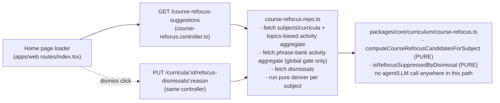

# Architecture: Cross-course refocus suggestion

## What changes structurally

A new read path spans every subject's courses at once — the first place in
this codebase that reasons about priority *across* subjects rather than
within one domain map or one subject's course list. It sits next to, not
inside, `domain_priority_suggestions`: same shape of idea (a dismissible
suggestion surfaced to the learner), deliberately different mechanism.



The only persisted state this feature owns is a dismissal record
(`course_refocus_dismissals` — one row per curriculum+reason, holding only
`dismissedAt`). The suggestion's *content* is never stored: it is recomputed
from `curricula.order`, `curricula.createdAt`, `curricula.learningStatus`,
and `MAX(topics.progressLastInteractedAt)` on every read. This is the core
structural departure from `domain_priority_suggestions` (see Decisions in
`spec.md` for the full reasoning) — that table stores AI-generated content
because regenerating it costs an LLM call; here regenerating costs one cheap
aggregate query, so storing stale content would be strictly worse than
recomputing it.

**The dismiss endpoint is modeled as a sub-resource, not a verb-suffixed
action** — `PUT /curricula/:curriculumId/refocus-dismissals/:reason`, not
`PATCH /course-refocus-suggestions/dismiss`. No suggestion is ever persisted
with its own id to PATCH against, but that doesn't license an RPC-style verb
in the path — this repo's own nearest precedent
(`PATCH /domain-priority-suggestions/:id`, no verb) and this project's REST
convention both point at a resource, not an action. A dismissal is itself a
resource (nested under the curriculum it applies to, keyed by `reason`), and
`PUT` is idempotent by nature — a repeat call is a no-op that reads
correctly, matching the "dismiss twice, one row" semantics this feature
needs.

**The "learner is still active anywhere" signal unions two independent
activity models, not one.** `topics.progressLastInteractedAt` only covers
`architecture-mentor` study. `language-practice` subjects never have
`curricula`/`topics` rows at all (verified:
`subject-section.tsx`'s `kind === 'architecture-mentor'` gate) — their
activity lives entirely in `phraseBankEntries.lastCorrectDate`/`updatedAt`,
keyed by `subjectId`. A learner who spent the last two days exclusively
drilling phrases must still read as "active" for every other subject's
stale-course gate — the global signal is
`MAX(topics.progressLastInteractedAt, phraseBankEntries.lastCorrectDate,
phraseBankEntries.updatedAt)` across the whole app, not topics alone.

## New infrastructure

None — no new service, no queue, no cron. Computed synchronously on the
existing home-page request path.

## Data model evolution

One new table:

```
course_refocus_dismissals
  id              text primary key
  curriculum_id   text not null
  reason          text not null   -- "stale_top_priority" | "new_high_priority_ignored"
  dismissed_at    timestamptz not null default now()

  unique (curriculum_id, reason)
```

No `.references()` FK, matching this schema's dominant convention (plain text
columns + app-level validation, same as `domain_priority_suggestions`,
`domain_nodes`, etc.). Its unique index is the first *compound* target for
`onConflictDoUpdate` in this codebase (existing upserts —
`streak.repo.ts:44`, `lecture.repo.ts:68`, `domain-map.repo.ts:750` — all
target a single column); the write follows the same
`.insert(...).onConflictDoUpdate({ target: [...], set: {...} })` idiom, just
with a two-column `target` array.

No change to `curricula`, `topics`, or `phrase_bank_entries` themselves —
every input signal this feature reads (`curricula.order`,
`curricula.createdAt`, `curricula.learningStatus`,
`topics.progressLastInteractedAt`, `phraseBankEntries.lastCorrectDate`,
`phraseBankEntries.updatedAt`) already exists as a column. One new index is
added, however: a composite index on
`topics(curriculum_id, progress_last_interacted_at)` — verified no such
index exists today (`schema.ts`'s only index near `topics` is unrelated).
Without it, the per-curriculum `MAX(progress_last_interacted_at)` aggregate
this feature runs on every home-page load would degrade from "cheap" to a
full-table scan as `topics` grows — added in the same migration as the new
table, not deferred.

## Failure modes

- **Suggestion fetch fails (network/DB error):** the home page renders with
  no banner — this endpoint is an enhancement layer over the existing board
  view, never a blocking dependency of it. Mirrors this repo's existing
  `PriorityReviewPanel`/doc-scan "silent fallback" posture for a failed
  background-ish read, not its foreground-trigger error posture (which
  surfaces errors loudly because the user explicitly asked for that specific
  action).
- **Dismiss write fails:** the banner's dismiss button shows a brief inline
  error and stays visible (not silently swallowed) — this is a user-initiated
  write, closer to the reorder-drag error posture (`MergeCurriculumButton`
  pattern) than the silent-fallback read posture above.
- **Concurrent dismiss of the same (curriculum, reason) pair:** the unique
  constraint plus `onConflictDoUpdate` makes a double-click or duplicate
  request converge on one row with the latest `dismissedAt` — no race that
  could produce two competing dismissal states.

## Rollout

Additive only: new table, new endpoints, new pure functions, one new banner
component. No existing table, endpoint, or component changes shape. Safe to
deploy independent of any data backfill — a fresh `course_refocus_dismissals`
table starts empty, which is the correct starting state (nothing has been
dismissed yet).
