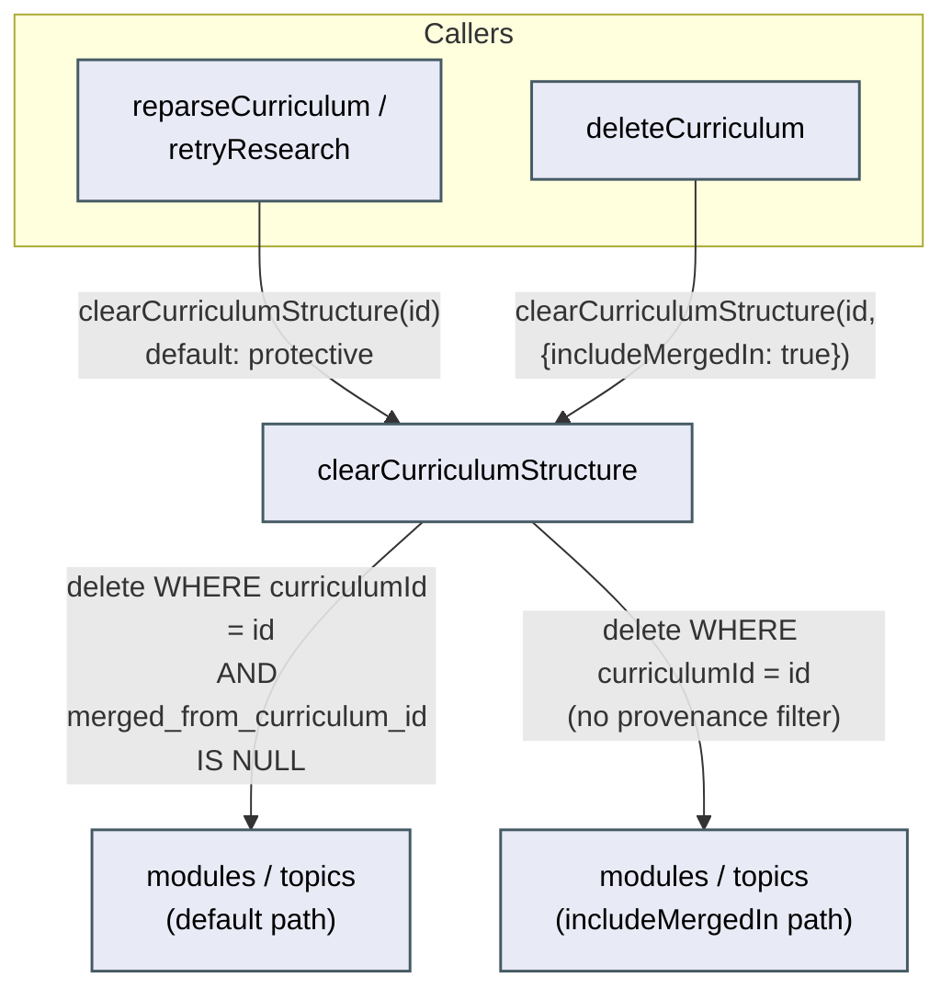

# Architecture: Make clearCurriculumStructure provenance-aware

## What changes structurally

`modules` and `topics` gain a nullable `merged_from_curriculum_id` column — a row-level,
always-resolvable provenance marker, keyed by the row's own id, distinct in purpose from issue
#62's `ontology_merges` table (an operation-level append-only log keyed by target/source
curriculum ids, whose own architecture doc already rules itself out as a foundation for this
fix — see `docs/architecture/ontology-audit-trail/architecture.md`'s "Relationship to the
provenance-aware fix" section). No table is shared; the two features share only a call site
(`mergeCurricula`'s reassignment step gets two independent one-line additions: the existing log
insert, and now the provenance column write).

`mergeCurricula`'s reassignment step (`curriculum.repo.ts`, the `movedModules`/`movedTopics`
update statements) sets `merged_from_curriculum_id` on every module/topic row it reassigns from
source to target — set to the source curriculum's id, but only if the row doesn't already carry
a marker (`coalesce(existing, sourceId)`), so a row that has already crossed one merge boundary
stays correctly flagged as non-native through any later merge, instead of the marker being
overwritten to whichever curriculum most recently touched it.

`clearCurriculumStructure` (`curriculum.repo.ts`) changes its contract: it now takes an optional
`{ includeMergedIn?: boolean }` parameter, defaulting to `false`. With the default, it deletes
only modules/topics (and their gaps/gap-mastery rows) whose `merged_from_curriculum_id` is
`null` — rows that trace back to the curriculum's own research/parse history. The two existing
callers that mean "clear and regenerate this curriculum's own structure"
(`reparseCurriculum`, `retryResearch` in `curriculum-parse.orchestrator.ts`) need zero code
changes — they inherit the safe default automatically. `deleteCurriculum` — the one caller that
means "this curriculum and everything under it is gone" — explicitly passes
`{ includeMergedIn: true }`, since a fully deleted curriculum must not leave orphaned
modules/topics behind pointing at a now-nonexistent id.

The choice to make protection the *default* (rather than an explicit opt-in flag each caller
must remember to pass) is deliberate: it is the same class of mistake the original bug was — a
shared destructive function whose safety depended on every caller remembering a precondition
nobody enforced. Defaulting to protective means a hypothetical third future caller of
`clearCurriculumStructure` is safe by construction, not by convention.

A related-but-out-of-scope risk found while tracing this: `mergeSourcesIntoCurriculum`'s
"partition modules into locked vs. free for regeneration" step
(`partitionModulesForMerge` in `curriculum-rules.ts`) classifies purely by learner-touch state,
not provenance — a freshly merged-in module with no progress yet would be classified "free" and
could be deleted/regenerated by that flow's own `deleteModules(freeModuleIds)` call, a distinct
data-loss path from the one this issue names. Issue #68 and its review doc scope the fix
strictly to `clearCurriculumStructure`; this adjacent risk is flagged for a future wishlist item
rather than folded into this fix, to avoid widening this change's blast radius beyond what was
reviewed and specified.

## New infrastructure

None.

## Data model evolution

- `modules.merged_from_curriculum_id` — nullable `text`, no default, no FK (matching this
  schema's existing convention of plain text columns + app-level validation, e.g.
  `curricula.domain_node_id`). Existing rows stay `null`; zero backfill needed.
- `topics.merged_from_curriculum_id` — same shape, same reasoning.
- One Drizzle-generated migration (`drizzle-kit generate`, next sequential number after
  `0026_jittery_midnight.sql`) adding both columns. Generated, never hand-written or pushed
  directly, per the constitution's migration rule.
- `sources`, `socratic_sessions`, `probe_sessions` are NOT touched — `clearCurriculumStructure`
  never deletes them, so they have nothing to protect against; scoping the marker to exactly the
  two tables the deleting function touches (per the review doc's own proposal) avoids adding
  provenance tracking with no consumer.

## Failure modes

- If the provenance-column write in `mergeCurricula` were ever skipped for one of the two
  update statements (modules written, topics not, or vice versa), a merged-in module could
  survive a later clear while its own topics get deleted out from under it (or the reverse).
  Closed by writing both updates in the same transaction, in the same code change, verified by
  a test that checks both tables' survival together, not either in isolation.
- If a future contributor adds a third caller of `clearCurriculumStructure` without reading this
  doc, the protective default means the new caller is safe unless it explicitly opts out — the
  failure mode from the original bug (destructive-by-default, safety by caller convention) is
  structurally closed rather than merely documented.

## Rollout

Additive column, default `null`, no backfill, no behavior change for any curriculum that has
never been part of a merge. Ships as one migration + the repo-layer change together; no phased
rollout, but one limitation stated plainly rather than glossed over: this protects merges that
happen *after* this fix ships, not retroactively. Any module/topic already moved by a merge that
ran before this migration lands with `merged_from_curriculum_id = null` (the column didn't exist
at merge time), so it is indistinguishable from a native row and remains unprotected against a
future clear on its current curriculum. Backfilling this from `ontology_merges` was considered
and rejected: that table's `source_id` refers to a deleted curriculum row and only records
counts, not which specific module/topic ids moved, so there is nothing to backfill from with
certainty. Acceptable for this personal, single-user project at its current merge volume; a
production multi-tenant system would need to either accept the same gap or reconstruct it
manually per historical merge before relying on the new protection.

**A second limitation, distinct from data loss, stated plainly:** this fix stops
`clearCurriculumStructure` from deleting merged-in content; it does not make the two orchestrator
functions that call it fully provenance-aware end-to-end. `reparseCurriculum` clears A's native
modules/topics, then calls `parseCurriculum`, which regenerates structure from
`getCurriculumSourceRows(A)` — a set that still includes any sources `mergeCurricula` moved over
from B, since nothing in this fix touches the `sources` table. If B's sources are still present,
`parseCurriculum` can produce fresh native modules covering the same material B's preserved
modules already cover — duplication, not loss, and the issue's done-when ("B's modules intact")
is still satisfied, but a learner could see B's content twice after a reparse. `retryResearch`
has the mirror-image gap: it calls `deleteAllCurriculumSources(A)` (unconditionally, no
provenance filter) before re-researching, so B's originally-merged-in modules/topics survive
this fix's protection, but the source material that justified them is deleted along with A's
own sources. Both are consistent with this fix's deliberate modules/topics-only scoping (matching
the review doc's proposal) and neither is closed by this change — named here as a follow-up
candidate, not fixed in this pass, since closing them would mean extending provenance tracking to
`sources` too, a larger change than what issue #68 asked for or the review doc specified.
