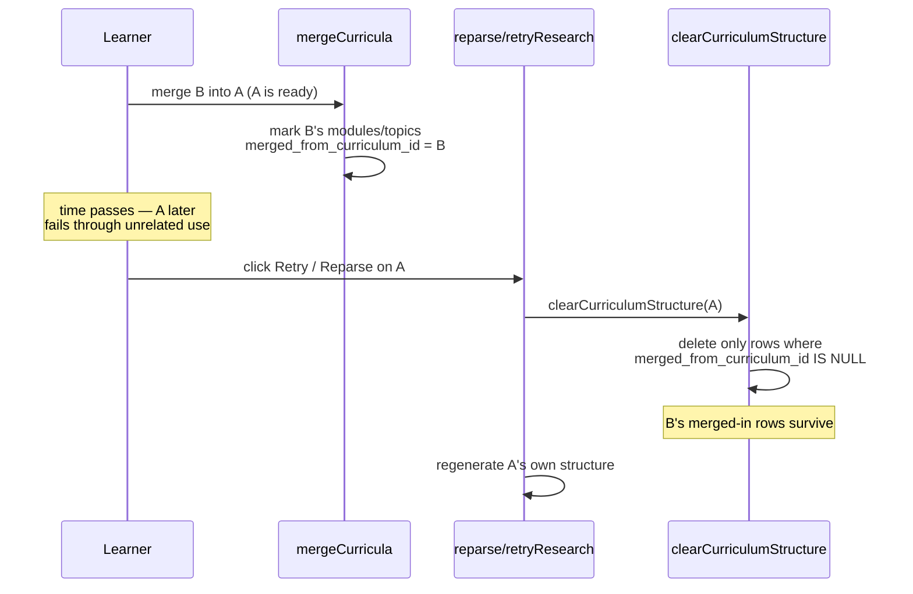

# Scenarios: Make clearCurriculumStructure provenance-aware

## Business Scenarios

SCENARIO 1: Merging content in, then an unrelated later failure, no longer destroys it

A learner merges curriculum B into curriculum A while A is healthy (`ready`). Time passes. A
independently fails later through ordinary use (e.g. the "add more sources" flow's synthesis
call throws, which is `mergeSourcesIntoCurriculum`'s existing catch-block behavior — flips A to
`failed`). The learner clicks "Retry research" or "Reparse" on A's `FailedBanner`, the normal
recovery action for a failed curriculum. B's originally-merged-in modules and topics remain
present under A, unchanged, after the retry/reparse completes — the same rows, same ids, same
content, still readable/quizzable. Only content that traces back to A's own research/parse
history is cleared and regenerated.

What to verify:
- `clearCurriculumStructure(A)` (the first step of both `reparseCurriculum` and
  `retryResearch`) deletes A's own native modules/topics but leaves every module/topic that
  arrived via `mergeCurricula` untouched.
- Gaps (and gap-mastery rows) attached to a surviving merged-in topic are not deleted alongside
  it — only gaps under topics that actually get cleared.
- This holds with zero timing coincidence — the merge and the later failure/retry can be
  arbitrarily far apart, matching the review's finding that this was never a race.

SCENARIO 2: A curriculum with no merged-in content still reparses exactly as before

A curriculum that never absorbed any merge (all its modules/topics are native) fails and gets
retried/reparsed. Every one of its modules/topics is cleared and regenerated, same as today —
the new provenance filter changes nothing for a curriculum with nothing to protect.

What to verify:
- `clearCurriculumStructure` on an all-native curriculum deletes 100% of its modules/topics and
  their gaps, identical to pre-fix behavior.
- No regression to the existing reparse/retry-research flow's observable outcome for the common
  case (no merge ever happened).

SCENARIO 3: Explicitly deleting a curriculum still removes everything it owns, merged-in or not

A learner (or an admin flow) deletes curriculum A outright via `deleteCurriculum`. Every module
and topic currently sitting under A is removed — including any that arrived via a prior merge —
because deleting the whole curriculum is a deliberate, total removal, not a partial
reparse-and-regenerate. No orphaned modules/topics are left pointing at a curriculum id that no
longer exists.

What to verify:
- `deleteCurriculum(A)` deletes every module/topic under A regardless of
  `merged_from_curriculum_id`, then deletes A's sources and its own `curricula` row, same
  end-to-end outcome as before this fix.
- This is the one call site that must opt out of the new protective default — verified by an
  explicit test, not just left implicit.

SCENARIO 4: A merge chain preserves provenance through more than one hop

Curriculum B merges into A (B's modules become merged-in under A). Later, A itself is merged as
a source into curriculum Z (a separate, later operation). B's originally-merged-in modules,
now moving a second time into Z, are still marked as merged-in under Z — not accidentally
"laundered" into looking native to Z just because they passed through A first.

What to verify:
- The provenance marker set at B→A merge time is preserved (not overwritten) when the same rows
  move again at A→Z merge time.
- A subsequent `clearCurriculumStructure(Z)` still protects these rows.

## Technical/Architectural Scenarios

SCENARIO 5: clearCurriculumStructure defaults to protective; only one caller opts out

`clearCurriculumStructure` gains an options parameter that defaults to protecting merged-in
rows. Any future caller that doesn't know about merge provenance gets the safe behavior
automatically. `deleteCurriculum` is the one existing call site that explicitly opts into full
deletion, with a comment explaining why.

What to verify:
- The two existing orchestrator call sites (`reparseCurriculum`, `retryResearch`) require no
  changes — they get protection automatically by calling the function with no options.
- `deleteCurriculum` is the only call site passing the override, and it's visibly commented.
