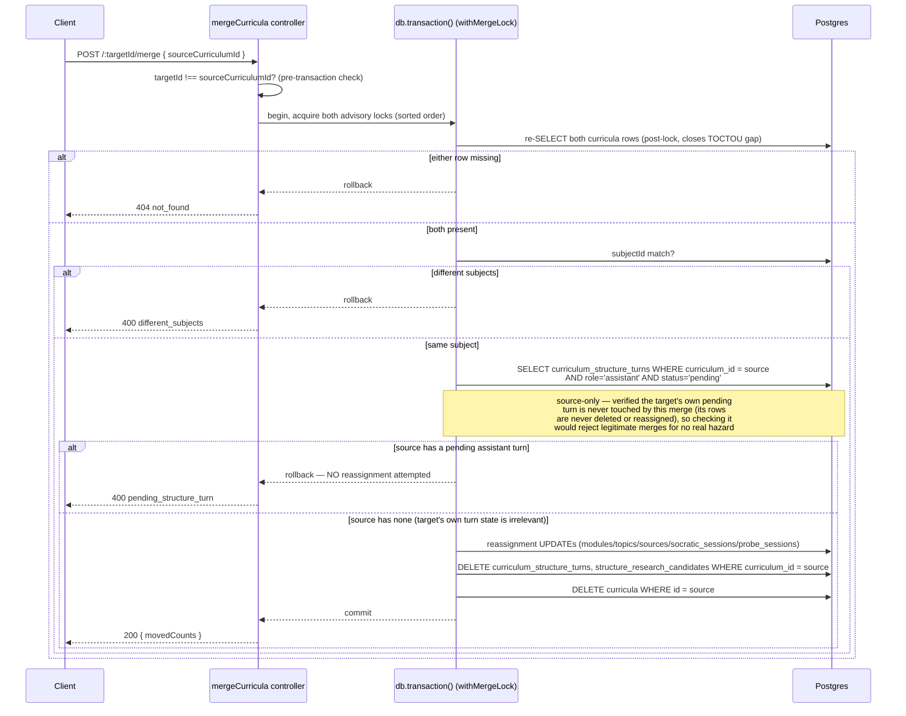
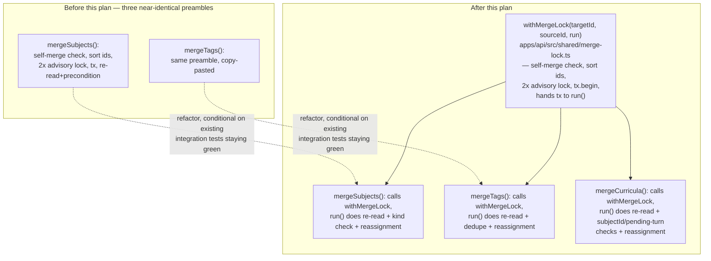

# Architecture — Curriculum merge

## Why this plan gets an architecture.md

Two reasons, either alone would qualify: (1) it extracts a shared write-pattern helper
(`withMergeLock`) out of two already-shipped functions and re-homes them on it in the same commit —
a real refactor of working, hot code, not just new code added beside it; (2) it introduces one new
kind of precondition (a partial-unique-index conflict, closed by rejection rather than by
reassignment) that the two prior merge implementations never needed, which changes the shape of the
transaction's precondition-check phase, not just its reassignment phase.

## What merge actually moves — Curriculum merge

```mermaid
flowchart TB
  curriculaSource["curricula (source)<br/>e.g. 'React Hooks (old)'"]
  curriculaTarget["curricula (target)<br/>e.g. 'React Hooks (new)'"]
  modulesSource["modules<br/>curriculum_id = source"]
  topicsSource["topics<br/>curriculum_id = source<br/>(denormalized alongside module_id)"]
  sourcesSource["sources<br/>curriculum_id = source"]
  socraticSource["socratic_sessions<br/>curriculum_id = source"]
  probeSource["probe_sessions<br/>curriculum_id = source (nullable)"]
  turnsSource["curriculum_structure_turns<br/>curriculum_id = source"]
  candidatesSource["structure_research_candidates<br/>curriculum_id = source"]
  llmSource["llm_call_events<br/>curriculum_id = source (nullable)"]
  gapsUntouched["gaps / gap_mastery / tag_assignments /<br/>lectures / probe_session_questions<br/>(keyed by topic_id/module_id/gap_id,<br/>never curriculum_id — untouched by construction)"]

  curriculaSource --> modulesSource
  curriculaSource --> topicsSource
  curriculaSource --> sourcesSource
  curriculaSource --> socraticSource
  curriculaSource --> probeSource
  curriculaSource --> turnsSource
  curriculaSource --> candidatesSource
  curriculaSource --> llmSource
  modulesSource -.->|"module/topic ids stable"| gapsUntouched

  subgraph AfterMerge["after mergeCurricula(target, source)"]
    direction TB
    modulesMoved["modules<br/>curriculum_id = target<br/>order += target's current max"]
    topicsMoved["topics<br/>curriculum_id = target"]
    sourcesMoved["sources<br/>curriculum_id = target"]
    socraticMoved["socratic_sessions<br/>curriculum_id = target"]
    probeMoved["probe_sessions<br/>curriculum_id = target"]
    turnsDeleted["curriculum_structure_turns: DELETED"]
    candidatesDeleted["structure_research_candidates: DELETED"]
    llmDangling["llm_call_events: left pointing at<br/>the now-deleted source id (deliberate)"]
    sourceDeleted["curricula row for source: DELETED"]
  end

  modulesSource -.->|"UPDATE curriculum_id, order offset"| modulesMoved
  topicsSource -.->|"UPDATE curriculum_id"| topicsMoved
  sourcesSource -.->|"UPDATE curriculum_id"| sourcesMoved
  socraticSource -.->|"UPDATE curriculum_id"| socraticMoved
  probeSource -.->|"UPDATE curriculum_id"| probeMoved
  turnsSource -.->|"DELETE"| turnsDeleted
  candidatesSource -.->|"DELETE"| candidatesDeleted
  llmSource -.->|"left alone"| llmDangling
  curriculaSource -.->|"DELETE (direct, not deleteCurriculum())"| sourceDeleted
```

Three facts this diagram encodes and the implementation must preserve:

1. `topics.curriculum_id` moves in the SAME logical step as `modules.curriculum_id` — they are
   independent `UPDATE` statements but must both run, every time, inside the same transaction.
   `getCurriculumDetail` fetches topics by `curriculum_id` directly (not by joining through
   `module_id`), so a topic left behind under the source id would render its module with zero
   topics under the target — a silent, hard-to-notice bug, not a loud error.
2. `gaps`/`gap_mastery`/`tag_assignments`/`lectures`/`probe_session_questions` need zero writes —
   confirmed by grep (discussion.md) that none of them reference `curriculum_id`. This is the
   direct generalization of `mergeSubjects`' own verified `tag_assignments` no-op: a child's
   grandchildren survive a reassignment untouched as long as the grandchild's own foreign key
   points at something whose identity doesn't change (`topic_id`/`module_id`), only its ancestor's
   ownership does.
3. `curriculum_structure_turns`/`structure_research_candidates` are the one place this merge
   diverges from "reassign everything" into "delete the source's rows" — see the precondition
   sequencing diagram below for why.

## The pending-structure-turn precondition — why rejection, not reassignment

The precondition check happens BEFORE any write, inside the same lock that closes the merge-vs-merge
race — this is deliberate, not incidental: if the check ran after the reassignment `UPDATE`s instead
of before, a raw Postgres constraint-violation error (not a clean 400) would abort the transaction
mid-sequence, and while Postgres would still roll the whole transaction back correctly (no partial
write), the client would see a 500 with a raw SQL error message instead of a named, catchable error
code — the same distinction `ontology-split-merge`'s own precondition-re-check-after-lock design
already established for `not_found`.

## Shared locking extraction — `withMergeLock`

The helper's contract: `withMergeLock<T>(targetId, sourceId, run: (tx) => Promise<T | {error:
"not_found"}>): Promise<T | {error: "self_merge" | "not_found"}>`. It owns exactly the self-merge
check, id sorting, the two `pg_advisory_xact_lock` acquisitions, and opening the transaction. It does
NOT own the entity-specific re-read or any entity-specific precondition (`kind_mismatch`,
`different_subjects`, `pending_structure_turn`) — those stay inside each caller's `run` callback,
which is also where each caller's own reassignment statements live. This is a genuine extraction, not
a speculative one: the three bodies inside `run` share nothing (a two-column reassignment for
subjects, a dedupe-then-reassign for tags, a five-table reassign-plus-two-table-delete for curricula)
— only the locking preamble around them is identical.

**The back-port is conditional, not automatic** (spec.md Decision #6, DoD Backend section): if
re-running `mergeSubjects`/`mergeTags`'s existing integration tests against the refactored code
turns up a regression, the back-port does not ship in this commit — `mergeCurricula` still ships on
the new helper, `mergeSubjects`/`mergeTags` keep their current, separately-working implementations,
and the back-port becomes its own follow-up once the regression is understood.

## What this plan does not change

- `curricula`, `modules`, `topics`, `sources`, `socratic_sessions`, `probe_sessions`,
  `curriculum_structure_turns`, `structure_research_candidates`, `llm_call_events` table shapes — no
  migration.
- `deleteCurriculum()` itself — merge deliberately avoids calling it (same reasoning `mergeSubjects`
  established for `deleteSubject()`), but this plan does not touch or fix anything about
  `deleteCurriculum()`'s own existing behavior.
- The domain-map read path — a curriculum merged away that was placed on a `domain_nodes` node
  simply stops appearing there (Decision #4); no code change needed, since "a node with zero placed
  curricula" is already a representable, already-handled state (any curriculum can be deleted
  outright today with the same visible effect).
