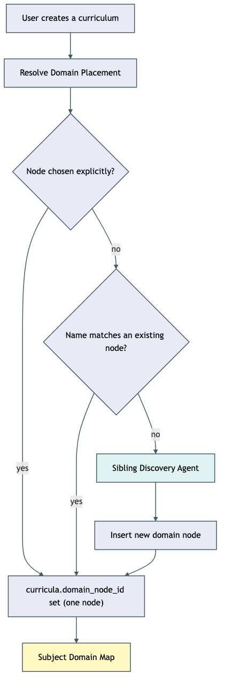
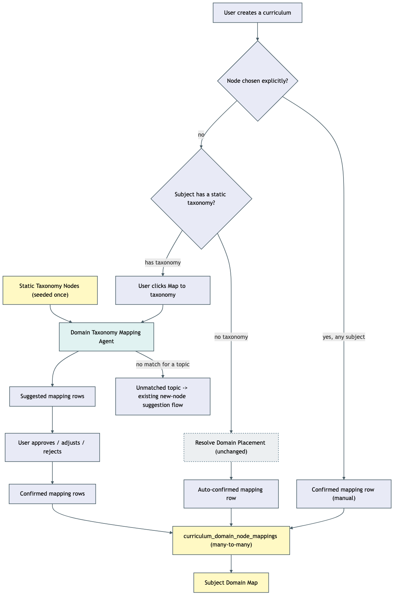

# Architecture: Decouple curricula from domain node creation

Six forks below are queued for human confirmation on GitHub issue #84 (`needs:decision` label,
comment posted 2026-08-04). Everything here reflects this plan's recommended option for each —
see "Decisions pending confirmation" at the bottom.

## What changes structurally

**Today:** creating a curriculum is what shapes a subject's domain-node tree. `handleCreateCurriculum`
(`apps/api/src/curriculum/curriculum.controller.ts:141`) calls `resolveDomainPlacement`
(`apps/api/src/domain-map/domain-placement.orchestrator.ts:76-175`), which — when no existing node
matches by name — calls a "sibling discovery" LLM agent that both places the topic AND inserts brand
new `domain_nodes` rows on the spot (`insertDomainNode`, same file, lines 126-164). The result is
written onto a single nullable column, `curricula.domain_node_id`. A subject's domain map is
therefore only ever as complete as the curricula someone has actually created under it — exactly the
coupling issue #84 wants broken.

**Proposed:** domain-node *creation* and curriculum *placement* become two separate mechanisms.

1. **Static taxonomy nodes are seeded once**, independent of any curriculum (`apps/api/scripts/
   seed-domain-taxonomy.ts`, reading `.planning/design-knowledge-taxonomy/taxonomy.yaml`). Seeded
   rows carry a new `domain_nodes.source = "static_taxonomy"` marker, distinct from the existing
   dynamically-created rows (`source = "ai_generated"`, the default for every row that exists today).
2. **Curriculum-to-domain-node placement moves off the single `domain_node_id` column onto a new
   many-to-many table**, `curriculum_domain_node_mappings` (curriculum ↔ domain node, with a
   `depth` and a `status`: `suggested` / `confirmed` / `rejected`).
3. **Placement is decided in this order at creation time — explicit choice first, subject type
   second:**
   - **An explicit `domainNodeId` on the create/update request always wins, regardless of subject
     type** (SCENARIO 5) — this is `resolveDomainPlacement`'s own existing Path 1 precedent, and it
     must be checked before `handleCreateCurriculum` ever looks at whether the subject is
     taxonomy-backed. Branching on subject type first and only falling back to "was a node
     explicit?" second would silently drop an explicit placement on a taxonomy-backed subject — the
     bug this plan's own grill-plan review caught before implementation.
   - With no explicit node given, a subject with **no** static taxonomy (every subject today, and
     every non-IT subject going forward — Business, Investing, Music, languages) keeps today's
     `resolveDomainPlacement` flow completely unchanged. The one difference is where the result
     lands: an auto-`confirmed` mapping row instead of a column write. Zero user-visible change.
   - With no explicit node given, a subject **with** a static taxonomy gets a new, on-demand,
     AI-assisted mapping step
     (`curriculum-domain-mapping.orchestrator.ts`): the user triggers it explicitly per curriculum, a
     new Mastra agent (`domainTaxonomyMapping`, mirroring `sibling-discovery.agent.ts`'s structured-
     output pattern) proposes which taxonomy node(s) the curriculum's topics belong under, and the
     user approves, adjusts the depth, or rejects each suggestion before it counts toward that node's
     progress. This agent **never** creates a domain node — a topic with no confident match anywhere
     produces a `domain_topic_suggestion` (the existing "propose a new node" review row this codebase
     already has), never a direct insert.
4. **`getDomainMapForSubject`** (`apps/api/src/domain-map/domain-map.repo.ts:145-217`) reads
   `confirmed` rows from the new mapping table instead of `curricula.domain_node_id`. The pure rollup
   deriver it calls, `domainNodeProgress` (`packages/core/src/domain-map/domain-map-progress.ts`),
   keeps its call shape — an array of `{domainNodeId, topics}` entries — but **gains a small fix**:
   when a curriculum is confirmed against more than one node (SCENARIO 9) and those nodes share a
   common ancestor, that ancestor's subtree walk sees *both* entries and today would flatten both
   topic lists together unchanged — double-counting the same curriculum's topics in the ancestor's
   `topicsIncluded`/`topicsMastered`. Found during this plan's grill-plan review, not present in the
   original design. The fix is a one-line dedup by `topic.id` on the flattened list before it reaches
   `moduleProgress` — see spec.md's Derivers table.

### Current flow

### Proposed flow

## New infrastructure

None. No new services, queues, or external dependencies — one new Mastra agent (same in-process
pattern as every other agent in `apps/api/src/mastra/`), one new backend module, one new DB table, one
one-off seed script run manually (matching `apps/api/scripts/seed-subjects.ts`'s existing precedent).

## Data model evolution

- **New table `curriculum_domain_node_mappings`**: `id`, `curriculumId`, `domainNodeId`, `depth`
  (`DepthLevel`, nullable until confirmed), `status` (`suggested` | `confirmed` | `rejected`),
  `source` (`"ai_suggested"` | `"manual"` | `"auto"` — `"auto"` is the non-taxonomy-subject path from
  `resolveDomainPlacement`), `createdAt`, `resolvedAt`. Never deleted on reject — same audit-trail
  convention as `domain_priority_suggestions` / `domain_supersession_suggestions` / `domain_topic_
  suggestions`. Deleted only when its owning curriculum is deleted (SCENARIO 13).
- **`domain_nodes` gains `source`** (`"static_taxonomy"` | `"ai_generated"`, default `"ai_generated"`
  for backward compatibility — every existing row keeps behaving exactly as it does today). This is
  the signal `resolveDomainNodeSource` (new pure deriver, `packages/core/src/curriculum-domain-
  mapping/`) uses to decide which of the two placement paths a subject uses.
- **`curricula.domain_node_id` is retired** (Decision #6 below) — its non-null values are migrated
  into one pre-`confirmed`, `source: "auto"` mapping row per curriculum (SCENARIO 10 — `"auto"`, not
  `"manual"`, since every pre-existing value in that column was written by `resolveDomainPlacement`,
  including its own explicit-placement case; there is no other, pre-this-ticket write path that would
  justify labeling a migrated row `"manual"`), then the column is dropped in the same migration.
  Generated via drizzle, never pushed directly, per this repo's own migration rule.

## Failure modes

- **Mapping agent call fails** (network, timeout, invalid structured output) — the trigger endpoint
  returns a clear error and inserts nothing (SCENARIO 11), mirroring `handleTriggerSubjectDuplicateScan`'s
  existing no-silent-fallback posture. Never a partial batch of suggestions.
- **Agent hallucinates a node id** — the pure `partitionMappingResult` deriver validates every
  returned node id against the real tree it was given (same defensive pattern
  `resolveParentNodePath` already uses today) and drops anything that doesn't resolve, rather than
  inserting a mapping row that points at nothing.
- **Concurrent accept/reject on the same suggestion** — claim-first write, `UPDATE ... WHERE status =
  'suggested'` (this table's own not-yet-resolved value — `resolveDomainTopicSuggestion`/
  `resolveDomainSupersessionSuggestion` use the literal `'pending'` because that's *their* status
  column's vocabulary; copying that literal instead of this table's own `'suggested'` would make
  every accept/reject a permanent no-op, since no row here is ever inserted with `status =
  'pending'`) (SCENARIO 12).
- **Subject deleted/merged mid-mapping** — same class of gap already logged and deliberately deferred
  for `resolveDomainPlacement`/`createCurriculum` (see `.planning/wishlist.md`'s ontology-split-merge
  entry) — not newly introduced by this plan, not fixed by it either. Noted, not re-litigated here.

## Rollout

1. Migration: add `curriculum_domain_node_mappings`, add `domain_nodes.source`, backfill existing
   `curricula.domain_node_id` values into the new table, drop the column — one migration, run via this
   repo's existing migrate script, never pushed directly.
2. Seed script run manually against production once issue #84's Decision #2 (which subject) is
   answered — `apps/api/scripts/seed-domain-taxonomy.ts`, parameterized by subject id/name so it isn't
   blocked on that decision landing before code ships.
3. Everything else (new orchestrator, controller, agent, UI) ships and works immediately for
   non-taxonomy subjects (auto-confirmed path, SCENARIO 8) even before the seed script runs; the
   on-demand "Map to taxonomy" trigger simply has nothing to show for a subject with zero
   `static_taxonomy`-sourced nodes yet.
4. Legacy per-subject domain nodes created by the old sibling-discovery flow are left exactly as they
   are by this ticket — reconciling them into the static taxonomy (Decision #4 below) is scoped as a
   follow-on step once Decision #2 lands, not part of this rollout.

## Decisions pending confirmation (GitHub issue #84, `needs:decision`)

1. Domain nodes stay scoped **per subject** (not one global tree) — preserves `mergeDomainNodes`'s
   cross-subject guard, `domain_priority_suggestions`/`domain_supersession_suggestions`'s subject
   scoping, and the `/subject/$subjectId/map` page, all unchanged.
2. The seeded IT taxonomy targets **a new, dedicated subject** (not the existing "Programming / Web
   Development" subject) — parameterized in the seed script, not hardcoded.
3. The AI mapping step runs **on demand** (a "Map to taxonomy" trigger the user clicks), not
   synchronously during curriculum creation.
4. Legacy domain nodes from the old dynamic-creation flow get **reconciled into the static taxonomy
   via the existing node-merge tool**, surfaced as review suggestions — scoped as a follow-on step,
   not blocking this ticket.
5. Subjects with no static taxonomy **keep today's dynamic sibling-discovery flow unchanged**.
6. `curricula.domain_node_id` **is migrated into the new mapping table and dropped**, not kept
   alongside it.

Full reasoning and options for each: `.planning/decouple-curricula-from-domain-nodes/decision-comment.md`
(also posted to issue #84).
