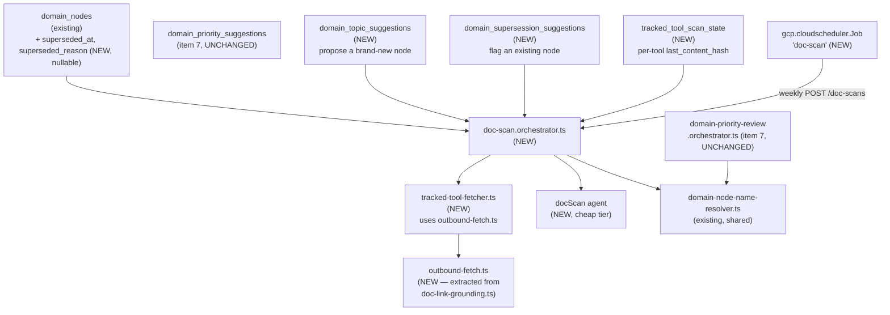
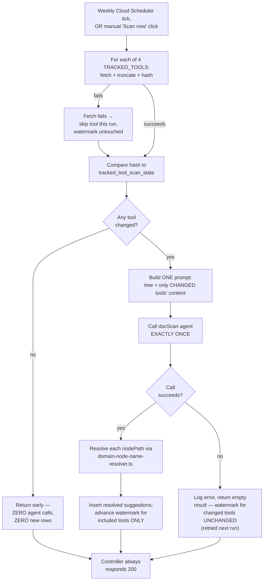
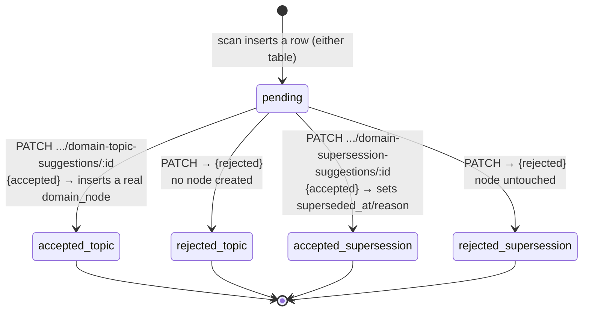
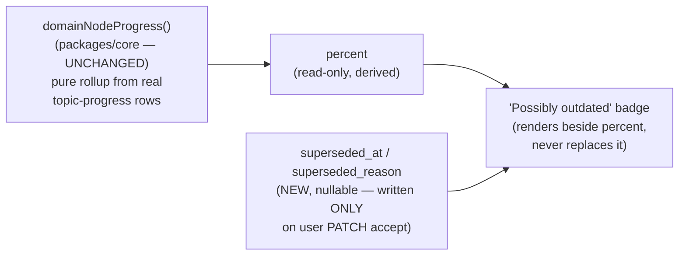

# Architecture — Periodic doc/changelog scan

## Why this plan gets an architecture.md

New Mastra agent (`docScan`), new orchestrator layer (`doc-scan.orchestrator.ts`) with its own
failure-propagation contract (deliberately the opposite of item 7's, for a documented reason), three
new tables, and — unlike item 7 — a genuinely new piece of deployed cloud infrastructure (a second
`gcp.cloudscheduler.Job`). Any one of these would qualify; all four together make this a clear
architecture-doc case.

## Where the new pieces sit relative to item 7's shape

`domainNodeProgress()` (item 5's percent rollup) and `domain_priority_suggestions` (item 7) are
untouched — this plan adds two new sibling suggestion tables and one new marker pair on
`domain_nodes`, not a modification to either existing mechanism.

## Scan flow — the load-bearing sequence

**The deliberate divergence from `domain-priority-review.orchestrator.ts` (item 7).** Item 7's
trigger is foreground and user-waited-on, so an agent failure there throws visibly (502) — a silent
no-op would look like a bug. This scan's primary trigger is a scheduled background job nobody is
watching in real time; the manual "Scan now" button reuses the identical orchestrator rather than
getting its own contract. An agent failure here is caught, logged, and returns an empty/flagged
result — `200` always — matching `domain-placement.orchestrator.ts`'s existing silent-fallback
posture instead. See `spec.md` Decisions #8, and SCENARIO 10 for the proof that a failure doesn't
also corrupt the watermark (changed tools stay un-advanced, so they're retried, not silently
skipped).

## Accept/reject — two sibling state machines, not one shared table

Why two tables instead of reusing item 7's `domain_priority_suggestions` (the seam its own
architecture.md drew for this item): verified by reading the actual schema —
`domain_priority_suggestions.domain_node_id` is `NOT NULL` and its payload column is
`suggested_target_depth`. A new-topic proposal has no existing node id to reference yet; a
supersession flag isn't a target-depth change. Forcing both into that row would mean making
`domain_node_id` nullable and adding two more nullable payload columns beside
`suggested_target_depth` for the cases where it doesn't apply — messier and less honest than two
small, fully-NOT-NULL-where-possible tables that share the exact same
`pending|accepted|rejected` + `resolved_at` + `source` shape as a pattern, not as a literal shared
row.

## The "flag, not reduce" boundary

`percent` and the supersession flag are two independent signals rendered side by side — the scan
job itself never writes to either `domain_nodes.target_depth` (item 7's column) or anything that
feeds `domainNodeProgress()`. The only write path to `superseded_at`/`superseded_reason` is the
user's own PATCH accept, which is exactly what keeps this compliant with `.product/PRINCIPLES.md`'s
"no passive maturity decay" rule (see `spec.md` Decisions #2).

## What this plan does not change

- `packages/core/src/domain-map/domain-map-progress.ts` — `domainNodeProgress()` unchanged; no
  code path in this plan can set `percent`.
- `apps/api/src/domain-map/domain-priority-review.orchestrator.ts` and
  `domain_priority_suggestions` — zero changes, own table, own mechanism, untouched.
- `apps/bot/src/server.ts` — zero changes; no new Telegram push wired (Decisions #7).
- Every other Cloud Run service, domain mapping, or service account in `infra/index.ts` — additive
  only; the new `gcp.cloudscheduler.Job` targets the existing `apiService`, no new service.
