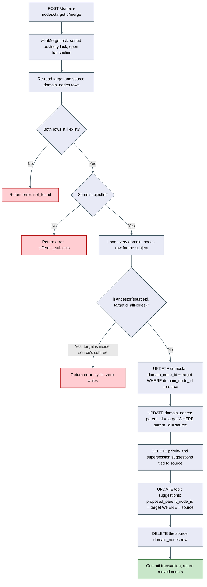
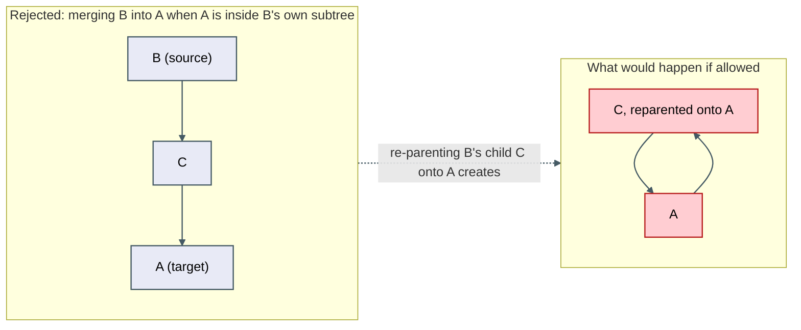

# Architecture: Domain-node merge

## Why this needed its own architecture.md

This is the first write path in the codebase that re-parents an existing `domain_nodes` row.
Every prior merge (`mergeSubjects`, `mergeCurricula`, `mergeTags`) only ever changed a foreign-key
-like column to point at a different owner; none of them altered the self-referential tree
structure itself. That distinction is what makes the cycle guard a genuinely new piece of
architecture, not just another reassignment — closing `docs/architecture/seed-knowledge-map/review.md`'s
previously-flagged gap.

## Merge procedure

## Cycle-guard shape — why an ancestor walk, not a descendant walk

The guard walks from the target upward via `parentId` (the same shape
`domain-placement.orchestrator.ts`'s `pathFor()` already uses for building display paths) and
checks whether the source appears in that chain — cheaper than enumerating the source's entire
subtree (`domainNodeProgress()`'s shape), and, critically, run with **no depth cap**: a capped
walk is correct for a rollup that can tolerate slight under-counting past 6 levels, but wrong for a
write-blocking correctness check where stopping early means silently allowing a corrupting merge
through. Full reasoning in `spec.md`'s "Cycle-guard design" section.

## What does not change

`getDomainMapForSubject()`'s own tree-assembly recursion (`buildItem()`) is left exactly as-is —
this item does not add a guard there. The reasoning: once `mergeDomainNodes` is the only write path
capable of re-parenting a node, and it always runs the ancestor-walk check before any write lands,
no cycle can ever exist in the data `buildItem()` reads. The read-path recursion staying unguarded
is therefore a correctly-scoped decision, not a leftover gap — the fix belongs on the write path
that could introduce the problem, not on every read path that assumes data integrity already holds
(the same posture `domainNodeProgress()`'s own comment already states: its cap is "a defensive
bound against future misuse," not a substitute for preventing the misuse at the source).

## Documentation changes

Publishes `docs/architecture/domain-node-merge/architecture.md` during implementation, carrying
both diagrams above, closing the two open findings from `docs/architecture/seed-knowledge-map/review.md`
(cycle guard) and `docs/architecture/ontology-split-merge/review.md`'s Decision #5 (deferred
re-parenting guard).
