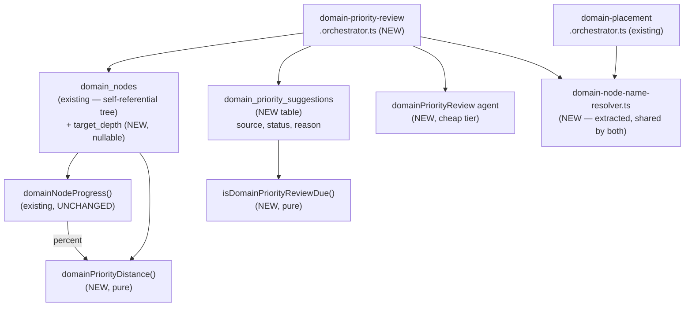
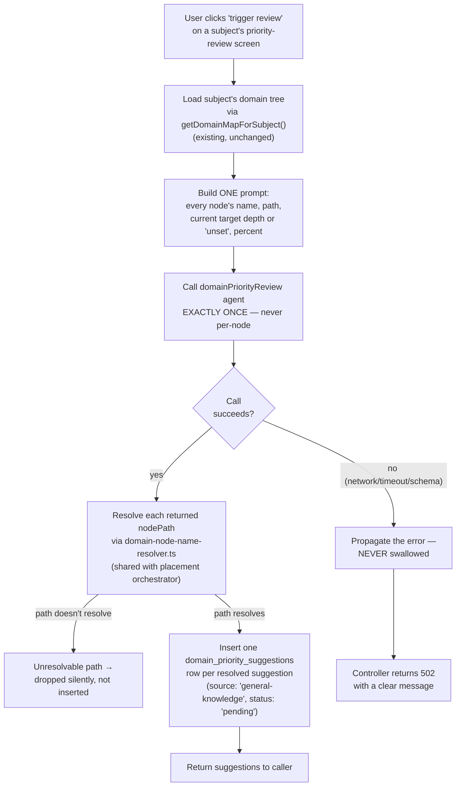
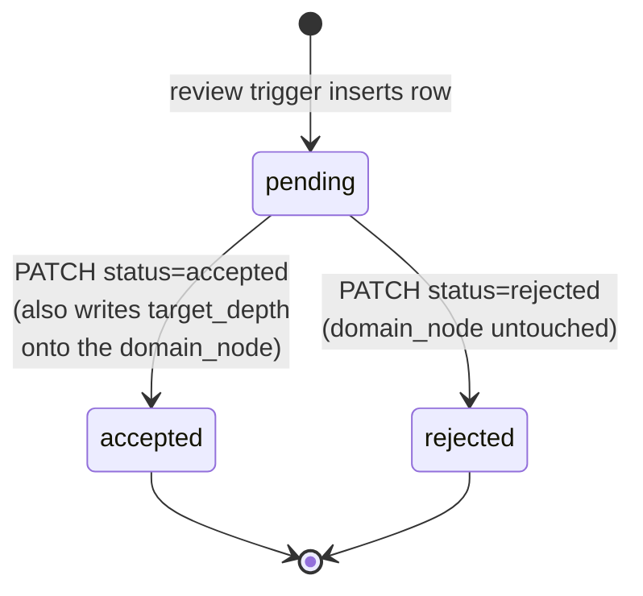
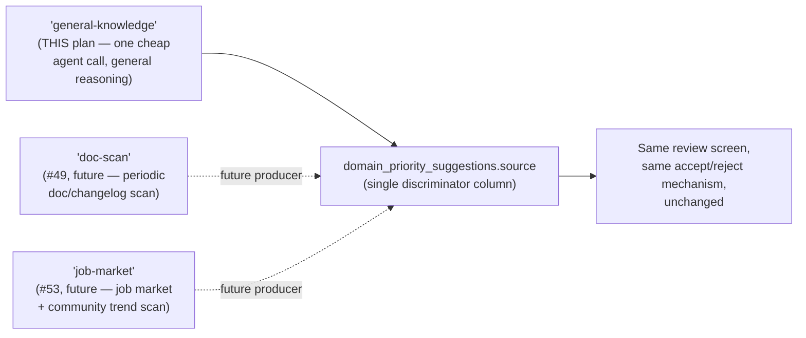

# Architecture — Per-domain expertise priority + monthly re-prioritization review

## Why this plan gets an architecture.md

Per this project's own trigger list: a new agent added to the Mastra registry
(`domainPriorityReview`), a new orchestrator layer (`domain-priority-review.orchestrator.ts`) that
introduces its own foreground-error-propagation contract (deliberately different from the existing
placement orchestrator's silent-fallback contract), and a new table
(`domain_priority_suggestions`) with its own accept/reject state machine sitting beside
`domain_nodes` — a structural addition, not a column bolted onto an existing pipe.

## Where the new pieces sit relative to `seed-knowledge-map`'s existing shape

`domainNodeProgress()` is called unchanged — the percentage rollup this plan displays alongside
priority distance is exactly item 5's existing contract, not touched or reinterpreted. The two new
pure derivers (`domainPriorityDistance`, `isDomainPriorityReviewDue`) are new, independent
functions, each testable without a database.

## Review-trigger flow — the load-bearing sequence for this plan

**This is the deliberate divergence from `domain-placement.orchestrator.ts`.** Placement's agent
call fails silently (`domainNodeId: null`, curriculum creation proceeds) because it is an invisible
background step inside another action the user isn't watching. This review trigger is the opposite
— an explicit, foreground, user-initiated action the user is actively waiting on. A silent no-op
here would look like a bug ("I clicked the button and nothing happened"), not graceful
degradation. See `spec.md`'s Decisions #10 and SCENARIO 8.

## Accept/reject state machine

Both terminal states are persisted rows, never deletions — `accepted` and `rejected` both set
`resolved_at`, distinguishing "handled" from "still pending" without losing the record of what the
agent suggested and what the user decided (`spec.md` Decisions #11).

## The seam for #49 and #53

This is why `source` is a discriminator column on `domain_priority_suggestions` rather than a
separate table per input, and why the accept/reject mechanism operates on the row shape, not on
which system produced it: when #49 or #53 land, they insert rows with a different `source` value
into this same table, and the existing review screen, accept/reject endpoints, and "review due"
derivation all keep working unmodified — the only visible change to the user is a new label on
some suggestions.

## What this plan does not change

- `packages/core/src/domain-map/domain-map-progress.ts` — `domainNodeProgress()` is called
  unchanged; the percentage rollup stays exactly item 5's contract.
- `domain-placement.orchestrator.ts`'s own behavior and its silent-fallback contract for curriculum
  creation — only its internal path-resolution helper is extracted into a shared file it now
  imports from; its test suite must keep passing unchanged as proof.
- `gap.ts`, `daily-push.ts`, `replenish.ts` — domain-node `target_depth` is not wired into
  probing-ceiling logic in this plan (see `spec.md` Decisions #5).
- No cron, scheduler, or cloud infrastructure changes — the review trigger is a plain HTTP
  endpoint, called manually.
