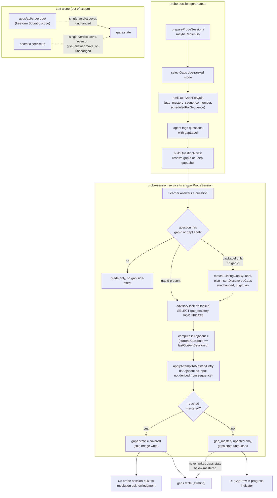

# Architecture: Generalized recall-gap mastery tracking

## Why this file exists

New data model (a sidecar mastery table + a new monotonic counter), a new write path with its own
concurrency contract, and a behavioral change to an existing endpoint (`answerProbeSession`) that
bridges into a pre-existing table's semantics (`gaps.state`). This crosses the bar for
`architecture.md` under this skill's own rule (data-model evolution + a new write path with
concurrency implications).

## As-planned design

## Data model additions (additive migration only)

- `gap_mastery` (new table): `id`, `gap_id` (unique, 1:1), `status`
  (`new|practicing|struggling|mastered`), `mastery_stage`, `correct_count_in_cycle`,
  `incorrect_count_in_cycle`, `last_correct_at_sequence`, `scheduled_for_sequence`,
  `last_correct_session_id` (plain text, references `probe_sessions.id` by value, no FK — matches
  this schema's existing plain-text-cross-table-id convention), `created_at`, `updated_at`,
  `mastered_at`. **`last_correct_session_id` is what proves "resurfaces in a later session"** —
  see spec.md Decision 4 for why the answered-question sequence counter alone (the original design)
  does not actually guarantee this, and why session identity does.
- `topics.gap_mastery_sequence_number` (new column, integer, default 0): the monotonic per-topic
  counter mastery scheduling needs — analogous to `phrases.sequenceNumber`'s role, but scoped to
  quiz-answer events per topic instead of phrase-generation events per subject/level/pack.
- `probe_session_questions.gap_label` (new column, nullable text): persists the AI-generated
  concept label even when unmatched at generation time, so a miss on a never-before-seen concept
  can still spawn a gap at answer time.

No column is removed or renamed on any existing table. `gaps.state`'s existing 3-value enum and all
existing readers (`gapMaturity`, `progressFromGaps`, `topic-row.tsx`, `concerns.tsx`) are
untouched — they keep reading the same column with the same meaning; this item only adds a new,
stricter path that's allowed to WRITE `"covered"` to it.

## Concurrency design

Mirrors `phrase-bank-concurrency.integration.test.ts`'s already-proven pattern exactly:

- **Lock key**: `hashtext(topic_id)::bigint` — `gaps`/`gap_mastery` have no `subject_id` column, so
  the natural write-contention scope is the topic, not a joined-out subject.
- **Lock order**: `pg_advisory_xact_lock` acquired BEFORE `SELECT gap_mastery ... FOR UPDATE`, on
  BOTH the generation-side due-read (read-only, no lock needed there — only the grading/write side
  mutates) and the grading-side write. This deliberately avoids the documented-but-unshipped
  deadlock risk one wishlist item ahead of this one (the phrase-bank FK's automatic `FOR KEY SHARE`
  conflicting with a differently-ordered `FOR UPDATE`) — both new write sites here use the SAME
  lock-then-FOR-UPDATE order, no second lock type introduced.
- **Unique index**: `gap_mastery(gap_id)` — a genuine DB-level 1:1 backstop, not just app-level
  convention.
- **Counter increment**: `topics.gap_mastery_sequence_number` incremented via `UPDATE ... SET
  gap_mastery_sequence_number = gap_mastery_sequence_number + 1 RETURNING
  gap_mastery_sequence_number`, inside the same advisory-locked transaction — never a
  read-then-write-elsewhere pattern that could race.

## Documentation changes

No existing doc covers this system (`docs/architecture/phrase-bank-mastery.md` covers the
ENGLISH-specific phrase-bank; this is a distinct, newly-generalized mechanism). Per the consistency
gate's Documentation-changes requirement: this item commits to publishing
`docs/architecture/generalize-gap-tracking.md` during implementation, containing the Mermaid
diagram above (regenerated to reflect the as-built shape if it diverges) and a short "what changed"
summary, following the same format as `docs/architecture/phrase-bank-mastery.md`.
