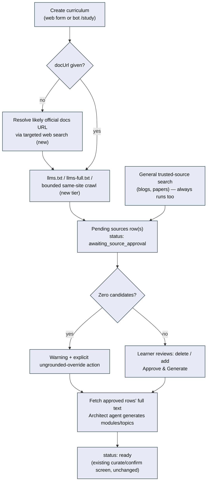
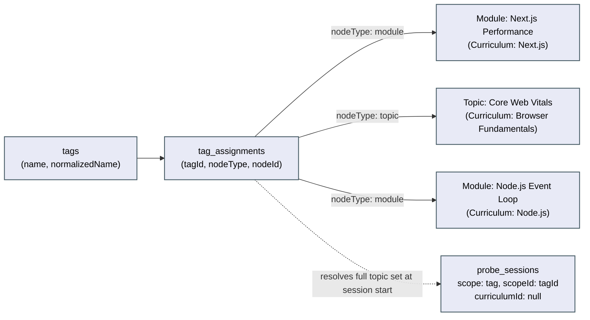

# Architecture: Grounded knowledge map

## What changes structurally

Four additive extensions to the already-shipped curriculum/probe-session system (`use-case-study-mode`, `doc-link-technology-intake`, `topic-study-experience`, `probe-quiz-grounded-explanations` — all verified present on `main` during planning, not assumed). No new services, no new deploy targets. Two genuinely new tables (`tags`, `tag_assignments`); everything else is additive columns or a new workflow state on existing tables.

### Phase 1 — Research no longer goes straight to synthesis; it stops at an approval gate

Today, `researchCurriculum` (`curriculum-parse.orchestrator.ts`) gathers grounding text (either via the docUrl-driven `gatherDocLinkGrounding` chain, or the bare-name `gatherTechResearchGrounding` search) and calls the architect agent in the same pass, landing at `status: "ready"` with modules/topics already generated. This plan splits that into two phases with a hard stop between them:

1. **Candidate gathering** (new): resolves an entry point (the given `docUrl`, or — new — one resolved from a bare technology name via a targeted "find the official docs" search), runs the existing llms.txt/llms-full.txt tiers, and — new — a bounded single-hop crawl of the entry page's same-site links when neither well-known file exists, **plus** a general trusted-source search for blog/paper candidates that runs unconditionally alongside. Every candidate becomes a `sources` row with `approvalStatus: "pending"`, `fetchedText: null` (except the llms.txt/llms-full.txt tier, where the content is already in hand from the existence probe and is stored immediately — no extra cost either way). Curriculum status becomes `"awaiting_source_approval"`. **No architect-agent call happens in this phase.**
2. **Approval** (new): the learner reviews the pending rows, deletes any they don't want (hard delete, not a soft "rejected" state — simpler, and nothing downstream needs to remember a rejected candidate), optionally adds their own links, then calls a new `approve-sources` action. This resolves `fetchedText` for any still-unfetched approved rows (the bounded-crawl and blog/paper candidates), deletes anything not approved, flips remaining rows to `approvalStatus: "approved"`, and **only then** calls the architect agent — reusing the exact same `saveCurriculumPlan` write path research already uses today.

The bare-name (`researchTopic`) and docUrl paths are unified into one pipeline: a bare name is no longer a separate, weaker path (today's single ungrounded search) — it's the same pipeline with an extra first step (resolve a likely docs URL) in front of it. Plain pasted-source creation (`parseCurriculum`) is untouched — a user pasting their own link *is* their approval, so no new gate applies there.

**Trusted sources are broader than one docs site — decided explicitly, not left docs-centric.** The general trusted-source search (a `web_search`-backed call in the same style as the existing `tech-research-grounding.ts`, scoped by a prompt asking specifically for official blogs and research papers rather than an open query) runs on every research-triggered creation, regardless of whether a docs entry point was found. Its results are unioned with the docs-chain's candidates before the approval screen is shown, deduplicated by URL. This directly answers the task's "official documentation, company blogs, or research papers" framing rather than only the docs-site case the existing llms.txt chain already covers well.

**The "warning, not encouraged" requirement is two distinct, separately-checkable pieces, not one:**
- A **hard block** at course-creation time: the architect agent is never invoked for a research-triggered curriculum with zero approved sources, except through the SCENARIO 5 override action — a structural gate (an `if` on approved-row count before the synthesis call exists at all), not a heuristic that tries to detect "did the model just make this up."
- A **soft warning** at quiz time: `probe-session-quiz.tsx` renders a small notice whenever `getCurriculumCitableUrls` (already exists, from `probe-quiz-grounded-explanations`) returns empty for the curriculum being quizzed — covering both pre-existing ungrounded curricula and any created via the SCENARIO 5 override. This reuses an existing, already-computed signal; nothing new is fetched or evaluated to produce it.

**Copy locations that carry this requirement, named so they're checkable:** `apps/web/src/curriculum/study-technology-form.tsx` (docUrl now optional — see below), the new `source-approval-panel.tsx`'s empty-state copy, the bot's `/study` reply text (`apps/bot/src/telegram/webhook.handler.ts` or `apps/bot/src/conversation/study-flow.ts`, whichever currently owns that reply), and `probe-session-quiz.tsx`'s new ungrounded notice.

**The web form gains the same bare-name trigger the bot already has, instead of a third input.** Today `study-technology-form.tsx` requires a `docUrl` (validated as an absolute URL) — there is currently no way to ask "broadly" from the web UI at all, only from the bot's `/study <name>`. Making `docUrl` optional and, when blank, submitting `researchTopic: name` (the existing legacy field, now unified into the grounded pipeline above rather than routed to the old ungrounded path) closes this gap without adding a third trigger field or new validation concept.

**Candidate discovery is not a pure computation end-to-end** (it fetches pages and calls a search API), but two pieces of it are: extracting same-site links from a fetched page, and deduplicating candidates found by more than one tier. Both are derivers (see spec.md).

### Phase 2 — Pre-assessment: a dedicated one-time step, not a UI tweak to the existing widget

`topics.selfGrade` already exists (1-5, nullable) and already has a UI widget (`self-grade.tsx`, wired inline on each `TopicRow`) — but it's easy to skip entirely, since nothing currently surfaces it as a moment the learner is asked to go through. This plan adds a dedicated screen, reached exactly once per curriculum right after `confirmCurriculum`, listing every included topic with that same widget, so grading happens as a deliberate pass rather than an easily-missed inline control. No new grading scale, no new persisted grade concept — the same column, the same 1-5 widget, just given its own moment.

A new `curricula.preAssessmentCompletedAt` (nullable timestamp) tracks whether the learner has passed through this screen at least once; it is set when they click "Start studying" there, not when every topic is graded (grading stays optional per topic, matching the existing field's semantics — this step gates *visiting* the screen once, not *completing* every grade). Once set, later visits to the curriculum skip straight to its topics exactly as today.

**Deliberately out of scope:** wiring `selfGrade` into anything new (initial gap state, question difficulty, generation bias). The task asks for the self-report *step* to exist before study starts; today's existing two consumers (`isTopicTouched`'s re-parse lock, `recommendation.ts`'s maturity tiebreaker) are untouched. Deeper consumption is a reasonable follow-up, not part of this plan's Definition of Done.

### Phase 3 — Cross-cutting tags: a new polymorphic junction table, modeled on an existing precedent

**No tag or knowledge-bit concept exists anywhere in the schema today** (verified by a full-repo grep during planning — the only "tag" hits are unrelated prose in agent-instruction strings and Drizzle's own migration-journal metadata). This is genuinely new ground, not an extension of something partial.

The schema reuses a pattern already established by `node_feedback` (`nodeType`/`nodeId` polymorphic attachment) rather than inventing a new attachment shape:

- `tags`: `id`, `name` (display form, e.g. "Performance"), `normalizedName` (lowercase/trimmed, unique-indexed — the actual dedup key), `createdAt`.
- `tag_assignments`: `id`, `tagId`, `nodeType` (`"module" | "topic"`), `nodeId`, `createdAt`, unique-indexed on `(tagId, nodeType, nodeId)`.

Tags attach at either granularity because the task's own example needs both: "Next.js Performance" as a whole module tagged `performance`, and a single topic buried inside an unrelated module (e.g. a performance-flavored topic inside a general "Testing" module) tagged the same way without its whole module qualifying.

**A cross-cutting study session is a new `ProbeScope` value, not a new session system.** `probeScopeSchema` widens from `["module","topic"]` to `["module","topic","tag"]`. `getScopeContext`'s new `"tag"` branch resolves the full topic set for a tag by unioning: (a) topics directly tag-assigned, and (b) all included topics under any tag-assigned module — deduplicated, across as many different curricula as the tag happens to touch. Everything downstream of that context (question generation, answering, progress, gap-closing) already operates per-topic or per-gap, never by trusting the session's own `curriculumId` — **verified directly during planning**, not assumed: `refreshTopicProgress` takes only a `topicId`; `syncSessionCounters` aggregates purely by `sessionId`; gap-closing on a correct answer resolves the gap via `question.gapId`/`question.topicId`, never the session row's `curriculumId`. The one real change needed is `probeSessions.curriculumId` becoming nullable (only ever `null` for `scope: "tag"`) and `ScopeContext`/`ScopeTopic` gaining a per-topic `curriculumId` (today's `ScopeContext.curriculumId` is a single value assumed to cover every topic in scope — true for module/topic scope, false for tag scope), since `generateProbeBatch`'s grounding fetch (`gatherProbeGrounding(curriculumId, ...)`) is called per-topic and must use each topic's *own* curriculum, not the context's singular one, for a tag session to stay correctly grounded per SCENARIO 14.

**AI-suggested tags are in scope, not deferred** — without them, the whole feature has nothing to show until a learner hand-tags topics across many existing curricula first, which is a real adoption dead end for a novel feature. `curriculum-architect.agent.ts` and `doc-research-architect.agent.ts` gain an optional `tags: string[]` per module in their structured output (same pattern already used for `level`/`suggestedDepth`); `saveCurriculumPlan` resolves each proposed tag name against the existing `tags` table by `normalizedName` (reuse) or creates it (new), then inserts a `tag_assignments` row for that module. The learner can still add/remove tags by hand afterward through the same UI control — AI suggestion is a seed, not the only path.

### Phase 4 — Preload/replenish: refetch-on-low, not polling, plus a demonstrated-progress bias reused from an existing but unwired deriver

**No replenish/threshold mechanism exists today, on web or bot** (verified by full-repo grep during planning) — every session today generates one fixed/scaled batch up front and is consumed until exhausted; the only "more" action is the bot's destructive full regenerate (wipes prior answers). This plan adds a real top-up path without adding polling infrastructure this app doesn't otherwise have:

- **Server-side trigger**: `answerProbeSession`, after its existing `syncSessionCounters` call, checks `total - answered <= 10`. If true and the session isn't already replenishing, it fires a background top-up (`void generateReplenishBatch(...).catch(...)`, the same fire-and-forget pattern the curriculum orchestrator already uses for research) that inserts more `probe_session_questions` rows and re-runs `syncSessionCounters` when done.
- **Concurrency guard**: a new `probeSessions.replenishing` boolean (default `false`), set `true` immediately before the fire-and-forget call starts and back to `false` in its completion/failure handler. The next answer's check reads this flag before deciding to trigger another top-up — this is the whole guard, no queue or lock service needed at this app's scale.
- **Delivery to the frontend — refetch-on-low, not polling.** Today's quiz UI fetches once (`prepareProbeSession`) and walks a static client-side array; there is no existing polling loop to extend. Rather than introduce one, the client performs the same `total - answered <= 10` check itself after each answer and, when crossed, calls the already-existing `getActiveProbeSession` endpoint again to pick up newly-inserted rows — bounded, one-shot per threshold-crossing, not a timer. This is eventually consistent with the server-side fire-and-forget generation (the client may refetch slightly before the new rows exist yet; the existing recording gate means the learner simply doesn't see them until the next check), which is an acceptable gap given the floor is 10, not 0. The bot's `quiz-flow.ts` needs the equivalent check before it decides "no more questions" and ends the session prematurely.
- **Demonstrated-progress bias — reuses an existing pure deriver that today's initial batch generation never wires in.** `packages/core/src/curriculum/gap.ts` already has `openGaps`/`nextGapToProbe` (wanted-first, then shallower-depth-first ranking over `state === "open"` gaps) — but it's only ever called from the unrelated single-question "daily push" bot flow, never from `probe-session.generate.ts`, which today hands the LLM *every* non-skipped gap (open and covered alike) and leaves prioritization to the model's own prompt-following. This plan wires `openGaps`'s ranking into the *replenish* path specifically (not the initial batch, which stays as-is — a larger, higher-risk change with no scenario requiring it here): a replenish batch's gap list is this session's own topics' currently-open gaps, ranked by the existing `openGaps` ordering, so a concept the learner is still missing is preferentially re-covered rather than uniformly resampling the whole original list.

## New infrastructure

None. No new service, queue, cron, or external dependency. The general trusted-source search reuses the existing OpenRouter `web_search` tool wiring (`OPENROUTER_API_KEY`/`CURRICULUM_MODEL`, already configured); the bounded crawl uses plain `fetch()` exactly like `source-fetch.ts` already does.

## Data model evolution

| Table | Change | Reason |
|---|---|---|
| `curricula` | `status` enum gains `"awaiting_source_approval"` | Phase 1 — the gate state between candidate-gathering and synthesis |
| `curricula` | + `preAssessmentCompletedAt` (timestamp, nullable) | Phase 2 — one-time-visit tracking |
| `sources` | + `approvalStatus` (text, `"pending" \| "approved"`, default `"approved"`) | Phase 1 — existing/pasted rows default to already-approved with zero migration risk; new candidate rows start `"pending"` |
| `probe_sessions` | `curriculumId` relaxed to nullable | Phase 3 — only ever `null` for `scope: "tag"`; verified no downstream code reads it as a filter key (see architecture notes above) |
| `probe_sessions` | + `replenishing` (boolean, default `false`) | Phase 4 — concurrency guard |
| `tags` (new table) | `id`, `name`, `normalizedName` (unique), `createdAt` | Phase 3 |
| `tag_assignments` (new table) | `id`, `tagId`, `nodeType` (`"module" \| "topic"`), `nodeId`, `createdAt`, unique on `(tagId, nodeType, nodeId)` | Phase 3 |

All additive (new columns default-backfilled, new tables) except the `probe_sessions.curriculumId` nullable relaxation, which is a constraint-loosening `ALTER COLUMN ... DROP NOT NULL` — safe (no data loss, no existing row violates it since every existing row already has a real value).

`sourceKindSchema` (`"link" | "text" | "web_research" | "llms_txt"`) is **not** widened — a discovery-tier label (docs / blog / paper) is carried in the candidate row's `title` text, not a new enum value, since nothing downstream needs to branch on it structurally, only display it.

## Failure modes

- **Official-docs-URL resolution finds nothing confidently** for a bare-name request: the docs-chain tier is simply skipped (no llms.txt/crawl tier runs); the general trusted-source search still runs and may still produce blog/paper candidates. Only if *that* also comes back empty does SCENARIO 5's warning/override path trigger.
- **Bounded crawl target times out or the entry page has no discoverable same-site links**: falls through with zero crawl-tier candidates, same as any other empty-tier case — never blocks the other tiers (llms.txt success, or the general search) from still contributing candidates.
- **The architect agent proposes a tag name that's a near-duplicate of an existing one in spelling but not exact-normalized form** (e.g. "Perf" vs "Performance"): accepted as a logged limitation — `normalizedName` matching is exact-after-normalization, not fuzzy; a learner can merge these by hand later if it happens, same category of acceptable imprecision as the sibling plan's "no fine-grained per-claim attribution" limitation.
- **Replenish generation fails** (LLM error, network): `replenishing` still flips back to `false` in the failure handler so a later answer can retry; the session simply doesn't grow this time, same degrade-gracefully posture as the existing initial-batch `generation_failed` handling.
- **A tag has zero currently-tagged topics** when a learner tries to start a session for it: same `not_found`-style error shape the existing scope resolution already returns for a missing topic/module id — no new error category needed.
- **Approval action submitted with sources that were meanwhile deleted server-side by a stale client** (e.g. two tabs): the approve action re-reads current pending rows server-side rather than trusting a client-submitted list wholesale for anything except which specific rows to keep/drop — a row id that no longer exists is simply a no-op, not an error.

## Rollout

1. `packages/shared`: widen `curriculumStatusSchema`, `probeScopeSchema`; add `approvalStatus` to `sourceSchema`; new `approveSourcesInput` schema; `tags`/`tagAssignment` shared types.
2. `apps/api/src/db/schema.ts`: all additive columns/tables above — generate + apply the Drizzle migration (single migration covering all of Phase 1/3/4's schema changes, generated once all schema edits are in place, per the existing "generate against the final shape" discipline the sibling plans already established).
3. `packages/core`: new derivers — same-site link extraction + candidate dedup (Phase 1), tag-name normalization (Phase 3), replenish threshold check (Phase 4) — see spec.md for exact names/signatures.
4. `apps/api/src/curriculum/`: candidate-gathering pipeline, approval endpoint, tag resolution in `saveCurriculumPlan`, pre-assessment completion endpoint.
5. `apps/api/src/probe-session/`: new `"tag"` scope branch, replenish trigger + guard, replenish-specific batch generation.
6. `apps/api/src/tag/` (new module): tag CRUD + assignment endpoints.
7. `apps/api/src/mastra/`: both architect agents gain optional per-module `tags` output.
8. `apps/web/src/`: source-approval panel, pre-assessment screen/route, tag chips + add/remove control, tag-scoped study entry point + route, quiz UI's refetch-on-low + ungrounded notice.
9. `apps/bot/src/`: `/study` reply copy update, quiz-flow's refetch-on-low check.
10. Publish `docs/architecture/grounded-knowledge-map.md` (new — this plan's scope is large and novel enough to warrant its own doc rather than folding into an existing one); extend `docs/architecture/use-case-study-mode.md` (Phase 1's gate) and `docs/architecture/topic-study-experience.md` (Phase 4's preload/replenish) with short cross-referencing subsections and updated diagrams where each existing diagram's flow actually changes.
