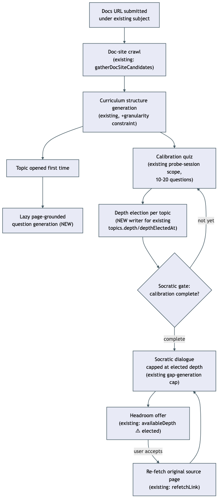

# Architecture: Learn from a documentation site

## What changes structurally

Socratic session start gains a new dependency it doesn't have today: it's blocked per-course until that course's calibration quiz completes. Topic depth gains its first real writer — `topics.depth`/`depthElectedAt` exist in the schema today but nothing sets them; the calibration quiz becomes that writer. Question generation gains a new unit of provenance (the source page, via `topics.sourceId`) that lazily fires on first topic-open rather than eagerly at crawl time. "Go deeper" is wired to re-fetch the topic's own original source page (existing `refetchLink()`) rather than a fresh unrelated web search.

## New infrastructure

None.

## Data model evolution

- `topics.depthElectedAt`/`topics.depth` get their first real writer (calibration quiz completion) — no schema change, an existing unwired column becomes wired.
- No new tables. Per-page question provenance reuses `topics.sourceId` (already tracks the originating `sources` row) — this column also gets its first real writer for doc-crawled curricula: the structure-generation model now echoes back which crawled page a topic came from (`curriculum-plan.ts`'s `sourceUrl`), and `saveCurriculumPlan` resolves that URL to the matching `sources` row on topic insert.

## Failure modes

- A course with fewer topics than the calibration quiz's `MIN_TOTAL` (10) must still run a smaller quiz, not block forever waiting to hit a floor it can never reach.
- If the doc-site crawl finds zero same-site pages beyond the entry URL, curriculum creation must still succeed (single-page course), not fail the whole flow.
- A "go deeper" re-fetch that returns no new content (page unchanged) must fail visibly to the user, not silently regenerate from stale cached text.

## Rollout

Standard deploy, no special rollout steps — personal, single-owner, low-traffic app.
