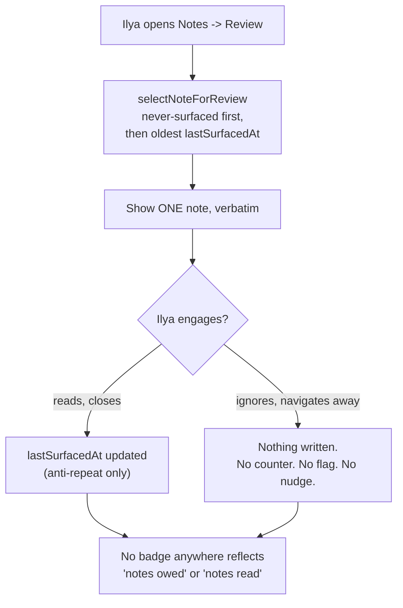

# Scenarios: learning brain (notes and highlights)

## Business Scenarios

### SCENARIO 1: Capture a note against a topic

Ilya is reading a topic's material and writes a short note on something clicking into place. It
saves as `notes` row `{nodeType: "topic", nodeId, body}` — no gap, no mastery change, no LLM call.

What to verify:
- The note is retrievable immediately via `GET /notes?nodeType=topic&nodeId=...`.
- Nothing else in the system (gaps, gap_mastery, liveness) is touched by this write.

### SCENARIO 2: Capture a note against a gap

Ilya answers a probe question, still finds the gap murky, and jots why — attached to that specific
`gapId`, not the whole topic. Same table, `nodeType: "gap"`.

What to verify:
- The note survives the gap later being marked `covered` — no cascade, no delete.
- A gap can carry multiple notes over time (no uniqueness constraint on nodeId).

### SCENARIO 3: Capture a highlight against a source

Ilya is reading a pasted article (a `sources` row) and quotes a passage verbatim. Same capture
endpoint, `nodeType: "source"`, `isHighlight: true` — the only difference from a note is the flag.

What to verify:
- A highlight and a free note render distinctly in the UI (quote styling vs. prose) but share one
  table, one search index, one review pool.
- `isHighlight` never changes the capture contract's required fields.

### SCENARIO 4: A note never creates or modifies a gap

Whatever a note says — even something that reads exactly like an admission of not knowing — capturing
it never writes to `gaps`, `gap_mastery`, or any liveness/mastery table, and never queues anything for
an AI pass to "look at later."

What to verify:
- `note.repo.ts` imports nothing from `gap.repo.ts`'s write functions.
- No background job, cron, or orchestrator reads `notes` to generate gaps. This is the module's
  explicit compliance boundary with `.product/PRINCIPLES.md`'s "User-only gap creation."

### SCENARIO 5: Full-text search across notes returns ranked results

Ilya searches "idempotency" across everything he's ever written. Postgres native
`to_tsvector`/`ts_rank` over the `notes.search_vector` GIN index returns matches ordered by
relevance — no new search dependency.

What to verify:
- A search hits the GIN index (verified via `EXPLAIN`), not a sequential scan.
- Results are ranked, not just filtered — a note using the term twice outranks one using it once.

### SCENARIO 6: Search results filtered to a taxonomy Area or sub-subject

Ilya narrows the same search to "React" only. The filter resolves the note's attached
topic/gap/source up to its curriculum, then to that curriculum's confirmed `domain_node` mappings,
then checks subtree membership using the same cycle-safe, depth-capped BFS `domainNodeProgress`
already established for the domain map's own rollup — not a second traversal design.

What to verify:
- A note attached under a descendant Area of the filtered node is included; one under an unrelated
  Area is excluded.
- The traversal terminates even against a malformed/cyclic tree (same defensive bound as
  `domainNodeProgress`).

### SCENARIO 7: Search results filtered by cross-cutting concern

Ilya filters to `security`-tagged notes only. Reuses `concernSchema` unmodified from
`@post-anki/shared` — the same six-value enum already on curricula/topics/gaps.

What to verify:
- Filtering by concern needs no new vocabulary; an invalid concern value 400s the same way every
  other concern-accepting endpoint already does.

### SCENARIO 8: An empty query returns no results without hitting the database

Ilya clears the search box. `normalizeSearchQuery("")` returns `null`; the controller short-circuits
before any SQL runs.

What to verify:
- A whitespace-only query (`"   "`) also normalizes to `null`.
- No `to_tsquery`/`plainto_tsquery` call is made for a null-normalized query.

### SCENARIO 9: Notes feed review surfaces one past note for rereading — never a queue

Ilya opens the notes browser's review tab. One past note is shown, chosen by `selectNoteForReview`
(never-surfaced-first, then oldest `lastSurfacedAt`) — its own text, verbatim, nothing generated
from it, nothing counted against him for not opening this screen yesterday, the day before, or ever.

What to verify:
- There is no "N notes to review" badge, counter, or unread state anywhere in the product.
- Not opening this screen for a month has zero visible consequence — no flag, no penalty, no
  reminder. This is the direct resolution of the tension named in the task: surfacing the user's
  own notes as study material stays safe from `.product/REJECTED.md`'s AI-auto-gap failure mode
  only because nothing here is AI-authored, nothing is queued, and nothing is owed.
- `lastSurfacedAt` updates only to prevent an immediate repeat — never to compute a "you're behind"
  signal.

### SCENARIO 10: Review is pull-only — never delivered via push or nudge

The review surface is reachable only by Ilya opening the notes browser himself. It is never injected
into `/daily-push`, the Telegram bot, or a liveness nudge.

What to verify:
- `push/push.repo.ts` and `push/push.controller.ts` carry zero references to `notes` or note review.
- The one daily proactive touchpoint (`/daily-push`) is byte-for-byte unchanged by this module.

## Technical/Architectural Scenarios

### SCENARIO 11: `selectNoteForReview` is a pure, deterministic deriver

Given a candidate list and "now," the same inputs always produce the same chosen note — no hidden
randomness, no wall-clock dependency beyond the injected `now`.

What to verify:
- Never-surfaced notes (`lastSurfacedAt: null`) always outrank surfaced ones.
- Among surfaced notes, strictly oldest `lastSurfacedAt` wins; ties break on `createdAt`.
- An empty candidate pool returns `null`, never throws.

### SCENARIO 12: Taxonomy resolution reuses the existing subtree-walk pattern

`resolveNoteTaxonomySubtree`'s BFS is written to the same shape as `domainNodeProgress`'s subtree
walk (`MAX_DEPTH`-capped, visited-set cycle guard) — a new, small implementation because the output
shape differs (a membership filter, not a progress rollup), but not a redesigned algorithm.

What to verify:
- Depth-capped and cycle-safe against the same fixtures `domainNodeProgress`'s own tests use.
- No second taxonomy-traversal design is introduced anywhere else in this module.

### SCENARIO 13: Web — note capture during study

From the probe room, a topic row, a gap listing, or the source editor, a small "add a note" control
is reachable without leaving the current screen — one shared `note-capture-box.tsx`, parameterized
by `nodeType`/`nodeId`, not four bespoke forms.

What to verify:
- The same component renders correctly for all three attachable node types.
- Capturing a note during a probe session does not interrupt or reset the in-progress question.

### SCENARIO 14: Web — notes browser (search, filters, pull-only review)

One screen: a search box (Scenario 5), taxonomy + concern filters (Scenarios 6–7), and a review tab
(Scenario 9) that only activates when Ilya clicks into it.

What to verify:
- Landing on the browser never auto-triggers a review fetch — the review tab is a deliberate click.
- Search, filter, and review all read from the same `notes.model.ts` shape — no divergent local
  mock, matching this repo's now-standard web-consumes-`@post-anki/shared` pattern.
