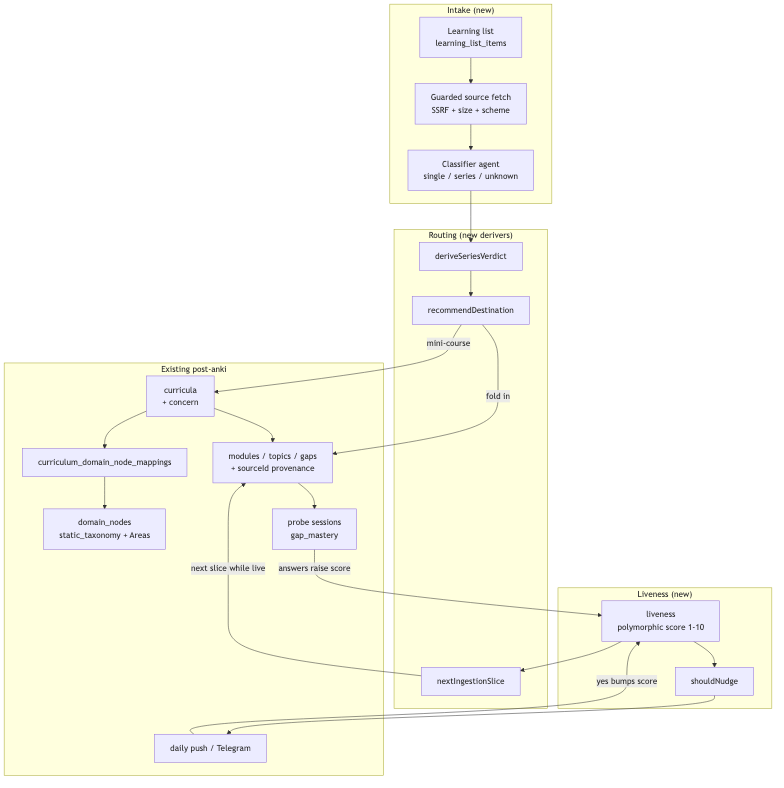

# Architecture: learning list intake

## What changes structurally

A new intake stage sits in front of curriculum creation: capture → guarded fetch → classify →
route. Routing either folds content into the existing objective taxonomy or proposes a
mini-course, and a new polymorphic **liveness** score gates how much content is ever generated.
The generation loop becomes a cycle rather than a one-shot: answering raises liveness, liveness
releases the next slice.

## New infrastructure

- None. No new services, queues, or cloud resources — this runs inside the existing API process
  and reuses the existing daily-push/Telegram delivery path.

## Data model evolution

- `learning_list_items` (new) — captured link/text, title, kind, classification verdict,
  recommendation, status, optional `curriculumId`, ingestion cursor, question ceiling.
- `liveness` (new, polymorphic) — `(entityType, entityId)` unique; score 1–10,
  `lastActivityAt`, `lastNudgeAt`, `lastNudgeResponse`. Applies to learning-list items,
  curricula and domain nodes on one scale. Follows the existing `tag_assignments` /
  `study_item_feedback` polymorphic convention (plain text ids, app-level validation).
- `domain_nodes.kind` (new column) — `"sub_subject" | "area" | null`. Makes the "AI may never
  create an Area" rule enforceable rather than conventional.
- `curricula.concern`, `topics.concern` (new, nullable, existing 6-enum) — promotes concerns from
  gap-level to course/topic level so a cross-cutting course is representable.
- `topics.sourceId` (new, nullable) — provenance back to the source that generated the topic.
  Without it, liveness is not measurable once content is folded into a shared Area.
- `topics.depthElectedAt`, `topics.availableDepth` (new) — records that basics-vs-advanced was
  asked, and what headroom remains above the elected depth.
- Taxonomy seed grows: React, Node.js and AWS as sub-subjects under `web-development`, each with
  10 fixed Areas + "Other" (see `web-development-areas.md`).

## Failure modes

- **Hostile URL** — captured URLs are user-supplied and fetched server-side; without an
  allowlist this is SSRF. Two existing fetch paths in `main` are already flagged unguarded, so
  the guarded fetcher must be shared, not written a third time.
- **Prompt injection** — fetched article text reaches an LLM whose output writes DB rows. Model
  output is validated against the real taxonomy before any write (the existing
  `partitionMappingResult` guarantee), and no fetched content may create Areas or auto-approve.
- **Liveness recomputation drift** — a scheduled recompute that misses a run would silently mark
  live items dead. Liveness is derived at read time from stored timestamps instead.
- **Provenance loss** — a topic folded into a shared Area with no `sourceId` becomes unmeasurable
  and its item can never decay correctly.
- **Runaway generation** — a high-liveness item could keep requesting slices. The per-item
  question ceiling is a hard stop independent of liveness.

## Rollout

- Migration generated via Drizzle and run through the existing migrate script — never pushed.
- Taxonomy additions are additive; existing `curriculum_domain_node_mappings` rows keep pointing
  at the nodes they already reference.
- Existing curricula and nodes start with no liveness row, which reads as unset (not dead) until
  their first recorded activity.
