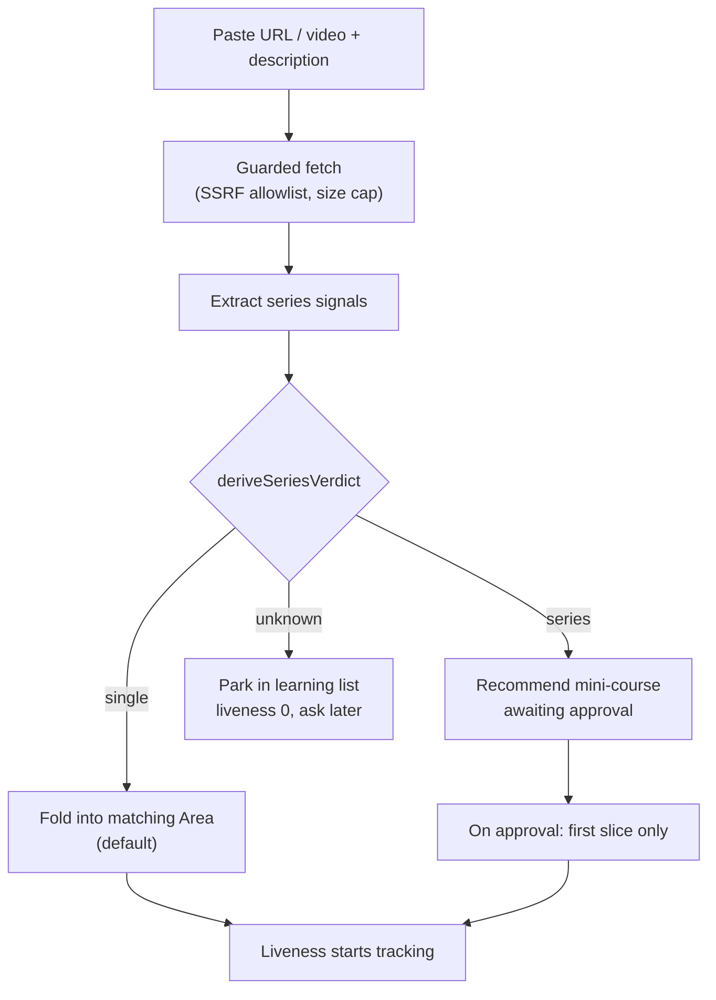

# Scenarios: learning list intake

## Business Scenarios

### SCENARIO 1: Capture a single article — folded in, no course

Ilya pastes one article URL; the classifier finds no series signals, so the article becomes a
handful of topics under the matching fixed Area (e.g. React → Effects & Synchronization) and no
mini-course is created.

What to verify:
- No `curricula` row is created for a single-article capture.
- Generated topics carry `sourceId` provenance back to the captured item.
- The destination Area is an existing `static_taxonomy` node — never a newly invented one.
- The folded-in item gets **no liveness row** — it is generated once and not scored.

### SCENARIO 2: Capture a multi-part series — mini-course recommended, not created

The classifier finds series signals (explicit "part of a series" text, sibling nav links,
pagination), so the system recommends a mini-course and states why, but creates nothing until
Ilya approves.

What to verify:
- The recommendation names the concrete signals that produced the verdict.
- Declining leaves the item captured at liveness 0 with no taxonomy writes.
- Approval is what creates the curriculum — never the classification itself.

### SCENARIO 3: The AWS agentic-AI security series — one guide, cross-cutting

Ilya pastes the "Security for agentic AI on AWS" intro. It is a series twice over (multi-page
guide inside a 9-guide series); the system proposes one mini-course at the **guide** level with
`concern: security`, mapped to several AWS Areas, and captures the 8 sibling guides as separate
un-ingested items.

What to verify:
- Exactly one curriculum is proposed — not one per sibling guide, not one giant course.
- `concern: security` is set, so the course counts toward the cross-cutting rollup alongside
  React and Node.js security material.
- Multiple confirmed `curriculum_domain_node_mappings` rows (AI/ML Services, Identity & Access,
  Observability) rather than one primary node.
- The 8 siblings exist as `learning_list_items` at liveness 0 with zero generated content.

### SCENARIO 4: Only the first slice is generated

On approval of a mini-course, the system generates one module and ~3 topics (roughly 6
questions) — not the full 20–30 question ceiling.

What to verify:
- Generated topic count on approval is the first-slice size, not the ceiling.
- The ceiling and the un-ingested remainder are recorded, so a later slice knows where to resume.
- No LLM call is made for content beyond the first slice.

### SCENARIO 5: Depth is elected per topic, at first study

When a topic first comes up for study, Ilya is asked basics or advanced. Questions are generated
only to the elected depth; the unelected higher depth is recorded as headroom.

What to verify:
- Election is asked once per topic at first study — never for all topics up front.
- Gaps generated do not exceed the elected depth.
- Headroom is stored, so "this could go deeper" is answerable later without re-reading the source.

### SCENARIO 6: Headroom nudge — offer the advanced level later

For a topic elected at basics and since mastered, the system later offers the advanced level.

What to verify:
- Only mastered-at-elected-depth topics are eligible for a headroom nudge.
- Accepting raises elected depth and queues the next slice at that depth.
- Declining suppresses the same offer for a cooling-off period rather than asking every day.

### SCENARIO 7: Sustained answering keeps a series alive

Ilya keeps answering questions traced to a captured item; liveness stays at or above the
generation threshold and the next slice is generated.

What to verify:
- Only answers on gaps provenance-linked to that item raise its liveness.
- The next slice is generated automatically while liveness holds, up to the ceiling.
- Generation stops at the ceiling even when liveness stays high.

### SCENARIO 8: Silence decays liveness and triggers a nudge

Ilya stops answering for a week or two; liveness decays and he is nudged by name — "do you still
want to learn *Security for agentic AI on AWS*?" — alongside similar items.

What to verify:
- Decay is a function of elapsed time since last provenance-linked activity.
- The nudge names the item and surfaces related items rather than asking generically.
- No further generation happens while the item is below the generation threshold.

### SCENARIO 9: Answering the nudge revives the item

Ilya says yes; liveness is bumped back above the threshold and generation resumes.

What to verify:
- An explicit yes raises liveness without requiring any answered question.
- The revived item resumes from the un-ingested remainder, not from the beginning.
- Repeated yes-then-silence does not ratchet liveness permanently upward.

### SCENARIO 10: Declining the nudge makes it dormant, deletes nothing

Ilya says no; the item and everything generated from it stop surfacing but stay in the database
with answer history intact.

What to verify:
- Dormant content never appears in daily push, probes, or recommendations.
- No topic, gap, or mastery row is deleted by a decayed score or a declined nudge.
- A later yes restores it instantly with no regeneration.

### SCENARIO 11: A paused course decays on the same scale

React Native was started months ago and abandoned. It decays and gets nudged exactly like a
captured article, because liveness applies to curricula and Areas too.

What to verify:
- Curricula and domain nodes carry liveness on the same 1–10 scale as learning-list items.
- **A curriculum whose score has decayed but whose nudge was never declined still appears in
  daily push and remains findable.** Decay stops generation; only an explicit decline suppresses
  surfacing. A two-week holiday must never hide a course mid-progress.
- A paused curriculum going dormant does not delete its structure or progress.
- Existing rows without liveness history behave as unset, not as dead.

### SCENARIO 12: Content that fits nothing lands in "Other"

An article about an area with no matching fixed Area is placed in that sub-subject's "Other"
rather than causing a new Area to be created.

What to verify:
- No `domain_nodes` row with `kind: "area"` is ever created by an AI path.
- The item is placed in "Other" and remains fully studiable there.
- "Other" volume is reportable, so the fixed set can be revisited deliberately.

### SCENARIO 13: A video is captured from its description

Ilya pastes a video URL plus the description. The description is the source text; no transcript
fetching is attempted.

What to verify:
- Classification and generation run on the pasted description, not on fetched video HTML.
- A video URL with no description is rejected with a clear reason rather than silently producing junk.

## Technical/Architectural Scenarios

### SCENARIO 14: A hostile URL cannot reach internal services or steer the model

A captured URL points at a private address, or the fetched page contains text instructing the
model to create courses or change depth.

What to verify:
- Fetch enforces an http/https-only scheme check, private/link-local address rejection, redirect
  re-validation, size cap and timeout.
- Fetched text is passed to the model as untrusted data, and model output is validated against
  the real taxonomy before any write — same guarantee `partitionMappingResult` already gives.
- No fetched content can cause an Area to be created or a curriculum to be auto-approved.

### SCENARIO 15: Liveness is recomputed without a cron stampede

Liveness for every tracked entity stays current without recomputing the whole table on a timer.

What to verify:
- Liveness is derived from stored timestamps at read time, so a missed job never corrupts it.
- Concurrent answer submissions do not lose an activity update.
