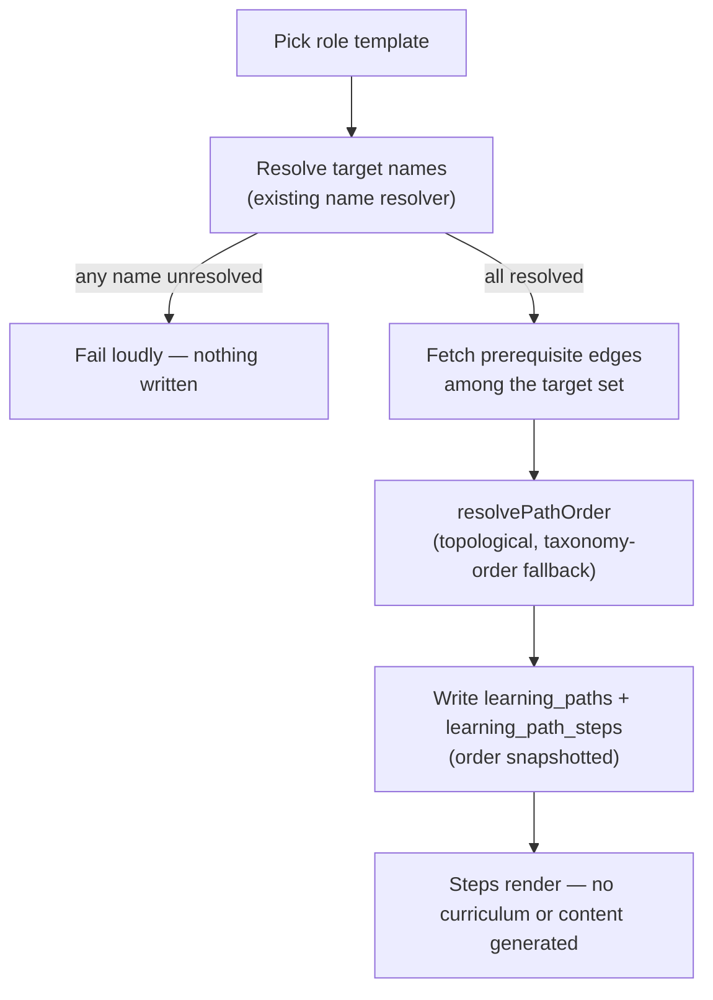

# Scenarios: learning paths

## Business Scenarios

### SCENARIO 1: Create a path from a role template — steps resolve to existing Areas, ordered by prerequisites

Ilya picks "Frontend Engineer" from the role template browser. The system resolves the template's
target Area names against the real taxonomy, orders them with `resolvePathOrder` using the
taxonomy's prerequisite edges, and writes one `learning_paths` row plus one `learning_path_steps`
row per resolved target, each carrying its final `order`.

What to verify:
- Every step's `domainNodeId` is an existing `static_taxonomy` node — never a newly created one.
- Step order respects every prerequisite edge that exists among the chosen targets.
- No `curricula` row, no content, is created by this action.

### SCENARIO 2: No prerequisite edges among the chosen steps — falls back to taxonomy order

A role template's targets happen to share no prerequisite edges with each other (e.g. the ten
React Areas, which carry no edges between themselves in `web-dev-areas.yaml`). Step order falls
back to the taxonomy's own `order` column, deterministically — never an arbitrary or agent-decided
order.

What to verify:
- With zero applicable edges, output order exactly matches taxonomy `order` order.
- Re-running creation from the same template produces the same order every time.

### SCENARIO 3: Starting a path generates nothing — an empty step points at the existing intake flow

Ilya starts a "Cloud Engineer" path. Several AWS Areas have no curriculum mapped to them yet. Those
steps render as not-started with zero progress and a prompt into the existing learning-list capture
flow — nothing is generated on their behalf.

What to verify:
- A step with no `curriculum_domain_node_mappings` (status `confirmed`) row anywhere in its subtree
  shows `topicsIncluded: 0`, `percent: 0` — never a fabricated placeholder.
- No LLM call, no learning-list item, no curriculum is created by starting the path.
- The empty-step CTA reuses the existing capture form; no new capture surface is built.

### SCENARIO 4: A path never creates a domain node

A role template names a target that no longer matches any real node (a typo, or a taxonomy rename
that outpaced the template). Path creation fails loudly before writing anything, rather than
silently inventing an Area or skipping the step.

What to verify:
- `resolveNodePathByName` returning no match aborts the whole creation — zero rows written.
- No `domain_nodes` row with `kind: "area"` (or any kind) is ever created by this flow.
- The failure names the specific unresolved target so it's fixable in the YAML.

### SCENARIO 5: Step progress reuses the existing subtree rollup

A step targets an entire sub-subject (e.g. "React") rather than one Area. Its progress rolls up
every Area beneath it exactly the way the domain map's own node rollup already does, because
`pathProgress` calls `domainNodeProgress` unmodified per step.

What to verify:
- A sub-subject-level step's `topicsIncluded`/`topicsMastered`/`percent` match what the domain map
  already shows for that same node.
- An Area-level step rolls up only that Area's own topics.
- No second, path-specific rollup implementation exists anywhere in this module.

### SCENARIO 6: Progress and step status are computed at read time, never stored

Ilya answers a question that pushes a step's mastered-topic count up. The very next fetch of the
path shows the new percent and status — no background job, no cache invalidation, because nothing
was ever written to a progress column in the first place.

What to verify:
- `learning_path_steps` carries no progress/status column at all.
- Two reads of the same path immediately before and after an answer differ correctly with zero
  extra writes to the path tables.
- A step's status can never disagree with its live curriculum/gap data (nothing to drift).

### SCENARIO 7: Next-step selection is the first not-done step, in fixed order — never a graph

All of a path's steps except the third are `done`. The recommended next step is the third step —
picked purely by walking the stored order, not by any mastery-based re-ranking or shortest-path
computation over the prerequisite graph.

What to verify:
- `nextPathStep` returns the first non-`"done"` step by stored order, full stop.
- The prerequisite graph itself (`domain_node_prerequisites`) is never sent to or rendered by the
  web client — only the resolved linear step list is.
- A path with every step `"done"` returns `null` from `nextPathStep`.

### SCENARIO 8: "What to study now" inside a step reuses the existing daily-push selection

Ilya opens the current step's detail. The question offered is chosen by the same
`selectDailyPush` the rest of the product already uses, called with candidates filtered to that
step's mapped curricula — not a second, path-specific ranking algorithm.

What to verify:
- The candidate list passed to `selectDailyPush` is exactly the topics/gaps under the current
  step's mapped, confirmed curricula — nothing from other steps or unrelated curricula leaks in.
- `selectDailyPush`'s own wanted-first / weakest / stale-refresh logic is untouched and unduplicated.
- No answer submitted from a path screen behaves differently from one submitted anywhere else in
  the product (same endpoint, same evaluation).

### SCENARIO 9: A path completes once every step reaches done

The last of Ilya's "Frontend Engineer" path's steps reaches 100% mastered. The path's overall
status flips to `"done"` on the next read.

What to verify:
- `pathProgress`'s `overallStatus` is `"done"` iff every step's status is `"done"`.
- Reading a completed path repeatedly is idempotent — no write happens on read.
- `completedAt` is set once, by the controller, the first time a read observes `"done"` — never
  recomputed or overwritten on later reads.

### SCENARIO 10: Abandoning a path deletes nothing

Ilya abandons the "Cloud Engineer" path halfway through. It stops being suggested, but every
mapped curriculum, topic, gap, and mastery row is untouched — exactly like declining a liveness
nudge never deletes anything.

What to verify:
- `PATCH` to abandon only changes `learning_paths.status`.
- No cascade touches `curriculum_domain_node_mappings`, topics, gaps, or `gap_mastery`.
- The path (and its history) remains readable, just excluded from "active paths" listings.

### SCENARIO 11: Two paths sharing the same Area don't double-count that Area's progress

Ilya runs "Frontend Engineer" and "Full-Stack Engineer" at once; both include the same React Area
as a step. Each path's own `pathProgress` call reports that Area's real percent — but a single
mastered topic is never double-counted within either call.

What to verify:
- `pathProgress`'s dedup-by-topic-id (the same fix `domainNodeProgress` already applies for a
  shared-ancestor subtree) prevents inflated `topicsIncluded`/`topicsMastered` when two of a
  path's own steps happen to overlap (e.g. one step at sub-subject level, another at one of its
  Areas).
- The two paths' progress numbers for the shared Area agree with each other and with the domain
  map.

### SCENARIO 12: Web — browsing a role template previews its resolved steps without creating anything

Ilya opens the role template browser before committing. Each template shows its resolved,
ordered target list (names, not raw ids) computed live — no `learning_paths` row exists yet.

What to verify:
- `GET /role-templates` performs the same resolution + ordering as creation but writes nothing.
- Leaving the browser without starting a path leaves no trace in the database.

### SCENARIO 13: Web — starting a path creates it in one action; tracking shows progress and next step

Ilya taps "Start" on a template. The path and all its steps are created in one request and the
detail view immediately shows every step at `not_started`, overall percent 0, and the first step
highlighted as next.

What to verify:
- One `POST /learning-paths` call yields a fully-stepped, readable path — no follow-up "add steps"
  calls are needed.
- The detail view's per-step progress bars, overall percent, and next-step highlight all come from
  a single `pathProgress` read, not N separate calls.
- The question surface on the current step is the same component used by daily push elsewhere.

## Technical/Architectural Scenarios

### SCENARIO 14: Prerequisite edges resolve from the YAML's cross-branch ids, order-independent

`it-taxonomy.yaml`'s prerequisite ids reference nodes anywhere in the tree, including earlier
top-level domains from later ones (e.g. `cloud-computing`'s prerequisites name `networking`,
declared earlier in the file) and siblings within the same branch. The seed script's two-pass
resolution (build the complete `yamlId → dbId` map across every root first, then resolve edges)
must produce correct edges regardless of declaration order.

What to verify:
- Every non-empty `prerequisites: [...]` in `it-taxonomy.yaml` produces a matching
  `domain_node_prerequisites` row after a single seed run.
- Re-running the seed script inserts zero duplicate edge rows (existence-checked upsert, same
  convention as node seeding).
- A forward reference (prerequisite id not yet inserted at declaration time) resolves correctly
  because resolution happens only after the full map is built.

### SCENARIO 15: A cyclic or dangling prerequisite among a path's chosen steps degrades safely

A future taxonomy edit accidentally introduces a cycle among a role template's target set (or a
target references a prerequisite id that was never seeded). `resolvePathOrder` must not throw or
hang — it falls back to the deterministic taxonomy-`order` ordering for the affected targets.

What to verify:
- A cycle among `targetNodeIds` does not infinite-loop (bounded, like `domainNodeProgress`'s
  `MAX_DEPTH` guard and `isAncestor`'s visited-set termination).
- A dangling prerequisite reference (edge points outside `targetNodeIds` or at a real node whose
  own further prerequisites are unresolvable) is simply ignored — it never blocks path creation.
- Path creation always succeeds for a valid target set, even when its prerequisite subgraph is
  malformed.
