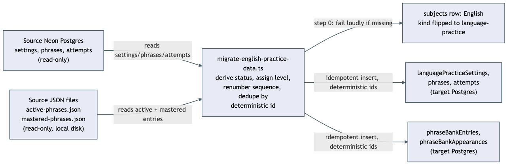

<!-- Plan auto-confirmed by grand-loop -->

# Architecture: Migrate existing English practice data into post-anki

## What changes structurally

Today, the English subject's practice tables (`phrases`, `attempts`, `phraseBankEntries`,
`phraseBankAppearances`, `languagePracticeSettings`) only ever receive rows from post-anki's own
live generate/grade loop. This plan adds a second, one-time write path into the exact same tables:
a standalone script that reads from a retired sibling app's own Neon Postgres instance (three
tables: `settings`, `phrases`, `attempts`) and its local JSON phrase-bank files
(`learning/active-phrases.json`, `learning/mastered-phrases.json`), transforms that data to fit
post-anki's schema, and writes it once. No new tables, columns, or services — the target schema
already fully covers this data (it shipped in the phrase-bank-mastery plan, which explicitly
deferred this exact migration). The only structural addition is the script itself and the small
amount of derivation logic it needs (status inference, level assignment, sequence renumbering).

The two source systems have no relationship to each other structurally — the Neon tables and the
JSON files were two independent practice mechanisms in the source app (a server-backed translation
drill loop, and a separate local-script-driven phrase recycling system) that happen to both feed
the same target concepts (`phrases`/`attempts` and `phraseBankEntries`/`phraseBankAppearances`
respectively). The script treats them as two independent input streams that both write into one
shared target subject.

## New infrastructure

None. No new cloud resources, deploy pipeline, or IaC changes. This is an application-level script —
a thin CLI entry under `apps/api/scripts/` calling real logic under
`apps/api/src/migrate-english-practice-data/` (split the same way `seed-domain-nodes.ts` already
splits its CLI entry from its testable logic, so its integration test lands under `src/` where
`vitest.integration.config.ts` actually looks) — run once by a human via `node --import tsx`,
connecting to two existing Postgres databases over their existing connection strings — the same "New
infrastructure: None" precedent as `docs/architecture/phrase-bank-mastery.md`, which built the
tables this script writes into.

## Data model evolution

No schema changes. Every target table this script writes to already exists:
`subjects` (one `UPDATE` to flip `kind`), `languagePracticeSettings`, `phrases`, `attempts`,
`phraseBankEntries`, `phraseBankAppearances`. The mapping from source to target:

| Source | Target | Notes |
|---|---|---|
| `settings.level` (single row, id=1) | `languagePracticeSettings.level` + the level every migrated `phraseBankEntries` row is assigned | Only level signal in the source; also drives SCENARIO 7 |
| `phrases` (uuid pk, `batch_id`, `level`, `position`, `russian`, `reference_english`, `domain`, `created_at`) | `phrases` (text pk, `subjectId`, `batchId`, `level`, `pack: "General"`, `position`, `russian`, `referenceEnglish`, `domain`, `targetPhraseBankEntryId: null`, `sequenceNumber`, `createdAt`) | `domain`/`level` enums are identical string sets — direct pass-through, no mapping table. `sequenceNumber` assigned per (level) group by `created_at` order, continuing from that level's real `nextSequenceBase` (SCENARIO 10) |
| `attempts` (uuid pk, `phrase_id` fk, `user_answer`, `score`, `verdict`, `feedback`, `native_alternatives text[]`, `created_at`) | `attempts` (text pk, `subjectId`, `phraseId`, `userAnswer`, `score`, `verdict`, `feedback`, `nativeAlternatives jsonb`, `createdAt`) | `verdict` enum identical — direct pass-through. `phraseId` resolved via the source-id → target-id map built while migrating `phrases` |
| `active-phrases.json` entries (`id`, `phrase`, `category`, `mode`, `recycleSchedule.{masteryStage, correctCountInCycle, incorrectCountInCycle, lastCorrectAtSentence, lastCorrectDate, scheduledForSentence, appearanceHistory[]}`) | `phraseBankEntries` (`status`, `masteryStage`, `correctCountInCycle`, `incorrectCountInCycle`, `lastCorrectAtSentenceCount`, `lastCorrectDate`, `scheduledForSentenceCount`) + one `phraseBankAppearances` row per `appearanceHistory` item | `status` has no direct source field — derived (see Decisions in `spec.md`). Schedule fields renumbered into the target's counter space, not copied verbatim (SCENARIO 3). `attempts`/`correct`/`streak`/`usageCount`/`mode` counters have no target column and are intentionally dropped (recorded, not silently lost) |
| `mastered-phrases.json` entries (`id`, `phrase`, `category`, `masteredDate`, `notes`) | `phraseBankEntries` with `status: "mastered"`, `masteryStage: 3`, `masteredAt` | Direct, low-ambiguity mapping |

No FK ordering hazard in practice: migrated `phrases` rows always get `targetPhraseBankEntryId:
null` (the source app never linked its batch-practice phrases to its phrase-bank concept — that
link is a post-anki-only design), so the one real FK in this cluster is never exercised by this
script. The only real insert-order dependency is `phraseBankAppearances.phraseBankEntryId`, which
must reference an already-inserted `phraseBankEntries` row (SCENARIO 9).

## Failure modes

- **Missing source or target credentials** — fails loudly before any connection attempt, naming the
  exact missing env var (SCENARIO 6).
- **Missing prerequisite subject** — fails loudly if no `subjects` row named "English" exists yet,
  matching `seed-domain-nodes.ts`'s existing "fail if prerequisite missing" convention, rather than
  creating one implicitly.
- **Interrupted mid-run** — the entire live write is one database transaction (`spec.md`'s Decision
  13), so a crash before commit rolls back to exactly the pre-run state — nothing partially visible.
  Simply re-running is always safe regardless of when the interruption happened: every row's id is a
  deterministic function of a stable source natural key, so a re-run after a pre-commit crash just
  repeats the same insert, and a re-run after a genuinely completed prior run finds every row already
  present via the existing-row check and creates nothing new (SCENARIO 4, SCENARIO 9).
- **Source JSON files moved or absent** — fails loudly naming the exact expected path (overridable
  via `SOURCE_LEARNING_DIR`, defaulting to the sibling repo's known local path), rather than
  silently skipping the phrase-bank import half of the migration.
- **A live-created phrase-bank entry collides with an imported active entry** — if the English
  subject is opened and generates a real batch between the `kind` flip (step 0) and this script's
  actual run, the live orchestrator may already have created a `phrase_bank_entries` row whose
  normalized text matches an active entry this script is about to import; the target schema's own
  partial unique index would reject a naive duplicate insert. Handled by running the same match the
  live app uses (`matchExistingPhraseBankEntry`) before every *active* phrase-bank insert and
  reusing the live entry (attaching only the imported history, never overwriting live progress) —
  see `spec.md` SCENARIO 11. Mastered imports skip this check entirely and always insert as their
  own row (`spec.md` Decision 16) — the unique index excludes mastered rows, so no collision is
  possible there, and mastered imports carry no history to attach even if one were found.
- **Reading the phrase-bank sequence ceiling too early** — if `currentMaxSequence` for a level is
  read before that level's `phrases` rows are fully migrated, imported active entries schedule
  against a stale ceiling and go immediately overdue instead of due-next-batch. Prevented
  structurally by the CLI's own step order, not left as a race (SCENARIO 12).

## Rollout

This is a single manual run, not a deploy. The human:
1. Supplies `SOURCE_DATABASE_URL` (source app's Neon connection string) and confirms the target
   `DATABASE_URL` already points at post-anki's real database (not a local/dev copy, unless a
   local-copy dry run is intentionally being exercised first).
2. Runs `--dry-run` first, reviews the printed summary against the source app's own data —
   spot-check phrase-bank counts against `active-phrases.json`'s and `mastered-phrases.json`'s own
   `phrases.length`, never `learning/index.json`'s cached stats, which were found stale during
   planning (it reports 6 active/8 total against the real files' 12 active/14 total).
3. Runs the script live once dry-run output looks correct.
4. Confirms the Phrase Bank panel and batch-practice attempt counts reflect the import (SCENARIO 2).
5. Only after that confirmation does the wishlist item's own "done when" criterion allow the source
   repo/worktree to be archived.

No rollback path beyond re-running is designed — this only inserts new rows (never updates existing
non-imported rows), so if something looks wrong the affected imported rows can be deleted directly
by their deterministic id prefix (`_import_` — see `spec.md`) and the script re-run after fixing the
mapping, without touching any live-generated data (which never shares that id prefix).
