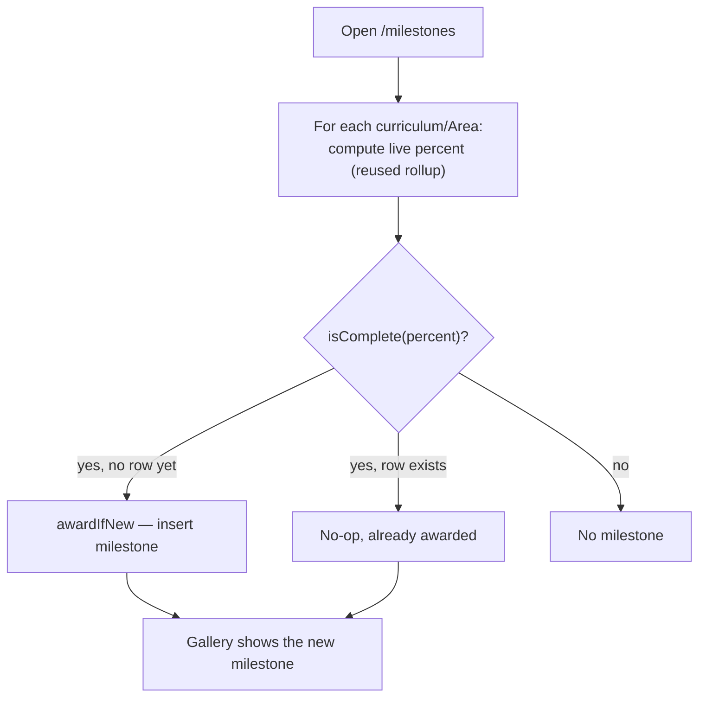

# Scenarios: milestones and completion

## Business Scenarios

### SCENARIO 1: A curriculum reaching 100% mastered awards a milestone on the next read

Ilya finishes the last included topic in "React Effects & Synchronization." The next time he opens
`/milestones`, a new milestone row exists for that curriculum.

What to verify:
- `isComplete` is evaluated from the curriculum's own `moduleProgress` percent — the same
  calculation the curriculum detail page already shows, never a second progress formula.
- The milestone's `achievedAt` is set to the moment of that read, not backdated to when the last
  topic was actually mastered.

### SCENARIO 2: An Area reaching 100% mastered awards a milestone the same way

Every confirmed curriculum mapped under the "State Management" React Area is fully mastered. The
next `/milestones` read awards an Area-level milestone for that node.

What to verify:
- `domainNodeProgress` is called unmodified, scoped to `domain_nodes` rows with `kind: "area"` —
  no second subtree-rollup implementation.
- The same `isComplete` deriver used for curricula (Scenario 1) is reused here, not a parallel
  Area-specific completion check.

### SCENARIO 3: A milestone is recorded exactly once, never regenerated on a later read

Ilya opens `/milestones` five times over a week after a curriculum reaches 100%. Exactly one
`milestones` row exists for it the whole time.

What to verify:
- `awardIfNew` is a genuine insert-if-not-exists — a second, third, fourth read for the same
  already-awarded entity/criteria produces zero additional rows and zero errors.
- `achievedAt` never changes after the first award.

### SCENARIO 4: Two concurrent reads never produce two milestone rows for the same achievement

Two browser tabs both load `/milestones` at nearly the same moment, both observing "not yet
awarded" for the same curriculum before either write commits.

What to verify:
- The DB-level unique index on `(entityType, entityId, criteriaKey)` is what actually prevents the
  duplicate — not just an app-level check-then-insert.
- The losing concurrent insert's `23505` violation is caught and treated as "already awarded,
  nothing to do," not surfaced as an error to the user.

### SCENARIO 5: Milestone evaluation only happens when the milestones page is opened

Achieving 100% on a curriculum does not itself trigger anything — no write happens until Ilya
actually visits `/milestones`.

What to verify:
- No cron, scheduler, or answer-submission code path calls `awardIfNew` — it is reachable only
  through `GET /milestones`'s own handler.
- A curriculum that reached 100% a month ago and has never had `/milestones` opened since still
  gets correctly awarded the very first time it is opened — no missed-window failure mode.

### SCENARIO 6: A later structural change never revokes or flags an already-awarded milestone

The "React Effects & Synchronization" curriculum was awarded a milestone last month. This month, a
new topic is folded into it via the learning-list intake flow, dropping its live `moduleProgress`
percent to 91%. The milestone is untouched.

What to verify:
- `listMilestones` reads only the `milestones` table's own rows — it never re-derives or
  re-validates against the entity's current live percent.
- The milestones gallery shows no "at risk," no strikethrough, no percent for that entry — just the
  achievement and its date, exactly as before the regression.
- The live 91% is visible elsewhere (Module 4's coverage report, the curriculum detail page) but
  never surfaces on the milestones page itself.

### SCENARIO 7: A milestone can never be deleted, decayed, or un-awarded by any code path

No feature anywhere in the product — liveness decay, a nudge decline, a curriculum deletion's
cascade, a domain-node merge — removes or edits an existing `milestones` row.

What to verify (code review, not a runtime assertion):
- No `DELETE FROM milestones` or `UPDATE milestones SET achievedAt` exists anywhere outside this
  module's own repo file.
- Deleting a curriculum cascades its modules/topics/gaps/sources (existing behavior, unchanged) but
  is NOT wired to also delete that curriculum's milestone row — the milestone is a historical fact
  about something that was once true, independent of whether the curriculum still exists to prove
  it.

### SCENARIO 8: Web — the milestones gallery is celebratory, with nothing resembling a backlog

Ilya opens the milestones page and sees a simple gallery: what was achieved, and when. No counts of
"3 more to go," no overdue markers, no red badges.

What to verify:
- The gallery component renders only `{entityType, entityLabel, criteriaKey, achievedAt}` per
  milestone — no percent, no "next milestone," no comparison to anything not-yet-achieved.
- An empty gallery (nothing achieved yet) shows a neutral empty state, not a guilt-inducing "0
  milestones — get started!" framing.

## Technical/Architectural Scenarios

### SCENARIO 9: `isComplete` is a pure one-line deriver, reused for both entity types

`isComplete(percent)` is the single completion check for both curricula and Areas — no
curriculum-specific or Area-specific completion logic exists anywhere.

What to verify:
- `isComplete` lives in `packages/core/src/milestone/`, takes a plain `number`, returns a plain
  `boolean`, with zero DB/HTTP/LLM dependency.
- Both `milestone.repo.ts`'s curriculum-award path and Area-award path call the same imported
  function — verified by there being exactly one definition, not two near-identical ones.
