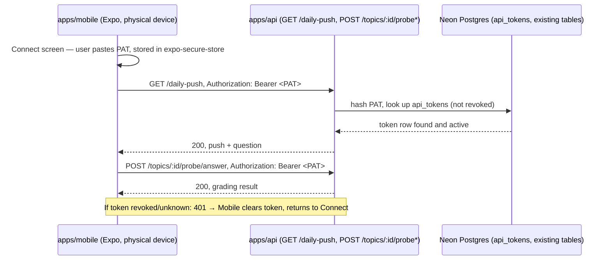

# Architecture: React Native mobile app (core study/review flow)

## What changes structurally

**A new `apps/mobile` app joins the monorepo as a fourth client of `apps/api`** (alongside
`apps/web` and `apps/bot`) — no parallel backend, no new service. It talks to the same REST
routes `apps/web` already uses for the study/review loop: `GET /daily-push`,
`POST /topics/:id/probe`, `POST /topics/:id/probe/answer`. This is a direct extension of the
reuse pattern the local-first Electric sync work established — "one gatekeeper, every client
goes through it" — except mobile calls `apps/api` directly (no same-origin proxy hop) since a
native app has no server tier to proxy through.

**The Electric shape endpoint (`GET /electric/v1/shape`) is explicitly NOT part of this slice.**
The task references it only as prior art for "reuse the gatekeeper, don't stand up a parallel
backend" — the actual study/review flow (daily push, probe start/answer) is plain REST and
predates Electric entirely. Wiring TanStack DB/ShapeStream into the mobile client would be scope
creep relative to "core flow, not full parity" and is deferred to a future slice, if ever.

**A new authentication primitive is required because the existing one is unsafe to embed in a
native client.** `apps/web`'s `API_SHARED_SECRET` is held server-side and injected by a
same-origin proxy route — that only works because `apps/web` has a server tier to hide the
secret in. A distributed app bundle (mobile, and eventually desktop) has no such trusted tier;
embedding `API_SHARED_SECRET` in the app would let anyone who downloads the app extract and reuse
it against production. Per-user (or per-device) authentication is required instead.

**Decision: a revocable personal access token (PAT), not a login screen.** The task's own wording
floated "e.g. a login screen exchanging credentials for a session token" — this plan deliberately
takes a lighter path instead, because:
- This is a genuinely single-user app today (same precedent the Electric sync spec already
  established for `user_streaks` and its no-multi-tenancy stance) — there is no registration flow,
  no password, no other user to onboard. Building username/password + registration + password
  reset would be infrastructure for a user base of one.
- A PAT is still **per-user authentication** in the sense that matters here: it is not a static
  secret baked into the app bundle, it is issued out-of-band, stored only on the device that
  requested it (`expo-secure-store`, OS keychain-backed), independently revocable, and never
  shipped in source control or the app binary.
- This is the same shape as GitHub/API personal access tokens — an established, well-understood
  pattern for "one human, multiple API-calling clients."
- If Post Anki ever needs multiple humans, the `api_tokens` table already carries a `label`
  column and is one migration away from a `user_id` foreign key; nothing here is a dead end.

**`apps/api`'s single `authorized()` gate grows a second, additive check — it does not replace
the first.** `apps/web`'s same-origin proxy and `apps/bot` keep using `API_SHARED_SECRET`
unchanged; a request is authorized if it presents *either* the correct shared secret *or* a
valid, unrevoked PAT (hash-compared against the new `api_tokens` table). This is deliberately
additive so existing clients see zero behavior change — the riskiest regression here is breaking
the one gate every route already depends on, so this is called out as its own scenario
(SCENARIO 5) rather than assumed safe.

**Token issuance stays a script, not an HTTP endpoint.** There is no "register" or "login" route.
A new `apps/api/scripts/create-api-token.ts` (same category as the existing `scripts/migrate.ts`)
connects to the DB directly, inserts a hashed token, and prints the raw value once. This avoids
a chicken-and-egg problem (no endpoint needs its own auth to mint the first credential) and keeps
the trust boundary for "who can create a valid credential" at "whoever can run scripts against
this database" — the same boundary migrations already sit behind.

## New infrastructure

None. No new Cloud Run service, no new Pulumi resource — `apps/mobile` is a client, not a
service; it ships as an Expo app built with EAS (or run via Expo Go for local iteration), not
deployed as part of this repo's existing IaC. The only backend-side addition is one new database
table (`api_tokens`) reached through the existing Neon/Drizzle path, applied via the existing
`db:migrate` script — no new deployment target.

## Data model evolution

New table `api_tokens` (Drizzle, `apps/api/src/db/schema.ts`):
- `id` (text, primary key)
- `label` (text, not null) — human-readable name shown when listing/revoking, e.g. "Ilya's phone"
- `tokenHash` (text, not null, unique) — SHA-256 (or equivalent) hash of the raw token; the raw
  value is never stored
- `createdAt` (timestamp, not null, default now)
- `lastUsedAt` (timestamp, nullable) — updated best-effort on successful auth, for visibility into
  whether a token is still in use before revoking it
- `revokedAt` (timestamp, nullable) — null means active; set means the token no longer authorizes
  anything

Generated via `drizzle-kit generate`, applied via the existing `db:migrate` script — never
pushed directly, per the constitution's migration rule.

## Failure modes

- **Stale/revoked token mid-session:** any `apps/api` route returns 401 the same way it already
  does for a bad shared secret; the mobile client's fetch layer treats 401 as "clear stored token,
  return to Connect screen" globally, not per-screen (SCENARIO 4).
- **Shared-secret regression:** covered explicitly as SCENARIO 5 — the additive check must not
  change the 200/401 outcome for any existing `API_SHARED_SECRET` caller.
- **No network / apps/api unreachable:** the mobile app has no offline cache in this slice (no
  Electric/TanStack DB involved here) — a failed fetch shows a retry affordance; there is no
  silent data loss because nothing is written optimistically on-device.
- **Token minted but never used:** harmless — `lastUsedAt` stays null, visible if the user later
  audits `api_tokens` directly.

## Rollout

Local-only for this slice: run `apps/api` locally (already how `apps/web`/`apps/bot` are
developed), mint one token with the script, run the Expo dev server, and connect from Expo Go on
a physical device (this development machine has neither an iOS Simulator nor an Android emulator
available — see Definition of Done for what that means for verification here). Pointing the
mobile app at the deployed Cloud Run `apps/api` instead of localhost is a config change
(`EXPO_PUBLIC_API_BASE_URL`), not a structural one, and is left for whenever the user actually
wants to use this off their local network — not required to prove this slice.

## Flow

