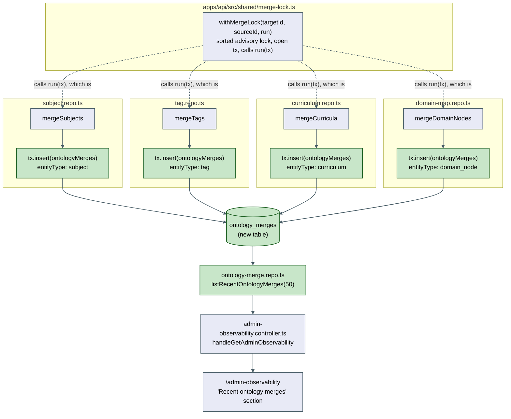

# Architecture: Merge/split audit trail

## Why this needed its own architecture.md

This item touches a shared preamble (`withMergeLock`) used by four independent entity repos, and
its scope was explicitly widened mid-flight (issue #62 was filed against two merges; two more now
exist). The design decision of *where* the shared behavior lives — inside the generic helper vs.
distributed across the four call sites — is exactly the kind of structural choice this file exists
to record, plus the explicit relationship to a second, still-open wishlist item that touches
adjacent code for a different reason.

## Log-write placement

`withMergeLock` itself is untouched — no new parameter, no new generic constraint. Each merge
function's own callback grows by exactly one statement, using data (`targetRow`/`sourceRow`, the
already-built result object, the open `tx`) it already had in scope for its own return value. This
keeps the shared helper's contract exactly as narrow as its own doc comment already claims, and
means a future fifth merge function adds logging the same way the first four did — by copying the
one-line pattern, not by learning a hook API.

## Relationship to the provenance-aware fix — why this table is not a foundation for it

```mermaid
flowchart LR
  subgraph ThisItem["This item: ontology_merges (event log)"]
    direction TB
    E1["One row per MERGE OPERATION"]
    E2["Keyed by target_id + source_id<br/>(source_id refers to a now-deleted row)"]
    E3["Answers: 'what merges happened, and when?'"]
  end

  subgraph ProvenanceItem["Provenance fix: modules/topics.merged_from_curriculum_id (state marker)"]
    direction TB
    P1["One nullable column on EVERY row"]
    P2["Keyed by the row's OWN id<br/>(always resolvable, never deleted out from under it)"]
    P3["Answers: 'did THIS row come from a merge?'<br/>at arbitrary future delete-time"]
  end

  ThisItem -. "cannot cheaply answer P3's question —<br/>source_id is gone by the time<br/>clearCurriculumStructure runs" .-> ProvenanceItem

  classDef default fill:#e8eaf6,stroke:#455a64,stroke-width:1.5px,color:#000
  classDef gapNode fill:#ffe0b2,stroke:#e65100,stroke-width:1.5px,color:#000
  linkStyle default stroke:#455a64,stroke-width:1.5px
  class ThisItem gapNode
```

Both items are, in a loose sense, about "where did this row come from" — that's the surface-level
similarity that made the still-open provenance wishlist item note a possible shared design surface
with issue #62. Worked through concretely here so the note doesn't get taken further than it should:

- **This item's log answers an operation-level question** ("a merge from curriculum B into
  curriculum A happened at time T, moving N modules") — useful for a human audit trail, entirely
  read by a human, never read back by application code.
- **The provenance fix needs a row-level, always-resolvable answer** — `clearCurriculumStructure`
  runs at retry/reparse time, which can be arbitrarily long after any merge, against whichever rows
  currently sit under a curriculum id. It cannot afford a reverse lookup through an operation log
  keyed by an id (the source curriculum's) that no longer exists, especially once more than one
  merge has landed on the same target over time — the log alone cannot tell "was this specific
  currently-existing module one of the ones moved by merge #1, merge #2, or was it native to the
  target all along."

**Conclusion, stated for future implementers of the provenance item:** do not attempt to derive or
extend `ontology_merges` into a provenance mechanism. Build the proposed `merged_from_curriculum_id`
(or equivalent) column directly on `modules`/`topics`, written at `mergeCurricula`'s reassignment
step, independent of this item's own log write. The two features share a call site
(`mergeCurricula`'s reassignment step gets two independent one-line additions over time — this
item's log insert, and later the provenance column write) but no shared table, shared function, or
shared migration.

## Documentation changes

Publishes `docs/architecture/ontology-audit-trail/architecture.md` during implementation, carrying
both diagrams above.
