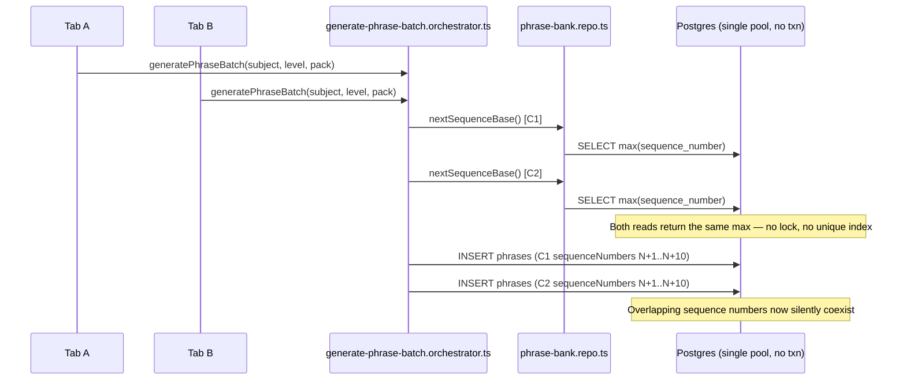
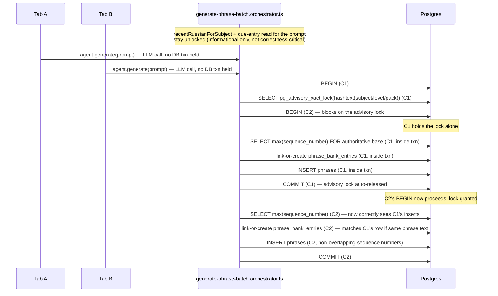

# Architecture: Phrase-bank concurrency and data-integrity fix

## Why this file exists

This is the first place in the codebase that introduces a real database transaction
(`db.transaction(...)`) and the first use of a Postgres advisory lock or a `SELECT ... FOR UPDATE`
row lock — confirmed by grep: no `.transaction(` call exists anywhere under `apps/api/src` today.
Every existing repo function calls the shared `getDb()` pool singleton directly, one statement at a
time. This plan changes that shape for exactly two write paths, so it counts as an architectural
shift under this project's own rule (new async/transactional boundary) even though the fix is
additive at the schema level and touches no API response shape.

## Current shape (as-built, confirmed against source 2026-07-28, no drift from review.md)

The same unlocked-read-then-write shape repeats in `linkOrCreateTargetPhrases` (read-then-insert
into `phrase_bank_entries`, no unique index to catch a duplicate) and in
`updatePhraseBankEntryAfterAttempt` (unconditional `UPDATE ... WHERE id = $1`, no version check, so
a concurrent grade against the same entry can silently overwrite a newer state with an older one).

## Proposed shape

## Key design decision: what's inside the lock, and what isn't

`review.md`'s proposed fix says "wrap `nextSequenceBase` + the batch insert in a transaction guarded
by `pg_advisory_xact_lock`." Taken literally, the current code order would put the LLM call
(`agent.generate`, typically 1-5s) *inside* that window, since `nextSequenceBase` is read before the
prompt is built today. Holding a Postgres transaction — and one of only 4 pooled connections open
(`apps/api/src/db/client.ts`, `max: 4`) — for the duration of an external network call is avoidable
cost with no correctness benefit: nothing about the LLM call needs the lock or the transaction.

**Decision (autonomous, safe/reversible default):** split the existing single `nextSequenceBase`
read into two conceptually different reads that happen to use the same function:
1. An early, unlocked read — used only to compute `currentSequenceNumber` for
   `dueEntriesForScope`, i.e. which phrases to suggest recycling in the prompt. Staleness here has
   no data-integrity consequence — worst case the model is offered a slightly stale due-list, which
   only affects which phrase gets recycled a batch earlier or later, not correctness.
2. An authoritative re-read of `nextSequenceBase`, taken *after* the LLM call returns, inside the
   locked transaction, immediately before assigning `sequenceNumber` values and inserting. This is
   the value that must never race.

This changes `generatePhraseBatch`'s internal ordering (still: read context → call LLM → resolve →
write) but keeps the write path — `nextSequenceBase` (re-read) → `linkOrCreateTargetPhrases` →
`toPhraseRows` → `insertPhraseBatch` — entirely inside one `db.transaction()` guarded by
`pg_advisory_xact_lock(hashtext(subjectId || level || pack))` as the transaction's first statement.
This closes both race 1 (`nextSequenceBase`) and race 2 (`linkOrCreateTargetPhrases`) with a single
lock scope, since both live inside the same write window for the same subject/level/pack tuple.

**Why a single advisory lock scope is acceptable here and not a scalability risk:** per
`verification-repo/projects/post-anki/post-anki/project.json`, this is a "single-owner local app,
no browser login flow." Real-world concurrency on one subject/level/pack tuple is "the same person
has two browser tabs open," not concurrent multi-user load. Serializing writes for that tuple has no
observable cost under the app's actual usage pattern; a lower-latency design (e.g. optimistic
sequence assignment with retry-on-conflict) would add real complexity for a concurrency level that
doesn't exist in production.

**Exact lock call form.** `hashtext(text)` returns `int4`; `pg_advisory_xact_lock` has both a
`(bigint)` and an `(int4, int4)` overload. To resolve unambiguously in the generated SQL rather than
risk an overload-resolution surprise at implementation time, the call is written with an explicit
cast: `SELECT pg_advisory_xact_lock(hashtext($1 || $2 || $3)::bigint)` where `$1/$2/$3` are
`subjectId`/`level`/`pack`.

**Non-negotiable: every DB call inside the locked transaction body must take `tx` explicitly.** The
shared pool caps at 4 connections (`apps/api/src/db/client.ts`, `max: 4`). If any function invoked
from inside `getDb().transaction(async (tx) => { ... })` — `nextSequenceBase`, `matchExistingEntryId`,
`createPhraseBankEntry`, `insertPhraseBatch` — silently falls back to its own default `getDb()`
parameter instead of the `tx` it was passed, that call checks out a *second*, independent pooled
connection while the first transaction still holds the advisory lock and its own connection open.
Under two genuinely concurrent `generatePhraseBatch` calls this is still survivable (2 transactions
× at most 2 connections each ≤ 4), but it silently breaks the entire point of threading one `tx`
through the write path — a function reading through a different connection than the one holding the
lock is not protected by that lock at all, re-opening the exact race this plan closes. Treat a
default-parameter fallback anywhere inside the locked path as a bug to catch in code review, not a
convenience.

**Repo function signature change:** `nextSequenceBase`, `matchExistingEntryId`,
`createPhraseBankEntry` (in `phrase-bank.repo.ts`), and `insertPhraseBatch` (in `practice.repo.ts`)
each currently call the module-level `getDb()` singleton directly. They gain an optional trailing
`db` parameter (the drizzle transaction/pool executor type, defaulting to `getDb()`) so
`generatePhraseBatch` can thread one `tx` through all of them inside `getDb().transaction(async
(tx) => { ... })`. This is the standard Drizzle pattern for composing multiple repo calls into one
transaction; no repo function's public call shape changes for existing non-transactional callers.

## Race 3 — grading's lost-update fix

`applyPhraseBankUpdates` (in `grade-attempts.orchestrator.ts`) currently: batch-reads entries via
`getPhraseBankEntriesByIds` (no lock) → computes next states in-memory via the pure
`applyPhraseBankAttempts` → writes each outcome via unconditional `UPDATE`. Two concurrent grade
calls touching the same entry each compute their transition off a read that may already be stale by
write time; the second write silently overwrites the first's progress.

**Fix:** wrap the read-compute-write sequence for the entries touched by one grading call in a
single `db.transaction()`. The read becomes `SELECT * FROM phrase_bank_entries WHERE id = ANY($1)
FOR UPDATE`, which blocks a second transaction's `FOR UPDATE` read on the same row until the first
transaction commits — the second transaction then reads the *already-updated* row, and the pure
`applyAttemptToPhraseBankEntry` transition is computed on top of genuinely current state instead of
a stale snapshot. The pure deriver itself (`packages/core/src/phrase-bank/phrase-bank.ts`) is
untouched — only the repo/orchestrator wiring around it changes.

**Deadlock avoidance:** when a single grading call touches more than one distinct entry (a batch of
several answers, several tagged phrases), the `FOR UPDATE` select locks all of them at once — lock
rows in a fixed order (`ORDER BY id`) so two concurrent grading calls that both touch entries {A, B}
always attempt to acquire them in the same order, never {A then B} vs {B then A}, which is what
would otherwise let Postgres detect and abort with a deadlock error instead of just serializing.

## Migration

One additive Drizzle migration (`db:generate:api` → review → `db:migrate:api`, never hand-pushed,
per this project's standing migration rule):

1. `ALTER TABLE phrases ADD CONSTRAINT phrases_target_phrase_bank_entry_id_fkey FOREIGN KEY
   (target_phrase_bank_entry_id) REFERENCES phrase_bank_entries(id) ON DELETE SET NULL.`
   `ON DELETE SET NULL` chosen because nothing in the app deletes a `phrase_bank_entries` row today
   (the mastery model archives via `status: "mastered"`, never deletes) — this is a safe, reversible
   default that only matters if a future delete path is ever added, and `SET NULL` degrades that
   phrase to "untracked" rather than either cascading a delete into unrelated `phrases` rows or
   blocking the delete outright.
2. `CREATE UNIQUE INDEX phrases_subject_level_pack_sequence_number_idx ON phrases (subject_id,
   level, pack, sequence_number)` — the DB-level backstop for race 1.
3. `CREATE UNIQUE INDEX phrase_bank_entries_subject_level_pack_phrase_text_idx ON
   phrase_bank_entries (subject_id, level, pack, lower(phrase_text))` — the DB-level backstop for
   race 2, matching the existing app-level exact-match (case-insensitive, trimmed) comparison in
   `matchExistingPhraseBankEntry`. This is an expression index; if `drizzle-kit generate` does not
   emit the `lower(...)` expression automatically from the schema-level index declaration, the
   generated migration's SQL is hand-edited to add it before running `db:migrate:api` — the
   generated migration file is still the only path change ever applies through, never a manual
   `ALTER` run out-of-band.

**Pre-migration safety check (implementation-time, not verified during this offline planning
session):** before running this migration against the real dev/prod database, run a read-only check
for existing violations — duplicate `(subject_id, level, pack, sequence_number)` rows, duplicate
`(subject_id, level, pack, lower(phrase_text))` rows, and any `phrases.target_phrase_bank_entry_id`
value with no matching `phrase_bank_entries.id`. If found, resolve them (the app-level validation
described in `review.md` makes this unlikely for single-tab usage to date, but it has not been
directly queried as part of this planning session — this is a fact to verify at implementation time,
not an assumption to carry into "done"). A migration that fails to apply because of a real duplicate
is the constraint working correctly; it must not be silently loosened to make the migration pass.

## Documentation changes

No existing `docs/architecture/phrase-bank-mastery/` file describes the transactional/locking shape
(the existing `as-built.mmd` predates this fix and shows the unlocked shape as current). During
implementation, `docs/architecture/phrase-bank-mastery/as-built.mmd` and its rendered `.png` are
regenerated to reflect the transaction-and-lock shape from this file's "Proposed shape" diagram
above, replacing the outdated as-built rather than leaving two conflicting diagrams.

## What this plan does not change

- No HTTP request/response shape changes on `POST /subjects/:id/phrase-batches` or
  `POST /subjects/:id/attempts` — every field already returned stays exactly as-is.
- No change to the pure derivers in `packages/core/src/phrase-bank/phrase-bank.ts` — the mastery
  state machine itself is not in question here, only the persistence layer around it.
- No change to `resolveTargetPhraseBankEntryIds` or the id-echo validation logic — that logic
  already protects against a bad echo becoming a dangling write; the new FK is a second, DB-level
  layer under it, not a replacement.
