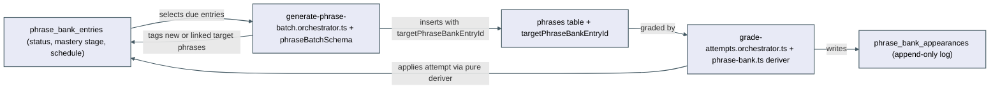

# Architecture: Phrase-bank spaced repetition with mastery tracking

## What changes structurally

Today, `phrases` rows are disposable, one-off generated-sentence instances — every batch is fresh
content with no identity that survives past a rolling "avoid repeating this Russian text" list.
The wishlist's own done-when criterion requires the opposite: a specific *target expression* (an
idiom, a vocabulary correction) must persist across many batches, accumulate attempt history, and
drive whether it gets recycled, rescued, or archived.

This plan introduces that missing identity as two new tables, owned by the same `practice` entity
folder as the existing phrase/attempt tables, and threads it through the existing
generate → grade loop rather than replacing it. This diagram is the second revision of this
design — the first draft's sentence-sequence mechanism (a lazily derived `COUNT(*)`) was found
broken by a red-team pass and replaced with a real stored `sequenceNumber` column; see "Sentence
sequence" below for why:

Three pure functions carry the actual algorithm, in `packages/core/src/phrase-bank/phrase-bank.ts`,
following the same inside-out pattern as `packages/core/src/streak/streak.ts`:

- `selectDuePhrases(entries, currentSequenceNumber, maxDue)` — which struggling/practicing entries
  are due for recycling in the next generated batch, most-overdue first, capped at `maxDue`.
- `applyAttemptToPhraseBankEntry(entry, attempt)` — the new/practicing/struggling/mastered state
  machine, the non-adjacency guard on the 3-correct mastery count, and the isolation rollback on a
  failed attempt. Takes the raw `verdict` (`Ok` | `NeedsReview` | `NeedsDeepDive`), not a
  pre-computed boolean — the verdict→correct mapping is itself part of the tested mastery rule, not
  a decision made in the orchestrator (an earlier draft of this plan left that mapping in
  `grade-attempts.orchestrator.ts`; a red-team pass flagged it as a business-logic leak, folded in
  here).
- `matchExistingPhraseBankEntry(candidates, phraseText)` — the exact-match, mastered-entries-excluded
  lookup rule used when a generated sentence introduces a phrase with no id to echo (see Failure
  modes).

Neither orchestrator re-implements these rules; they only fetch entries, call the deriver, and
persist the result. This keeps the mastery algorithm testable without a database or an LLM call,
matching the constitution's Layer 1 rule.

## New infrastructure

None. No new cloud resources, deploy pipeline, or IaC changes — this is entirely within the
existing Postgres database and Node API/React web app already deployed for post-anki.

## Data model evolution

**New table `phrase_bank_entries`** (one row per tracked target expression, per
subject+level+pack — mirrors `learning/active-phrases.json` / `mastered-phrases.json`'s per-phrase
fields plus the flattened `recycleSchedule` object from the source app's JSON shape):
- `id` (text, pk), `subjectId`, `level`, `pack` (text — same scoping as `recentRussianForSubject`)
- `phraseText` (text — the canonical expression, e.g. "get to the bottom of")
- `category` (text, nullable — e.g. "idioms", "vocabulary-corrections", mirrors source data)
- `status` (text: `new` | `practicing` | `struggling` | `mastered`)
- `masteryStage` (integer, default 0), `correctCountInCycle` (integer, default 0),
  `incorrectCountInCycle` (integer, default 0)
- `lastCorrectAtSentenceCount` (integer, nullable), `lastCorrectDate` (timestamp, nullable)
- `scheduledForSentenceCount` (integer, nullable — null means not yet scheduled)
- `notes` (text, nullable)
- `createdAt`, `updatedAt` (timestamp), `masteredAt` (timestamp, nullable)

**New table `phrase_bank_appearances`** (append-only, mirrors `recycleSchedule.appearanceHistory[]`):
- `id` (text, pk), `phraseBankEntryId` (text, FK), `phraseId` (text, FK to `phrases` — the actual
  generated sentence this attempt answered)
- `sentenceCount` (integer — the running generated-sentence count for that subject/level/pack at
  the moment of this attempt; see "sentence sequence" below)
- `result` (text: `correct` | `incorrect`), `score` (integer), `wasOverdue` (boolean)
- `createdAt` (timestamp)

**Modified table `phrases`**: two new columns.
- `targetPhraseBankEntryId` (text, nullable, FK to `phrase_bank_entries.id`). Null for ordinary
  generated sentences with no trackable phrase; set only when the generation step tagged (or newly
  created) a bank entry for that sentence. Additive and backward-compatible — existing rows simply
  get `null`, meaning "not tracked," which is correct for all of them.
- `sequenceNumber` (integer, not null). A true monotonically increasing counter, one per row,
  scoped to `subjectId`+`level`+`pack`, assigned at insert time by the generation orchestrator
  (`nextSequenceNumber = currentMax + 1`, `currentMax + 2`, … for the 10 rows in a batch, computed
  once via `MAX(sequenceNumber)` inside the same insert path `insertPhraseBatch` already uses).

**Sentence sequence — a real stored column, reversed from an earlier draft of this plan.** An
earlier version of this design derived "how far apart are two appearances of this phrase" lazily
via `COUNT(*) FROM phrases WHERE subjectId=… AND level=… AND pack=…` at read time, on the theory
that it avoided a schema change. A red-team pass on this plan (recorded below) found that design
semantically broken, not just non-optimal: grading happens per *chunk* (5 or 10 items,
`batch-practice.tsx`'s `chunkSize`), and no new `phrases` rows are inserted between chunk
submissions for the same batch — so every item in one generated batch would read back the
*identical* `COUNT(*)`, making true within-batch adjacency undetectable. Worse, two genuinely
back-to-back appearances of the same phrase that straddle a batch boundary (last item of batch N,
first item of batch N+1) would show a `COUNT(*)` difference of up to `BATCH_SIZE` (10), and get
wrongly classified as "far apart" by the non-adjacency guard. A real per-row `sequenceNumber`,
assigned once at generation time and never recomputed, gives every phrase instance — including
consecutive ones across a batch boundary — a stable, exact position, which is what adjacency and
recycling-due-date arithmetic actually need. `phrase_bank_appearances.sentenceCount` (below) stores
this same `sequenceNumber` value at the moment of the attempt, not a recomputed count.

**Migration note:** `sequenceNumber` is added `NOT NULL`. Pre-existing `phrases` rows (today's
test data only — this feature has not shipped to real users) are backfilled in the same migration
via a window-function `UPDATE` ordering by `createdAt` within each `subjectId`/`level`/`pack`
group, before the `NOT NULL` constraint is applied — a data migration inside a not-yet-applied,
freshly generated Drizzle migration file, not a hand-edit of an already-applied one.

## Failure modes

- **LLM echoes a `targetPhraseBankEntryId` that is not one of the due-entry ids actually sent in
  the prompt** (hallucinated or stale). Because `phrases.targetPhraseBankEntryId` is a real FK, an
  unvalidated echo would throw a foreign-key violation on insert and fail the entire
  `generatePhraseBatch` call for all 10 items, not just the mistagged one. The orchestrator
  validates every echoed id against the actual due-entry id set it sent before building insert rows;
  an id that doesn't match is treated exactly like a `null` echo (untracked sentence) — same
  graceful-degrade principle already used on the grading side, applied symmetrically here.
- **Two generated items in the same batch echo the same due-entry id.** Only the first occurrence
  (generation order) is linked; any later duplicate for the same entry is treated as if it had
  echoed `null`. This keeps "one appearance per entry per batch" true without a second LLM
  round-trip to ask for a correction.
- **A novel (untagged) phrase's text matches an existing bank entry.** Resolved by
  `matchExistingPhraseBankEntry` (see Derivers below), not by the LLM: an exact, case-insensitive,
  trimmed match against *active* (non-`mastered`) entries for that subject/level/pack reuses the
  existing entry instead of creating a duplicate. A match against a `mastered` entry is deliberately
  **not** reopened — mastered phrases stay archived even if a generated sentence happens to reuse
  the same wording — so the sentence is treated as untracked in that one case. This rule is a pure
  function over already-fetched candidates, not fuzzy/semantic matching, so a near-duplicate with
  different wording (e.g. "drowning in work" vs. "drowning (in work/busy/stuff)") is accepted as a
  known v1 limitation (see spec.md's decisions) rather than solved here.
- **Grading references a `phrases` row whose `targetPhraseBankEntryId` no longer resolves to a live
  entry** (shouldn't happen absent manual DB edits, but defensively): the grading step logs and
  skips the phrase-bank write for that attempt rather than failing the whole grade-batch call —
  attempts/scores/feedback for the learner are never blocked by a phrase-bank bookkeeping issue.
- **Electric sync lag or outage** (the known SPOF flagged in tonight's `docs/architecture/
  english-batch-practice/review.md`): the recycled-phrase badge on phrase cards depends on the
  `phrases.targetPhraseBankEntryId` column syncing through the same pipeline that already has this
  gap. This plan does not fix that pre-existing gap (out of scope, already tracked as its own
  wishlist follow-up); it deliberately avoids making it worse by keeping the new Phrase Bank
  summary panel off Electric entirely (see below).

## Rollout

Single deploy, no phased rollout or feature flag — this is additive to an already-unshipped
feature (English batch practice has not been deployed to real users yet, per tonight's log). The
migration adds two new tables and one nullable column; no existing data needs to change shape, and
no existing endpoint's response shape changes in a breaking way (new fields are additive).
