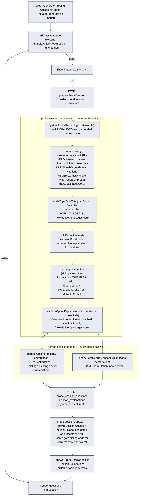
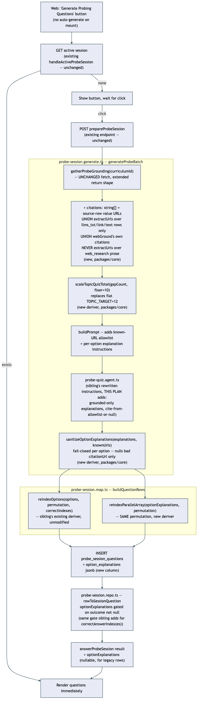

# Architecture: Probe quiz grounded explanations

## Hard prerequisite — this plan stacks on `topic-study-experience`, not on `main`

This is not a parallel-independent extension. `.planning/topic-study-experience/` introduces, in the same worktree cycle, the exact things this plan modifies further: the `type`/`correctAnswerIndexes`/`answeredIndexes` columns on `probe_session_questions`, the outcome-gated reveal in `probe-session.repo.ts`, the shuffle-at-insert step in `probe-session.map.ts`, and a rewritten `probe-quiz.agent.ts` instruction set. None of that exists on `main` today (verified directly — current `probe-quiz.agent.ts` and `probe-session.generate.ts` are the pre-sibling versions, read in full during planning).

**Implementation of this plan must not start until `topic-study-experience` has merged to `main` (or this branch is stacked directly on its branch).** Every "Files to modify" entry below is written against the POST-sibling shape of these files, not their current `main` shape. A lighter implementation model applying this plan against unmodified `main` will find `type`, the outcome-based reveal gate, and `reindexOptions` don't exist yet, and will stall or improvise the wrong thing. This is logged again in `todo.md`.

This also means the same files are touched by both plans in sequence, not in parallel — see "File collision risk" below for exactly which ones and why that's fine as long as the ordering holds.

## What changes structurally

No new services, no new async boundary, no new infrastructure. Three additive extensions to the batch-quiz system `topic-study-experience` builds:

1. **Per-option explanations travel alongside `options`, shuffled in lockstep.** The generation agent returns one `{ text, citationUrl }` per option, in the same order as `options`. When the sibling's shuffle-at-insert step reindexes `options`, this plan's insert step applies the *same permutation* to `optionExplanations` in the same call — a new small generic deriver, `reindexParallelArray`, sitting next to (not replacing) the sibling's `reindexOptions`. Reveal timing mirrors the sibling's existing correct-answer gate exactly: `optionExplanations` is only populated in the DTO once `outcome !== null`.

2. **Grounding material already fetched for generation is reused for citation validation — nothing new is fetched or persisted, and the trust set is built by provenance, not by scraping every string that looks like a URL.** `apps/api/src/probe/probe-grounding.ts`'s `gatherProbeGrounding` already resolves grounding text for a probe batch today (curriculum's persisted `sources.fetchedText` first via `getCurriculumGroundingText`, falling back to a live web search only when that's thin). This plan extends its return shape with a `citations: string[]` allowlist — but critically, **not** every URL-shaped substring anywhere in the grounding text qualifies, because a `web_research`-kind source row's `fetchedText` is model-generated search *prose* (`tech-research-grounding.ts`'s `gatherTechResearchGrounding().text`), not a fetched document — regex-extracting URLs from that prose would happily launder a URL the search model *typed* but that resolves to nothing, which is exactly the fabricated link the user forbade. The allowlist is therefore built from three provenance-verified sources only: (a) every `sources` row's own `value` field that parses as an absolute URL, regardless of kind (already real — `link`/`llms_txt`/docUrl-anchored `web_research` rows per `doc-link-technology-intake`'s design); (b) URLs regex-extracted from `fetchedText`, but **only** for rows whose `kind` is `llms_txt`, `link`, or `text` — real fetched-or-pasted document content — **never** for `web_research`-kind rows, whose `fetchedText` is search prose; (c) for the live web-search fallback branch (curriculum has no usable persisted sources), the `citations` array `webGround` already collects from OpenRouter's structural `url_citation` annotations — a separately verified channel, not text-mined from the model's prose at all. `probe-session.generate.ts` passes this list into the prompt (a soft instruction: "cite only from this list, or leave it null") *and* uses it as a hard post-generation filter — any `citationUrl` the agent returns that isn't in this list is nulled before the row is built. No second LLM call, no new fetch, no new persistence.

3. **Batch size is no longer a flat constant — it scales with what there actually is to test, uncapped.** `probe-session.generate.ts`'s `targetTotal` currently returns a fixed `12` for topic scope regardless of how many concepts/gaps that topic has, and clamps module scope to a hard `MAX_TOTAL = 20`. This plan replaces the topic-scope flat constant with a new pure deriver, `scaleTopicQuizTotal(gapCount, floor)`, and removes the module-scope ceiling (floor only, no cap).

## Where the "real link" guarantee actually comes from

Two independent, complementary layers, neither requiring a new fetch or a second model call:

- **A known-good allowlist, built by provenance, from already-persisted data — never by text-mining model-generated prose.** `sources.value` is already a real URL for every `link`, `web_research` (docUrl-anchored), and `llms_txt`-kind row (guaranteed by `doc-link-technology-intake`'s design — `value` is always the original `docUrl`, never a derived sub-path). This plan adds `getCurriculumCitableUrls(curriculumId)` to `curriculum.repo.ts` — reads `getCurriculumSourceRows` (already exists) and returns the union of (a) every row's `value` when it parses as an absolute `http(s)` URL, regardless of kind, and (b) URLs regex-extracted (`extractUrls`, a pure deriver) from `fetchedText`, but **only** for rows whose `kind` is `llms_txt`, `link`, or `text`. `web_research`-kind rows are deliberately excluded from step (b): their `fetchedText` is `gatherTechResearchGrounding`'s model-written summary prose, not a fetched document, and regex-extracting "URLs" out of prose the model itself wrote would trust exactly the kind of claim this whole feature exists to distrust. For the live web-search fallback (curriculum has no usable persisted sources, `gatherProbeGrounding` falls through to `webGround`), the allowlist instead uses the `citations` array `webGround` already collects from OpenRouter's structural `url_citation` annotations — a channel the search API verifies separately from the prose it also returns, and which `tech-research-grounding.ts`/`probe-grounding.ts` both already collect today but currently discard without ever threading it anywhere. This plan is the first real consumer of that previously-dead, already-verified data — and specifically avoids ever running `extractUrls` over any model-generated prose (`web_research.fetchedText` or `webGround`'s own `text`), which was an early draft mistake caught before finalizing this plan (see "Decisions made autonomously" in `spec.md`).
- **A fail-closed validation step, applied once, cheaply.** After the agent returns structured output, every option's `citationUrl` is checked against that allowlist. Anything not on it becomes `null`. This is a pure function (`sanitizeOptionExplanations`), unit-testable with a fixed allowlist and a fixed set of claimed URLs — no live HTTP call, no LLM call, exactly per the task's explicit "don't over-engineer this into a second LLM call" instruction.

**Curricula with no usable grounding at all** (thin/no `sources` rows, and the web-search fallback also comes back empty) produce an empty allowlist — every citation nulls out, but explanations and questions still generate from the model's general knowledge, exactly like today's existing `gatherProbeGrounding` empty-grounding fallback already behaves for question content. This plan does not add a new "block generation" failure mode; it only ever narrows what's *shown as a citation*, never blocks the quiz itself. See SCENARIO 6.

**Accepted limitation: no fine-grained per-claim attribution.** `getCurriculumGroundingText` (the function `gatherProbeGrounding`'s pasted-source branch already calls) concatenates every source row's `fetchedText` with no per-row title or URL marker in between — that attribution is stripped before the agent ever sees the text. So while the allowlist itself is always real, the agent has no principled way to know *which* URL backs *which specific claim* when a curriculum has more than one or two source rows; its choice is a best-effort pick from the allowlist, not a verified attribution. This plan partially compensates without restructuring the shared grounding pipeline (out of scope): the known-URL allowlist block appended to the prompt lists each URL together with its source row's `title` (already available via the existing `getCurriculumSourceRows`), giving the agent a short label to match against, cheaply, without touching `curriculum.repo.ts`'s or `probe-grounding.ts`'s actual text-assembly logic. Most curricula have few source rows (typically one `docUrl` plus at most a couple of manually added links), so this is a minor practical gap, not a structural one — logged here so it isn't mistaken for an oversight.

## File collision risk — logged, not coordinated live

Per task instructions, this is informational since the sibling plans aren't being coordinated in real time, but real enough to flag:

- **`apps/api/src/mastra/probe-quiz.agent.ts`, `apps/api/src/db/schema.ts`, `apps/api/src/probe-session/{generate,map,repo,service}.ts`, `packages/shared/src/probe-session.ts`** — all touched by `topic-study-experience` first, then extended again by this plan. Safe *only* under the hard prerequisite above (implement this plan strictly after that one merges). If implemented out of order, expect merge conflicts in the agent instruction string and outright missing symbols (`type`, `reindexOptions`, the outcome gate) in the schema/repo files.
- Two other planning agents (personal-learning-map chat + stats dashboard; feedback/promote-demote/ordering) are covering separate scope in parallel and may also touch `probe-quiz.agent.ts`'s instructions or `probe-session.generate.ts` if either turns out to need question-generation changes — not confirmed, just flagged per task instructions. No action taken here beyond noting it in `todo.md`.

## New infrastructure

None.

## Data model evolution

One additive nullable jsonb column on the existing `probe_session_questions` table, via a **separate, follow-up Drizzle-generated migration** — not folded into `topic-study-experience`'s migration, and not generated until that one has already landed (see prerequisite above; `drizzle-kit generate` diffs against whatever `schema.ts` looks like at generation time, so generating this plan's migration before the sibling's exists would produce the wrong diff):

| Column | Type | Default | Purpose |
|---|---|---|---|
| `option_explanations` | jsonb (`{ text: string; citationUrl: string \| null }[]`), nullable | `null` | One entry per option, same order as `options`. `null` for rows generated before this plan (legacy) or for any row still mid-generation-failure. |

No changes to any other table. `sources` (from `doc-link-technology-intake`) is read-only from this plan's perspective — no new columns, no new `kind` value, just reusing `value` and `fetchedText` that already exist.

## Failure modes

- **LLM returns an `optionExplanations` array whose length doesn't match `options.length`.** Handled the same defensive-downgrade pattern `probe-session.map.ts` already uses for a malformed `correctAnswerIndex` (clamping): a new pure deriver, `alignOptionExplanations(options, explanations)`, pads missing entries with a neutral placeholder (`{ text: "No explanation available.", citationUrl: null }`) and truncates extras, rather than rejecting the question.
- **LLM fabricates a citation URL.** Covered above — nulled by `sanitizeOptionExplanations`, question and explanation text still persist. See SCENARIO 3.
- **Grounding is empty or thin.** Covered above — generation proceeds ungrounded (existing behavior), citations simply never populate. See SCENARIO 6.
- **A pre-migration row is loaded post-deploy.** `option_explanations` is `null` for it; `rowToSessionQuestion` and `answerProbeSessionResultSchema` both treat `optionExplanations: null` as a valid, expected state — "no explanations for this legacy question," not an error. See SCENARIO 9.
- **Batch-size uncap increases LLM cost/latency for very large topics/modules.** Accepted — this is exactly what "as many as needed" was asked for; the explicit button (SCENARIO 7) is the UX mitigation (the learner opts into the cost/latency, it doesn't happen silently on page load).
- **`source-fetch.ts`'s `stripHtml` already destroys embedded `<a href>` links at fetch time for `link`-kind sources**, before this plan even runs — a `link`-kind row's `fetchedText` is plain de-tagged text, so `extractUrls` over it will typically find nothing beyond what happened to appear as literal URL text in the visible content. In practice this means most citable deep-page links come from `llms_txt`-kind rows (plain markdown, never HTML-stripped) or `text`-kind rows (user-pasted), while `link`-kind and docUrl-anchored `web_research` rows mostly only ever contribute their own root `value` URL as a citation, not a specific subpage. This is the correct priority for this plan (a real root link beats a fabricated deep link), but it's a known, expected shape — not a broken citation extractor — worth remembering when spot-checking citations post-deploy.

## Rollout

1. Confirm `topic-study-experience` has merged (hard prerequisite — see above).
2. `packages/core`: new derivers — `reindexParallelArray` (added to the sibling's now-existing `shuffle.ts`), `scaleTopicQuizTotal` (new `quiz-size.ts`), `extractUrls`/`sanitizeCitationUrl`/`sanitizeOptionExplanations`/`alignOptionExplanations` (new `option-explanations.ts`).
3. `packages/shared/src/probe-session.ts`: extend `generatedProbeQuestionSchema`, `probeSessionQuestionSchema`, `answerProbeSessionResultSchema` with `optionExplanations`.
4. `apps/api/src/db/schema.ts`: add `option_explanations` column, generate + apply the follow-up migration.
5. `apps/api/src/curriculum/curriculum.repo.ts`: add `getCurriculumCitableUrls` (value URLs + kind-filtered `extractUrls`, excluding `web_research` rows' prose).
6. `apps/api/src/probe/probe-grounding.ts`: extend `ProbeGrounding`/`gatherProbeGrounding` to always populate `citations` — pasted branch calls `getCurriculumCitableUrls`; web-search branch reuses its existing `collectCitations(annotations)` output as-is, with no `extractUrls` call added over that branch's own prose text.
7. `apps/api/src/probe-session/probe-session.generate.ts`: thread `citations` into the prompt + post-generation sanitize step; replace flat `TOPIC_TARGET`/`MAX_TOTAL` sizing with the new deriver.
8. `apps/api/src/probe-session/probe-session.map.ts`: apply `reindexParallelArray` alongside the sibling's `reindexOptions`; persist `optionExplanations`.
9. `apps/api/src/probe-session/probe-session.repo.ts`: gate `optionExplanations` on `outcome !== null` in `rowToSessionQuestion`; thread through `answerProbeSession`'s result.
10. `apps/api/src/mastra/probe-quiz.agent.ts`: add grounded-explanation + citation-allowlist instructions on top of the sibling's already-updated instruction set.
11. `apps/web/src/curriculum/probe-session-quiz.tsx` (sibling's new component): add the empty-state "Generate Probing Questions" button state; render per-option explanations/citations post-answer.
12. Publish documentation — see `spec.md`'s Documentation changes.
