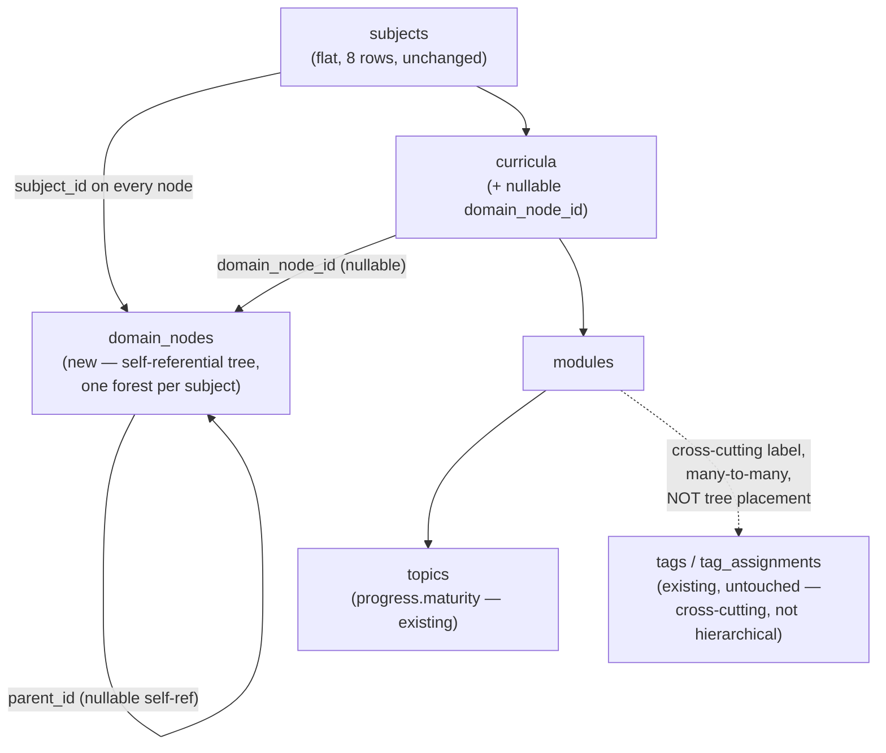
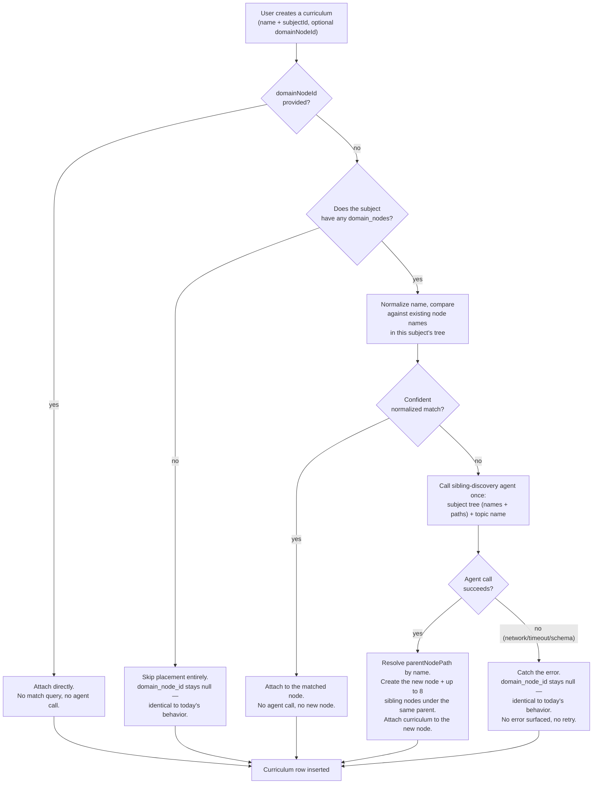

# Architecture — Domain hierarchy, placement, and knowledge-map visualization

## Why this plan gets an architecture.md

Per this project's own trigger list: a new self-referential data shape (`domain_nodes`, not a
variation of an existing table), a new agent added to the Mastra registry, and a new orchestrator
layer sitting between curriculum creation and the database — a structural addition sitting beside
`subjects`/`curricula`, not a feature bolted onto either. `check-my-writing-mode` and
`phrase-bank-concurrency-fix` (recent sibling plans in this same queue) both explicitly skipped this
file because they added a table on the *existing* pipe without introducing a new relationship shape
or a new decision-making layer; this plan does both.

## Where `domain_nodes` sits

`domain_nodes` is a parallel structure to `curricula`, both hanging off `subjects` — not a
replacement for either. A node is either a pure organizational grouping (no curricula attached
anywhere directly on it) or has one or more curricula attached via `curricula.domain_node_id`. Tags
remain exactly what they were before this plan: a flat, many-to-many label spanning unrelated
branches, structurally incapable of expressing "this topic's one correct position in the domain,"
which is the entire point of the new table.

## Placement decision flow (curriculum creation)

This is `resolveDomainPlacement()`'s entire contract — every scenario in `scenarios.md` (3 through 6)
is a distinct path through this one flowchart, which is also why no scenario needed to be invented
beyond what's drawn here.

## Percentage rollup — read path, separate from the write/placement path above

`GET /subjects/:id/domain-map` runs two flat queries (never a recursive CTE, never N+1, regardless of
tree depth) — all `domain_nodes` for the subject, and all `curricula` (with their `modules`/`topics`)
for the subject that have a non-null `domain_node_id` — assembles the tree in memory using the
denormalized `subject_id` column, then calls the new `domainNodeProgress()` deriver
(`packages/core/src/domain-map/domain-map-progress.ts`) once per node, purely in memory against
already-fetched data. No agent, no LLM, no network call is ever part of this read path — it is pure
arithmetic over already-persisted `topic.progress.maturity` values, satisfying
`.product/PRINCIPLES.md`'s "No passive maturity decay" by construction (there is no time input
anywhere in this call graph to decay against).

## What this plan does not change

- `subjects` — flat, 8 rows, no structural change.
- `tags`/`tagAssignments` — completely untouched, no schema change, no new read/write path.
- The existing curriculum-creation research/source-approval pipeline
  (`curriculum-parse.orchestrator.ts`) — `resolveDomainPlacement()` is a new step invoked
  immediately before the existing `createCurriculum()` insert, not a rework of anything upstream of
  it (source approval, research triggering, pasted-material handling all run exactly as they do
  today, independent of this plan).
