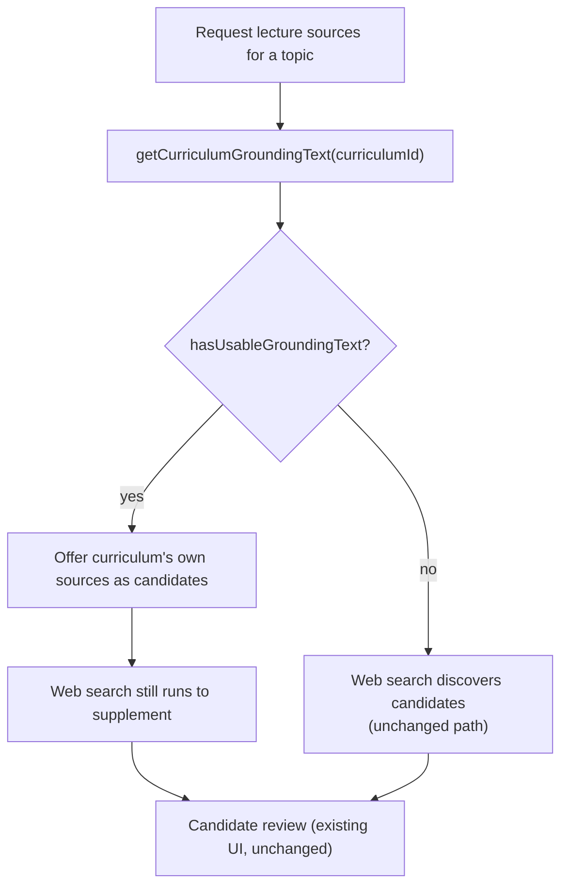

# Scenarios: AI study-material generation

## Business Scenarios

### SCENARIO 1: Lecture candidate discovery checks the curriculum's own stored sources before web search

Ilya requests lecture sources for a topic whose curriculum already has a pasted article covering
most of it. Candidate discovery offers that stored source first; web search only supplements when
the curriculum's own material is thin.

What to verify:
- `gatherLectureSources` calls `getCurriculumGroundingText(curriculumId)` and checks
  `hasUsableGroundingText` BEFORE calling `gatherLectureSourceGrounding` (web search) for candidate
  discovery.
- When the curriculum's own grounding text passes the threshold, its citable URLs
  (`getCurriculumCitableUrls`) are offered as candidates; web search still runs to supplement, but
  never REPLACES the curriculum's own material in the candidate list.
- When the curriculum has no usable source text, behavior is unchanged from today (web search
  discovers candidates) — this fix only reorders preference, it never removes the web-search path.

### SCENARIO 2: Zero usable grounding at compile time refuses instead of fabricating

Every approved source candidate for a topic turns out to have empty fetched text (all fetches
failed). Compiling the lecture sets status `"failed"` with a clear reason — it never calls the
compiler agent with "produce your best-effort synthesis."

What to verify:
- `compileLecture` checks `hasUsableGroundingText` across all approved sources' combined text
  before calling the agent.
- On failure, `lectures.status` becomes `"failed"` with a stated reason distinguishing this case
  ("no usable source text") from a genuine LLM/timeout failure.
- The existing `"(no approved sources with usable text — produce your best-effort synthesis)"`
  prompt branch is removed entirely — there is no code path left that reaches the compiler agent
  with zero real grounding text.

### SCENARIO 3: Candidate re-fetch during compile already goes through the guarded fetcher — confirmed unchanged

`compileLecture`'s `resolveSourceText` call (used to fetch a candidate's body when it wasn't
already cached) already routes through `guarded-fetch.ts`'s SSRF-allowlisted, size-capped path.

What to verify (Fact, not a new requirement):
- `apps/api/src/curriculum/source-fetch.ts::resolveSourceText` calls `guardedFetchText` for the
  `"link"`/URL case — confirmed by reading the file during planning.
- This scenario requires zero code changes; it exists so a reviewer checking 7.1's SSRF posture
  finds an explicit "verified, unchanged" answer rather than silence.

### SCENARIO 4: Requesting a worked example generates a grounded, citation-bearing artifact

Ilya opens a topic and requests a worked example. A new `study_materials` row is created with
`kind: "worked_example"`, grounded via the same hierarchy as lecture generation, with real
citations.

What to verify:
- The grounding hierarchy checked is: curriculum's own stored sources → topic/gap accumulated text
  → web search — the same order S1 establishes, via the shared `hasUsableGroundingText` gate.
- `study_materials.citations` contains only URLs the grounding step actually surfaced — no invented
  links, matching every other citation-bearing path in this codebase.
- The topic's existing `lectures` row (if any) is completely untouched by this request.

### SCENARIO 5: Requesting an analogy uses the same mechanism with a different instruction

Ilya requests an analogy for the same topic. A second `study_materials` row is created,
`kind: "analogy"`, using the identical grounding/orchestration path as Scenario 4 — only the prompt
instruction differs.

What to verify:
- `buildStudyMaterialPrompt` is the single function branching on `kind` — no second orchestrator,
  no second grounding call implementation.
- Both the worked example and the analogy for this topic coexist as two separate rows.

### SCENARIO 6: Multiple worked examples/analogies can exist for one topic — nothing is overwritten

Ilya requests a second worked example for the same topic, wanting a different angle. Both the
original and the new one remain readable afterward.

What to verify:
- `study_materials` carries no unique constraint on `topicId` (unlike `lectures_topic_id_unique`) —
  a second `POST /topics/:id/study-materials` with the same `kind` creates a new row, never updates
  the existing one.
- `GET /topics/:id/study-materials` returns every row for that topic, newest first.

### SCENARIO 7: A request with genuinely no usable grounding anywhere refuses cleanly

A topic has no curriculum source material, no meaningful gap/topic text yet, and a web search
returns nothing substantive. The request fails with a clear, honest reason instead of the agent
inventing content from raw training-data recall.

What to verify:
- `hasUsableGroundingText` is checked against the FINAL combined grounding text (curriculum +
  accumulated + web), not against any single tier in isolation — a thin combination across all
  three tiers still counts as "has usable grounding" if it clears the threshold in aggregate.
- On refusal, `study_materials.status` is `"failed"` with `failureReason` set; no row is left in
  `"generating"` forever.
- No fallback "best-effort synthesis" prompt branch exists anywhere in `study-material.orchestrator.ts`
  — the same rule S2 applies to the lecture path applies here from the start.

### SCENARIO 8: No generation in this module is ever triggered by anything other than an explicit request

Neither lecture compilation nor worked-example/analogy generation is ever invoked by a cron, a
liveness nudge sweep, or `/daily-push`.

What to verify (code review, not a runtime assertion):
- No file under `apps/api/src/push/`, `apps/api/src/liveness/`, or any scheduler/cron entry point
  imports `compileLecture`, `gatherLectureSources`, or `study-material.orchestrator.ts`'s request
  function.
- The only callers of each are their own controllers, reached solely via an explicit `POST`.

### SCENARIO 9: Web — worked examples and analogies live in the same study room as the lecture

Ilya opens a topic's lecture view and sees a `StudyMaterialPanel` beside the existing
`LecturePanel` — request buttons for worked example and analogy, and a read history of what's
already been generated for that topic, shown verbatim.

What to verify:
- `StudyMaterialPanel` is mounted in the existing `apps/web/src/routes/lecture.$topicId.tsx` route —
  no new route is created for study materials alone.
- The history list shows every past `study_materials` row for the topic (Scenario 6's multiple
  rows), each independently readable, with no summarization or truncation of the stored body.

### SCENARIO 10: Web — citations render identically to the existing lecture citation pattern

A generated worked example's citations render as a clickable list, visually and structurally the
same as `LectureReady`'s existing citations block in `lecture-panel.tsx`.

What to verify:
- `StudyMaterialPanel` reuses the same citation-list markup pattern as `LectureReady` — not a
  second, differently-styled citation component.
- An artifact with zero citations (grounding came entirely from accumulated topic/gap text, no web
  search needed) renders with no citations section at all, matching `LectureReady`'s existing
  `citations.length > 0 ? ... : null` behavior.
