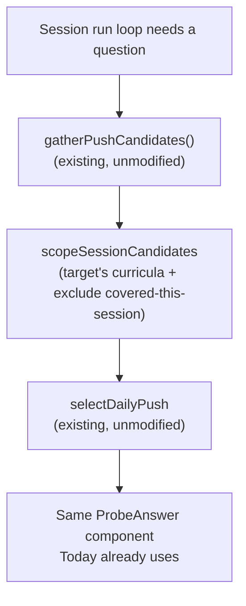
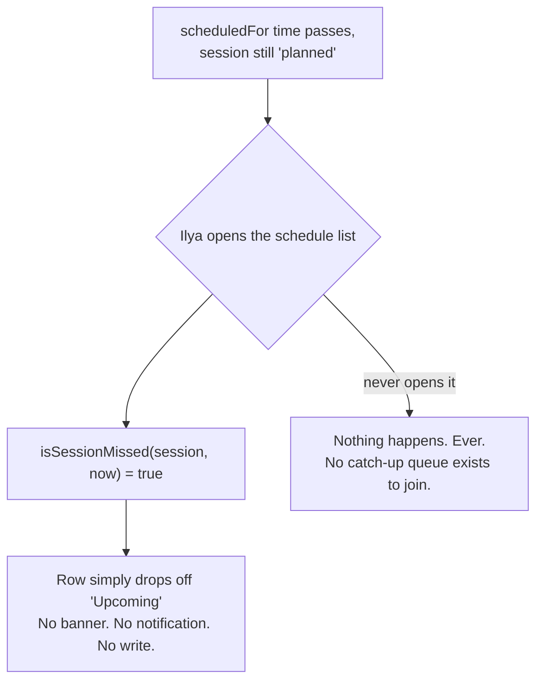

# Scenarios: study scheduling

## Business Scenarios

### SCENARIO 1: Plan a session with a target and a duration

Ilya plans "React, 20 minutes" for later today. `POST /study-sessions` writes one `study_sessions`
row: `status: "planned"`, `targetType: "domain_node"`, `targetId`, `plannedDurationMinutes: 20`,
`scheduledFor` optional. No reminder is scheduled — planning is a personal intent record, not a
delivery obligation.

What to verify:
- Creating a planned session touches nothing in `push/` and creates no Cloud Scheduler job.
- `targetType` may be `null` ("anything") or one of `"learning_path" | "domain_node" | "curriculum"`.

### SCENARIO 2: Start a session — planned or ad hoc

Ilya either taps "Start" on a planned session, or starts one right now with no prior plan. Either
way `status → "in_progress"`, `startedAt` is set, and the run loop begins immediately.

What to verify:
- An ad hoc start (`scheduledFor: null`, no prior "planned" row) works identically to starting a
  pre-planned one — Scenario 1's planning step is optional, never required.

### SCENARIO 3: The run loop draws its next question from the existing daily-push ranking

Each "next question" during the session calls `scopeSessionCandidates` (filters the target's mapped
curricula, excludes gaps already covered this session) and then `selectDailyPush` completely
unmodified — no second ranking algorithm is introduced anywhere in this module.

What to verify:
- `selectDailyPush`'s wanted-first / weakest / stale-refresh logic is byte-for-byte unchanged.
- A gap already answered once this session is excluded from the next pick, even if it's still
  technically the "weakest" by `selectDailyPush`'s own ranking.

### SCENARIO 4: A due liveness nudge surfaces once during the session

If a liveness nudge is due, it appears inside the session screen exactly as it does on Today — the
same `NudgePanel`, the same `liveness/` read, not a session-specific nudge mechanic.

What to verify:
- The nudge check reads the existing `liveness.repo.ts` due-nudge logic unmodified.
- Responding to the nudge inside a session behaves identically to responding on Today.

### SCENARIO 5: Session ends at the planned duration or on early stop

The run loop stops when `shouldEndSession` returns true (duration elapsed) or Ilya taps "End now."
A question already in progress is allowed to finish; nothing forces him to keep going, and nothing
punishes stopping early.

What to verify:
- `plannedDurationMinutes` elapsing does not cut off a question mid-answer.
- Ending early sets `status: "completed"` (or `"abandoned"` if zero questions were answered) — never
  a partial/failed state that implies something was owed.

### SCENARIO 6: A missed planned session is silently dropped

Ilya planned a session for 6pm and never opened the app. It simply stops appearing under "upcoming"
once `scheduledFor` has passed — no catch-up queue, no "you missed this" banner, no rescheduling
prompt.

What to verify:
- `isSessionMissed` is a display-time label only, on the schedule list — no write happens, no status
  flips automatically, no notification fires.
- This literally applies `.product/PRINCIPLES.md`'s "No session debt": missed pushes are silently
  dropped; a missed planned session gets the identical treatment.

### SCENARIO 7: Session review shows a one-time summary

At completion, Ilya sees questions answered, correct count, and elapsed minutes — computed from the
session's own counters plus `sessionElapsedMinutes`.

What to verify:
- The summary reads directly off `study_sessions` counters — no separate per-answer table to
  aggregate.
- Revisiting a completed session later shows the same frozen summary (counters don't keep moving).

### SCENARIO 8: Consistency tracking rolls up planned-vs-completed sessions, read-time only

Ilya checks "how consistent have I been" — `sessionConsistency` computes `{planned, completed, rate}`
over a rolling window directly from `study_sessions` rows, on every read. Nothing is pushed to him
about it.

What to verify:
- The number is never delivered proactively — it's visible only when Ilya opens the schedule/review
  view himself.
- This is scoped to session-scheduling adherence only, not learning outcomes — retention/mastery
  reporting belongs to the future Module 4 (Analytics), not here.

### SCENARIO 9: Completing a session also records today's streak activity

On session completion, the service calls the existing `recordActivityToday` (streak service)
unmodified — `user_streaks` stays the single source of truth for "did something today."

What to verify:
- No second streak counter is introduced by this module.
- A completed session with at least one answered question counts exactly like any other activity
  already counts today (e.g., a probe answer on the Today page).

### SCENARIO 10: Targeting a learning path scopes the run loop to that path's curricula

Ilya schedules a session against his "Frontend Engineer" path. Candidates are filtered to the
curricula mapped under that path's steps — reusing the same scope-then-`selectDailyPush` pattern
the `learning-paths` module's own S8 already established for its step-level push.

What to verify:
- Only topics/gaps under the path's mapped, confirmed curricula are eligible for this session.
- No second taxonomy-to-curricula resolution is written — it calls the same resolution the
  `learning-paths` module exposes.

### SCENARIO 11: Targeting "anything" behaves exactly like the existing Today push

With no `targetType`, the session pulls from the same unscoped candidate pool `gatherPushCandidates`
already produces for `/daily-push` — the only difference is the session wraps it in a duration timer
and running counters.

What to verify:
- An unscoped session's first question, given identical underlying data, matches what `/daily-push`
  would have returned at that same moment.

### SCENARIO 12: Web — schedule, run, and review a session in one connected flow

Ilya plans a session, starts it from the same screen (or later, from the schedule list), watches a
timer while answering questions, and lands on the review summary when it ends.

What to verify:
- All three steps live in one route tree (`apps/web/src/routes/study-sessions.tsx`), not three
  disconnected pages.
- The question surface during the run is the same `ProbeAnswer`/`NudgePanel` components Today
  already renders — no parallel question UI is built for this module.

## Technical/Architectural Scenarios

### SCENARIO 13: Derivers are pure and unit-tested before any IO

`scopeSessionCandidates`, `shouldEndSession`, `sessionElapsedMinutes`, `recordSessionAnswer`,
`isSessionMissed`, and `sessionConsistency` are all pure functions over plain data, tested against
fixtures with no database, no clock, and no network — `now` is always an injected parameter.

What to verify:
- Every deriver takes `now` as an explicit argument rather than reading `Date.now()` internally.
- 100% of this module's branching logic is covered by `packages/core/src/study-session/*.test.ts`
  before the repo/controller layer is written.
