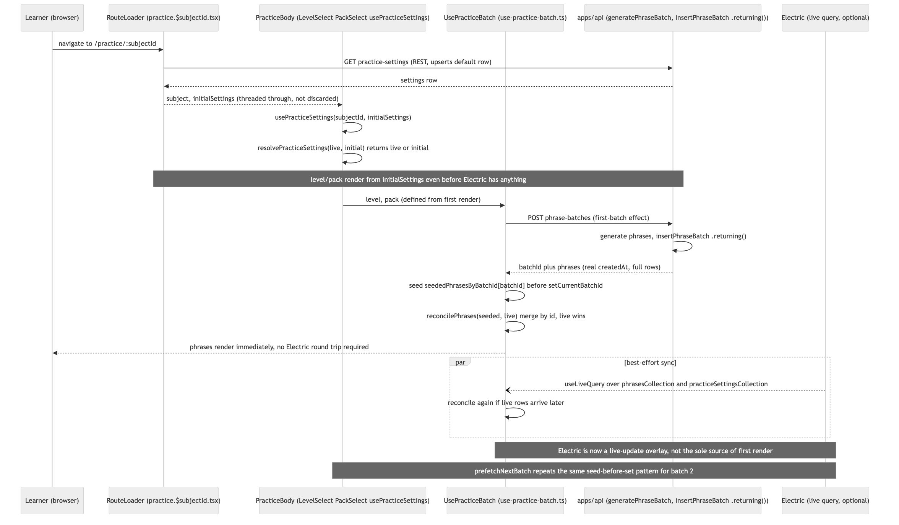

# Architecture Review: Fix batch-practice's no-fallback dependency on Electric sync

## What was reviewed

The generate-batch read path for `/practice/:subjectId`: the route loader, `usePracticeSettings`,
`usePracticeBatch`, the `POST /subjects/:id/phrase-batches` endpoint, and `insertPhraseBatch`.
Merged via commit `235f112` (feature) and `55aabd7` (merge), diffed against parent `a548f56`.
Touched: `apps/api/src/practice/practice.repo.ts`, `generate-phrase-batch.orchestrator.ts`,
`apps/web/src/practice/{use-practice-batch,use-practice-settings,practice.collection,
practice.api-client}.ts`, `level-select.tsx`, `pack-select.tsx`,
`apps/web/src/routes/practice.$subjectId.tsx`, plus their test files.

## Documentation found

`docs/architecture/english-batch-practice/review.md` (a prior `/debrief`, 2026-07-25) had already
identified this exact gap as a critical single point of failure and proposed the fix this commit
implements. `.bmad/batch-practice-electric-fallback/{spec.md,scenarios.md,plan-summary.md}` (state:
confirmed) is the planning record — auto-confirmed by `/grand-loop`, no human review, per the
project's own documented policy for that flow. `.bmad/batch-practice-electric-fallback/review.md`
is the `review-playwright` verdict (8/8 scenarios pass), not an architecture review — used here only
as evidence the runtime behavior matches the spec, not as the architectural judgment itself.

## As-built architecture

The route loader now threads its already-fetched `initialSettings` through instead of discarding
it. `usePracticeSettings` resolves to `live ?? initial` (`resolvePracticeSettings`), so level/pack
render on the very first paint even if Electric's live query has produced nothing. Once level/pack
are known, `usePracticeBatch`'s first-batch effect calls `POST phrase-batches`; the backend now
returns real inserted rows (`insertPhraseBatch` uses drizzle's `.returning()` instead of discarding
the insert and returning pre-insert rows with no `createdAt`). The hook seeds
`seededPhrasesByBatchId[batchId]` from that response *before* flipping `currentBatchId`, then
`reconcilePhrases(seeded, live)` merges the seeded rows with whatever Electric's `useLiveQuery` has
delivered, keyed by `id`, live winning on a shared id. The identical seed-before-set pattern repeats
in `prefetchNextBatch`, so the second batch doesn't re-enter the same stall one batch later. Electric
is now strictly an eventual-consistency overlay, never a precondition for first render.

## Verdict

Sound. This closes the exact single point of failure the prior review named — the generate response
already contained the data; the fix stops discarding it — without introducing a new one. The design
mirrors the existing SSR-seed-then-overlay pattern already used on `apps/web/src/routes/index.tsx`,
so it's consistent with how this codebase already solves the same class of problem rather than a
one-off. Backend, frontend, and test changes all match `spec.md`/`scenarios.md` exactly; nothing
drifted between plan and code.

Two real tradeoffs worth naming, neither rising to the critical bar:

- **`seededPhrasesByBatchId` only clears on a genuine level/pack change**, not per-batch. Across a
  long practice session at one level/pack, every generated batch's 10 phrases stays in that map for
  the life of the hook instance. Bounded (whole-page remount on subject change already resets it,
  per the route's `key={subject.id}`), and 10 small objects per batch is not a real memory
  concern at this app's scale — but it is a small, unbounded-within-session accumulation that a
  reviewer should know is there.
- **A new re-entrancy guard (`lastResetKeyRef`) was added to the level/pack reset effect**, not
  called out in `spec.md`'s derivers table. It's a necessary consequence of the fix, not scope
  creep: level/pack can now be defined from the very first render (seeded via `initialSettings`),
  so the reset effect can fire more than once for the same key before its own generate call
  settles — without the guard, a second same-key firing would abort the still-in-flight first-batch
  request and never retry it, reintroducing a stuck "Generating…" state by a different path than the
  one this fix closes. The guard is covered only indirectly, through the e2e suite passing, not by
  a dedicated hook-level unit test — reasonable given the project's own stated policy of e2e-only
  coverage for hook wiring and unit tests for the extracted pure functions.

## Questions a reviewer would ask

- `seededPhrasesByBatchId` accumulates one entry per batch for the life of the hook instance within
  a single level/pack — is that acceptable indefinitely, or should old batch ids be pruned once
  they're no longer `currentBatchId`/`nextBatchId`?
- `lastResetKeyRef`'s guard logic isn't exercised by a dedicated unit test — is e2e-only coverage
  (S1–S8) considered sufficient for this kind of effect re-entrancy bug going forward, or does this
  class of bug warrant a hook-level test even under the project's usual "only pure functions get
  unit tests" policy?
- `reconcilePhrases` and `resolvePracticeSettings` both apply "live wins on a shared id/whenever
  present" — is there any scenario where a stale Electric row could win over a fresher seeded row
  (e.g. Electric redelivering an older cached shape after a fast local update), or is `id`-based
  replacement always safe because rows are immutable once inserted?
- The cross-tab scenario was explicitly rejected in `spec.md` because "each tab generates its own
  batch on open" — does that mean two tabs open on the same subject will now silently generate and
  persist two independent phrase batches with Electric-down conditions, and is that an acceptable
  steady-state or just untested?
- `insertPhraseBatch` switching to `.returning()` changes the query from a plain `INSERT` to one
  that also returns rows — for a 10-row batch this is negligible, but is `.returning()` used
  consistently elsewhere in `practice.repo.ts`/similar repos, or is this the first instance of that
  pattern in the codebase?
- Now that `docs/architecture/english-batch-practice/review.md`'s as-built diagram is stale (it
  still shows the Electric-only path), is refreshing it worth doing now that this fix has shipped,
  or is this new `batch-practice-electric-fallback/as-built.png` considered its replacement for that
  specific slice?
