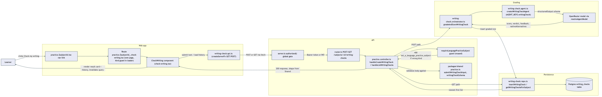

# Architecture Review: Check my writing

## What was reviewed

A new freeform-writing scoring surface on the English (`language-practice`) subject: a learner pastes
arbitrary text (a Slack message, a PR description, an email) at `/practice/:subjectId/check-writing`,
a new Mastra agent grades it for native-soundingness (0-10 score, one of the existing three verdict
bands, 1-2 sentences of feedback, 1-2 full rewrites), the graded result is persisted to a new
`writing_checks` table, and a history list (newest-first, plain REST, no Electric) is shown on the
same page. In scope: `packages/shared/src/practice.ts`, the new `writing-check.*` files under
`apps/api/src/mastra/` and `apps/api/src/practice/`, `practice.controller.ts`/`router.ts`/`server.ts`
wiring, the new `writing_checks` Drizzle migration, and the new web route + component + API client
under `apps/web/src/`. Reviewed by reading merge commit `a709ecc` (feature commit `306a539`) in full
against its parent `4f85d0f`.

## Documentation found

No prior architecture doc for this feature — this is the first `docs/architecture/check-my-writing-mode/`
entry. This went through `/grand-loop` + `/plan-playwright` + `/write-playwright-tests`, not the
interactive `/plan-ie` + `/review-ie` flow, so the review-equivalent build record is
`.planning/check-my-writing-mode/spec.md` (confirmed) plus `.planning/LOG.md`'s 04:35 entry. The
built code matches the spec closely — same table shape, same route-splitting reasoning (trailing-
underscore escape, matching `curriculum.$curriculumId_.assess.tsx`'s precedent), same agent
separation, same auth-gate reasoning (global `authorized()` in `server.ts`, no per-route middleware).

One drift worth registering: the spec's "Files to touch" section (line ~189) says the two mock
fixture texts land under `verification-repo/.../features/practice/fixtures/mock-data/`. They
actually live in `mock-openrouter/responses.ts` as `WRITING_CHECK_SLACK_MESSAGE_TEXT` /
`WRITING_CHECK_STIFF_EMAIL_TEXT`, exported alongside the mock response bodies and imported directly
by the three e2e tests. This is arguably a better placement (the submitted text and its expected
graded response live in the same file, right next to the `writing-check` responder that matches on
it), but it is a real deviation from the plan as written, not a match.

This review is code-and-architecture only, per instruction — `npx tsc --noEmit`, the two new vitest
files (`writing-check.repo.test.ts`, `writing-check.orchestrator.test.ts`), and the three e2e
scenarios (`@check-my-writing-mode.S1/S2/S3`) were read but not executed, so their actual pass/fail
status is unverified by this review.

## As-built architecture

Entry point: a nav link on the existing `/practice/:subjectId` page to the new sibling route
`/practice/:subjectId/check-writing`, which uses the codebase's established trailing-underscore
escape (`$subjectId_`) to opt out of the parent route's layout — the parent has no `<Outlet/>`, so
this avoids stacking a second loading-state UI on top of the existing batch-practice/phrase-bank
surface. The route's own loader repeats the `kind !== 'language-practice' → notFound()` guard already
proven on the parent page.

The `CheckWriting` component submits through `writing-check.api.ts` (a TanStack Start
`createServerFn`, matching every other API client in `apps/web`), which hits the API's global
`authorized()` gate — every route in this codebase shares one auth check, so nothing new had to be
wired for these two endpoints. `practice.controller.ts`'s two new handlers reuse the existing
`requireLanguagePracticeSubject` guard verbatim (a 400 if the subject isn't `language-practice`-kind)
before doing anything else.

On the write path, `gradeAndStoreWritingCheck` calls a brand-new Mastra agent
(`AGENT_KEYS.writingCheck`, its own file, its own instructions) via the same
`structuredOutput: { schema }` mechanism every other agent in this codebase uses — no bespoke calling
convention. The agent's Zod schema enforces `nativeAlternatives` as 1-2 items (never empty, unlike
the existing `gradeBatch` schema), and the submitted text is embedded verbatim in the prompt (the
same technique used elsewhere in this codebase for content-based mock matching). A successful
generation is inserted into the new `writing_checks` table (no FK to `subjects`, matching every other
`language-practice` table's existing convention) and returned; the read path
(`getWritingChecksForSubject`) lists by `subjectId`, ordered `created_at DESC`.

Failure path: there is a single top-level `try/catch` in `server.ts`'s `handleRequest` — any
unhandled error (the agent throwing, returning no structured output, a DB error) is caught there and
turned into a `500 internal_error`. No row is written on failure since the insert only runs after a
successful `agent.generate` call — this is the same failure-handling shape every other agent-backed
endpoint in this codebase already has, not a new pattern introduced for this feature.

## Verdict

Sound. This is a clean, additive port that follows the codebase's own established conventions at
every decision point it faced — new agent file (not touching any of the existing 8), new repo file
(matching the `phrase-bank.repo.ts` precedent for splitting out a finer-grained entity), a new table
with no FK (matching every other `language-practice` table), reuse of the existing auth gate and
subject-kind guard rather than inventing new ones, and a route-splitting decision backed by a real
precedent already in the codebase (`curriculum.$curriculumId_.assess.tsx`). The two new orchestrator/
repo unit tests are real behavioral tests (mapping, ordering, error-on-no-output), not placeholders,
and the e2e test read (`check-writing-scores-a-submission`) asserts against a real inserted Postgres
row via `countWhere`, not just DOM state.

The real tradeoffs, none of which cross the bar for escalation:

- **Submission failures are silent in the UI.** `check-writing.tsx`'s `handleSubmit` has a `finally`
  that resets the "Checking…" state but no `catch` — if the POST returns a `500` (the exact path
  traced above when the agent throws or returns no structured output), the button re-enables, the
  typed text remains in the textarea, and the user sees no error message. Nothing is lost — the text
  is still there to resubmit — but there's no signal telling them what happened. Worth fixing, not
  worth blocking on.
- **History ordering has a narrow race window.** `getWritingChecksForSubject` orders by `created_at`
  alone; IDs are `randomUUID()`-based (`apps/api/src/shared/id.ts`), not time-sortable, so there's no
  free secondary sort key. Postgres timestamp precision makes a real collision unlikely in normal use,
  and the plan's own `S2` scenario already sidesteps this by asserting on fixture content rather than
  raw order — a pragmatic call, not an oversight.
- **The submitted text is embedded verbatim into an LLM prompt with no sanitization beyond a 5000-char
  cap.** This is a single-user, no-tool-access agent whose output is constrained by a fixed Zod
  schema (score/verdict/feedback/rewrites only) — a prompt-injection attempt in pasted text could at
  worst skew the score or feedback the user sees in their own history, not act on anything else. Not
  a security exposure in the sense this review escalates for, but worth a reviewer's eyes.

## Questions a reviewer would ask

1. Should `handleSubmit` in `check-writing.tsx` surface a visible error state (e.g. a toast or inline
   message) when the POST fails, instead of silently re-enabling the submit button with the failure
   invisible to the user?
2. Is a narrow near-simultaneous-insert ordering collision in `getWritingChecksForSubject` (same
   `created_at` tick, no secondary sort key) acceptable long-term, or does it need a monotonic ID / a
   secondary `id` sort once this sees concurrent real-world use rather than just test traffic?
3. The submitted text is embedded verbatim into the grading prompt with no more guarding than the
   5000-char cap — given this is single-user with schema-constrained output, is that the accepted
   posture for every future agent that takes freeform user text, or does this one deserve a written
   note explaining why it's fine here specifically?
4. `writing_checks` has no FK to `subjects` (matching the existing convention) — if a subject is ever
   deleted, should its writing-check history be cleaned up too, or is an orphaned row considered
   acceptable the way it apparently already is for `attempts`/`phraseBankEntries`?
5. The new agent's `nativeAlternatives` schema enforces `.min(1).max(2)` as a hard floor, while the
   sibling `gradeBatch` schema allows an empty array for non-`Ok` verdicts — was that inconsistency
   between two agents doing structurally similar work a deliberate choice worth documenting, or should
   `gradeBatch` eventually get the same floor?
6. The plan's fixture-placement note (`fixtures/mock-data/`) didn't match where the fixtures actually
   landed (`mock-openrouter/responses.ts`) — was that a deliberate mid-build call, and should the
   `/write-playwright-tests` fixture-placement guidance be updated so future plans stop citing the
   wrong location?
7. Is there a plan for the already-listed "migrate existing English practice data into post-anki"
   wishlist item to backfill `writing_checks`, and if so, does this table's shape (no FK, freeform
   `text` column) already accommodate whatever that historical data looks like?
