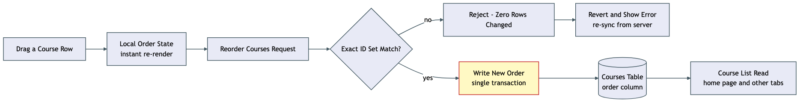

# Architecture Review: Course-level priority drag-and-drop reordering

## What was reviewed

Issue #69: courses (curricula) had no priority ordering of their own — only modules/topics
inside one curriculum could be re-ranked. This adds a `curricula.order` column, a transactional
`reorderCurricula` endpoint, and a `@dnd-kit`-based drag handle on the home page's subject course
list. In scope: `apps/api/src/curriculum/curriculum.repo.ts`/`curriculum.controller.ts`,
`apps/api/src/router.ts`/`server.ts`, `packages/shared/src/curriculum.ts`, and
`apps/web/src/subject/subject-section.tsx` plus the new `curriculum-drag-order.ts`.

## Documentation found

None found under `docs/` for this specific feature — `docs/architecture/course-priority-drag-reorder/architecture.md` did not exist yet at review time. Reconstructed from the code and the confirmed `.planning/course-priority-drag-reorder/` plan set directly; no drift found between what the plan describes and what shipped.

## As-built architecture

A drag gesture updates local client state instantly (so the dropped row doesn't visibly snap back
while waiting on the network), then fires a PATCH carrying the subject's full reordered id list.
The backend's one real guard sits before any write happens: the payload's id set must exactly
match the subject's current full set of course ids — not merely "every id given belongs to this
subject," but the complete set, no fewer, no more. A mismatch (most often another tab having
created or deleted a course mid-drag) is rejected with zero rows touched; the client reverts to
its pre-drag order, shows a visible error, and re-syncs from the server. A match proceeds through
a single database transaction reassigning sequential order values, so a mid-write failure can
never leave some courses renumbered and others holding stale values. Both the originating tab and
any other open tab eventually read the same `order` column back through the existing read paths.

## Verdict

**Sound.** The one design choice that matters most here — validating the *exact* id set rather
than a looser "every id belongs here" check — is exactly the kind of hardening that closes a real
corruption path (a partial list would leave omitted courses colliding with the newly assigned
range), and it's paired with the discipline of checking that a sibling function
(`reorderModules`) *doesn't* have this same protection and flagging it separately (#75) rather than
quietly leaving the inconsistency undocumented.

Two real tradeoffs, both already named rather than hidden:

- **No automated end-to-end test for the actual drag gesture.** The HTTP → transaction → DB round
  trip is proven directly (curl, integration tests), but nothing exercises a real mouse-drag in a
  real browser yet — that's a genuine, currently-open gap in coverage, tracked as a
  `verification-repo` follow-up rather than silently accepted as "good enough."
- **Optimistic local state is a second source of truth, briefly.** Between the drop and the
  server's response, the UI is showing an order the database doesn't have yet. The failure path
  (revert + visible error + re-invalidate) covers the case that was designed for — a stale payload
  rejected outright — but two tabs racing each other with both requests individually valid (each
  is a complete, correctly-shaped reorder of the same set) isn't something this design
  distinguishes from an intentional "last edit wins." That's a reasonable default for a
  single-user, single-owner app, not a defect.

Neither rises to a critical/high-stakes issue — no data-loss risk (the transaction and the
exact-set check together prevent the partial-write corruption this design is built to avoid), no
security surface change, no outage or cost-runaway path, and no coupling that blocks the two
features already planned to depend on this (#70, #71) — they consume the `order` column, which is
exactly what this ships.

## Questions a reviewer would ask

- Two tabs both drag-reordering the same subject concurrently: each request is individually valid
  (a complete, correctly-shaped set), so the second write simply overwrites the first with no
  conflict signal. Is silent last-write-wins the right call here, or does this need an
  optimistic-concurrency check (e.g. a version/updated-at compare) before it matters in practice?
- `createCurriculum`'s `nextOrder` assignment reads existing orders then computes a value with no
  lock — the plan names this as an accepted, pre-existing race shared with `createModule`. Given
  this feature is the first place `curricula.order` collisions become user-visible (two courses
  tied on `order` after a race), is "self-healing on the next drag" still an acceptable answer, or
  does this feature change the calculus enough to warrant fixing it now?
- `order` is scoped per subject — does anything elsewhere in the codebase (an admin view, a
  cross-subject export) list curricula without subject scoping, where an `order` value would be
  meaningless or misleading if read out of that context?
- `reorderModules`'s missing scoping check (#75) was found here and deliberately left unfixed as
  out of scope. Given `reorderCurricula` and a fixed `reorderModules` would end up needing the
  identical exact-set validation shape, is a shared helper worth building once #75 is picked up,
  rather than writing the same guard twice?
- If the database transaction commits successfully but the client's follow-up
  `router.invalidate()` call itself fails (e.g. a network drop right after a successful write),
  does the UI show a false "couldn't reorder" error even though the reorder actually persisted —
  would a learner retrying in that state cause any issue, or is a retry always safe here?
- Is there any code path that inserts a `curricula` row directly rather than through
  `createCurriculum`/`createSplitOutCurriculum` (a seed script, a data-migration tool, a different
  creation endpoint) that would silently reintroduce the all-tied-at-`0` state the migration's
  backfill was written to avoid?
- The exact-id-set check loads the subject's full existing id list on every reorder call — at
  what course-count per subject would that comparison start to matter, and is today's realistic
  usage nowhere near it?
