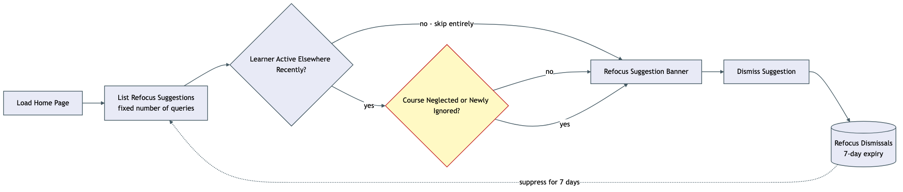

# Architecture Review: Cross-course refocus suggestion

## What was reviewed

Issue #70: nothing today notices "you've been ignoring course X, and course Y just became
urgent" across a learner's courses — `domain-priority-review` only re-prioritizes *within* one
domain map. This adds a home-page banner surfacing a course as neglected (top-priority, 14+ days
untouched, learner still active elsewhere) or newly-ignored (top-priority, brand new, never
opened), backed by a pure deriver, a small-fixed-query repo function, and a dismissal table. In
scope: `packages/core/src/curriculum/course-refocus.ts`,
`apps/api/src/curriculum/course-refocus.repo.ts`/`.controller.ts`, and
`apps/web/src/curriculum/course-refocus-banner.tsx`. This review is scoped to #70 only — #69
(course-priority drag-reorder, built earlier in the same worktree) was already separately
debriefed as sound.

## Documentation found

None found under `docs/` for this specific feature at review time. Reconstructed from the code
directly and cross-checked against the confirmed `.planning/cross-course-refocus-suggestion/`
plan set — no drift found between what the plan describes and what shipped.

## As-built architecture

Loading the home page triggers one repo function that does a small, fixed number of reads
regardless of how many courses or subjects exist: courses joined with their subjects, one
aggregate query for last-studied-at per course, one aggregate query for language-practice phrase-
bank activity, and one for active dismissals — never a per-course fan-out. A global gate runs
first: if the learner hasn't studied anything anywhere in the last 3 days, no suggestions are
generated at all, full stop. Only past that gate does the per-course rule run — top-third
priority and 14+ days untouched, or brand-new top-priority and never opened — each a pure
arithmetic comparison over timestamps already in the database, deliberately with no LLM call,
unlike `domain-priority-review`'s AI-driven judgment for a genuinely more subjective question.
Language-practice subjects are excluded from being suggested themselves (no `topics` rows to
measure), but their activity still counts toward the global "is the learner active anywhere" gate.
A surfaced suggestion renders as a dismissible banner card; dismissing writes a row that
suppresses that exact (course, reason) pair for 7 days, then it can resurface.

## Verdict

**Sound.** The most consequential design choice here — deliberately not using an LLM for this —
is the right call and is stated as a reasoned decision rather than an oversight: this is a
quantitative comparison ("has N days passed"), not a judgment call, so paying for a model
invocation here would be pure cost with no accuracy benefit. Pairing that with the "learner active
elsewhere" global gate is what keeps this from nagging someone who's simply not using the app at
all right now — a real design decision, not an accidental side effect of the arithmetic.

A few real tradeoffs, all already named in the plan rather than discovered here:

- **A deliberate "dead zone."** A top-priority course created 8-13 days ago with zero activity
  produces no suggestion at all — too old for the "newly ignored" trigger (7-day window), not old
  enough for the "stale" trigger (14-day window). Documented and accepted as a reversible threshold
  choice, not a bug.
- **No automated e2e test for the actual dismiss click.** The HTTP/DB round trip and the real
  server-rendered banner markup were both proven directly; the interactive click itself needs a
  real browser and is tracked as a `verification-repo` follow-up, same posture as #69.
- **Fixed, global thresholds (14/7/3 days).** No per-subject or per-learner tuning. Reasonable as
  a first default; would need revisiting only if real usage shows one subject's pace is
  systematically different from another's.

None of these rise to a critical/high-stakes issue — no data-loss risk (this feature only ever
reads existing data plus one idempotent upsert), no security surface change, no cost or outage
risk (fixed query count, explicitly no agent/LLM call in this path), and no coupling that blocks
other planned work — it's a consumer of #69's `curricula.order`, exactly as intended.

## Questions a reviewer would ask

- The dismiss handler here doesn't call `router.invalidate()` after a successful dismiss, relying
  on local component state to hide the card and the next natural page load to reflect the
  server's own 7-day suppression filter — #69's reorder handler does invalidate explicitly. Was
  that asymmetry deliberate (the two features have different consistency needs), or should this
  match #69's pattern for uniformity?
- The three thresholds (14, 7, 3 days) are fixed constants with no per-subject or per-learner
  override. If someone's language-practice-style subject naturally has a faster cadence than an
  architecture-mentor subject, would today's single global default eventually feel wrong for one
  and not the other?
- Is the 8-13-day "dead zone" (documented above) actually the intended behavior long-term, or
  should the two threshold windows overlap so every course in that range gets at least one
  signal?
- `listCourseRefocusSuggestions` recomputes everything fresh on every home-page load with no
  caching layer — at what course/subject count would the current four-query approach start
  showing up as real page-load latency, and is that realistically far off given current usage?
- Dismissals are keyed by `(curriculumId, reason)` with one shared 7-day cooldown. If a course
  could ever independently trigger both `stale_top_priority` and `new_high_priority_ignored` (the
  code's own `continue` after the first match suggests not, in the current rule set) — is that
  guaranteed to stay true if the rule set grows a third reason later?
- This feature and #69 both read/write around `curricula.order` and were built sequentially in
  the same uncommitted worktree, on the same branch, for two separate GitHub issues (#69, #70) —
  what's the intended commit/merge story when a human picks this up: one combined commit, or two
  separable ones?
