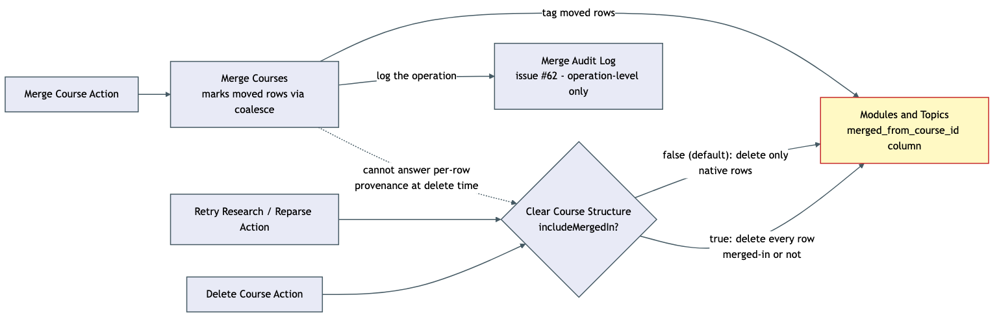

# Architecture Review: Curriculum-merge provenance fix

## What was reviewed

Issue #68: `clearCurriculumStructure` (the shared delete-and-regenerate step behind "Retry
research"/"Reparse" and full curriculum deletion) was deleting merged-in modules/topics with no
concept of how they got there. A curriculum that absorbed another one's content via a merge, then
later failed through ordinary, unrelated use, would silently lose that merged-in content the next
time someone retried it. In scope: `apps/api/src/curriculum/curriculum.repo.ts`
(`clearCurriculumStructure`, `mergeCurricula`, `deleteCurriculum`), the new
`merged_from_curriculum_id` column on `modules`/`topics`, and the generated migration.

## Documentation found

`docs/architecture/curriculum-merge/review.md` already documented the bug this fixes (found
during an earlier `/debrief` pass) and proposed the exact fix shape used here. The build agent
also wrote a new `docs/architecture/curriculum-merge/architecture.md` documenting the contract —
read and cross-checked against the actual diff; no drift found.

## As-built architecture

Two independent entry points converge on one shared, now-provenance-aware delete function.
`mergeCurricula` reassigns modules/topics/sources/sessions from source to target curriculum and
tags each moved module/topic with `merged_from_curriculum_id` (via `coalesce()`, so a row that's
already crossed one merge boundary keeps its original marker rather than being overwritten by a
second hop) — separately from this, it still writes to the existing operation-level merge-audit
log (issue #62). `clearCurriculumStructure` now takes an `includeMergedIn` option, defaulting to
`false`: the two retry/reparse call sites pass no option at all and get the protective filter for
free, while `deleteCurriculum` explicitly opts in to `true` since a full deletion must genuinely
remove everything. The marker column carries no foreign key — by design, since the source
curriculum row it names is deleted in the same transaction that sets it; the column is read only
as a null-check, never joined back to a live `curricula` row.

## Verdict

**Sound.** This closes a genuine, ordinarily-reachable data-loss path, and it closes it the safer
way: by changing the shared function's *default* behavior rather than requiring every future
caller to remember to pass a flag. That single design choice is why this fix generalizes — a
caller added a year from now that doesn't know this history is still protected unless it
deliberately opts out.

Two real tradeoffs, both already named explicitly in the plan rather than hidden:

- **No retroactive protection.** Curricula that absorbed a merge before this migration ships have
  no marker on their rows — the exposure this fix closes going forward isn't closed for anything
  that already happened. This is a real, current gap in this specific database, not just a
  theoretical one, since curriculum-merge has been live and used already.
- **The marker is per-row, not per-merge-event.** In a chain (B into A, then A into Z), a row
  originally from B still reads `merged_from_curriculum_id = B` after landing in Z — correct for
  the one thing this fix needs (protect it from deletion), but it means the column can't answer
  "which merge most recently moved this row," only "did it ever cross a merge boundary." Fine for
  the current use; would need rethinking if a future feature wants a full provenance chain rather
  than a boolean.

Neither rises to a critical/high-stakes issue — no data-loss risk was introduced (the opposite:
one was closed), no security surface, no outage or runaway-cost path, and no coupling that blocks
other planned work. The dangling-reference design (a column that names a row guaranteed to be
gone) already has direct precedent elsewhere in this codebase (`created_domain_node_id`), so this
isn't a new pattern being introduced under time pressure — it's a repeat of an already-accepted
one.

## Questions a reviewer would ask

- In a two-hop merge chain, `merged_from_curriculum_id` keeps the *first* source, not the most
  recent one — is "was this ever merged in" the only thing anything will ever need to know, or
  will a future feature (e.g. showing provenance to a user) want the full chain?
- The column has no index. If `clearCurriculumStructure` or a future provenance-aware query runs
  against a curriculum with thousands of modules, does the `IS NULL` filter need one, or is
  current curriculum size nowhere near where that would matter?
- Is there a test that would fail if a *third* future caller of `clearCurriculumStructure` were
  added without specifying `includeMergedIn` and *needed* the unsafe behavior — i.e. does the
  protective default hold up under a caller that gets it wrong, or only under the two/three
  callers that exist today?
- The existing merge-audit log (#62) and this new column both now encode "this came from a
  merge," in different shapes for different purposes (operation history vs. row-level delete
  filter) — worth a short doc note so a future engineer doesn't assume one supersedes the other?
- Scenario 4 (two-hop chain) is covered by a test — was a *three*-hop chain considered, or is two
  hops accepted as sufficient coverage for the coalesce behavior?
- Given curriculum-merge has already been live, are there real curricula in the current database
  sitting in the "already exposed, not retroactively protected" gap named above — worth a
  one-time audit query before this ships, separate from this fix's own scope?
- `reparseCurriculum`/`retryResearch`'s other known gap (duplicating/orphaning source-material
  rows on retry) is explicitly out of scope here — does closing it later need any of this same
  provenance infrastructure, or is it a fully separate mechanism?
