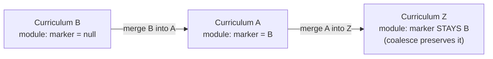
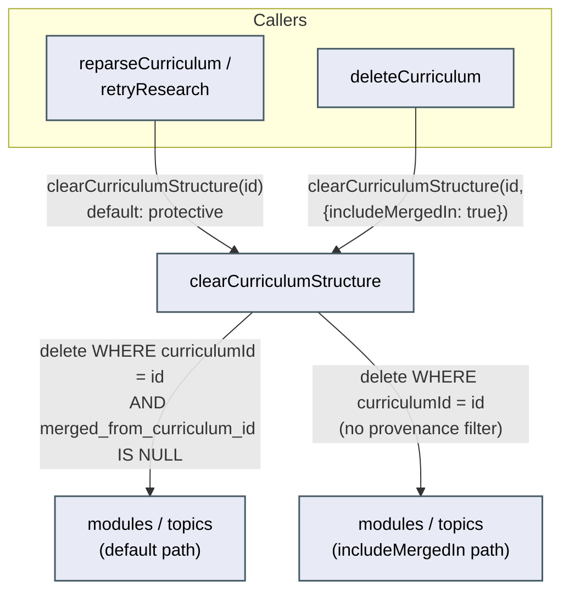

# Architecture: Curriculum merge

## What this covers

Curriculum merge lets a learner absorb one curriculum's modules, topics, sources, Socratic
sessions, and probe sessions into another curriculum in the same subject
(`mergeCurricula`, `apps/api/src/curriculum/curriculum.repo.ts`). This doc describes the
current-state shape of that merge and, specifically, how `clearCurriculumStructure` — the
shared "wipe this curriculum's structure and regenerate it" step used by the failed-curriculum
retry/reparse flow — knows which rows are safe to delete and which arrived via a merge and must
survive. No prior architecture doc existed for this feature; `review.md` in this same folder is
the `/debrief` that first found the gap this doc's provenance contract closes.

## Provenance model

`modules` and `topics` each carry a nullable `merged_from_curriculum_id` column (`text`, no
default, no foreign key — matching this schema's existing convention for plain
app-validated reference columns, e.g. `curricula.domain_node_id`). `null` means "native to this
row's current curriculum's own research/parse history." A non-null value names the curriculum
id the row most recently arrived from via a merge.

`mergeCurricula`'s reassignment step sets this marker on every module/topic it moves from
source to target, using `coalesce(existing_marker, source_id)` rather than an unconditional
overwrite:

This means a row that has already crossed one merge boundary keeps its *original* source
flagged through any number of later merges — it never gets relabeled as "native to" whichever
curriculum most recently absorbed it. A module merged into A and later re-merged (as part of A)
into Z is still recognized as non-native to Z.

## clearCurriculumStructure's contract

`clearCurriculumStructure(curriculumId, options?: { includeMergedIn?: boolean })` defaults
`includeMergedIn` to `false`. With the default, its three queries (the topic-id lookup used to
find gaps to clean up, the topics delete, the modules delete) all filter on
`merged_from_curriculum_id IS NULL` — only rows that trace back to the curriculum's own
research/parse history are removed. Gaps and gap-mastery rows are only cleaned up for topics
that actually get deleted, so a surviving merged-in topic keeps its gaps intact too.

Two real callers exist:

- **`reparseCurriculum` / `retryResearch`** (`curriculum-parse.orchestrator.ts`) call
  `clearCurriculumStructure(id)` with no options — they inherit the protective default
  automatically and needed zero code changes for this fix. This is the "Retry research" /
  "Reparse" recovery action a learner triggers from a failed curriculum's `FailedBanner`.
- **`deleteCurriculum`** explicitly passes `{ includeMergedIn: true }`, with a comment
  explaining why: a fully deleted curriculum must not leave orphaned modules/topics behind
  pointing at a now-nonexistent curriculum id. This is the one caller that means "this
  curriculum and everything currently under it is gone," not "clear and regenerate this
  curriculum's own structure."

Protection is the default, not an opt-in flag callers must remember — a hypothetical third
future caller of `clearCurriculumStructure` is safe by construction unless it deliberately
opts out, rather than safe only if it remembers a precondition nobody enforces. That "safety by
convention, not by construction" gap is exactly the shape of the original bug this fix closes
(see review.md's Verdict).

## New infrastructure

None. One additive schema change (two nullable columns) plus the repo-layer filter/write
changes described above.

## Data model

- `modules.merged_from_curriculum_id` — nullable `text`, no default, no FK. Existing rows stay
  `null`; zero backfill.
- `topics.merged_from_curriculum_id` — same shape, same reasoning.
- `sources`, `socratic_sessions`, `probe_sessions` are not touched — `clearCurriculumStructure`
  never deletes rows from those tables, so there is nothing for a marker there to protect
  against.
- This is deliberately a different mechanism from issue #62's `ontology_merges` table (an
  operation-level, append-only audit log keyed by target/source curriculum ids, recording counts
  moved — not which specific module/topic ids moved). `ontology_merges` cannot answer "is this
  specific row currently safe to delete," which is the question `clearCurriculumStructure` needs
  answered at row-delete time; `merged_from_curriculum_id` is a row-level, always-resolvable
  marker built for exactly that question. The two features share only a call site —
  `mergeCurricula`'s reassignment step now writes to both, independently.

## Known limitations (stated plainly, not fixed here)

**Not retroactive.** This protects merges that happen *after* this fix shipped. Any
module/topic moved by a merge that ran before this migration landed has
`merged_from_curriculum_id = null` (the column didn't exist yet), so it is indistinguishable
from a native row and remains unprotected against a future clear on its current curriculum.
Backfilling from `ontology_merges` was considered and rejected: that table's `source_id` refers
to an already-deleted curriculum row and only records counts, not which specific module/topic
ids moved — there is nothing to backfill from with certainty. Acceptable for this personal,
single-user project at its current merge volume.

**Doesn't make the orchestrator functions fully provenance-aware end-to-end.** This fix stops
`clearCurriculumStructure` from *deleting* merged-in modules/topics, but the two flows that call
it still touch the `sources` table without any provenance awareness of their own:

- `reparseCurriculum` clears A's native modules/topics, then calls `parseCurriculum`, which
  regenerates structure from `getCurriculumSourceRows(A)` — a set that can still include sources
  `mergeCurricula` moved over from B (nothing in this fix touches `sources`). If B's sources are
  still present, this can produce fresh native modules covering material B's preserved modules
  already cover — duplication, not loss, but a learner could see B's content twice after a
  reparse.
- `retryResearch` calls `deleteAllCurriculumSources(A)` unconditionally before re-researching, so
  B's originally-merged-in modules/topics survive this fix's protection, but the source material
  that originally justified them is deleted along with A's own sources.

Both are consistent with this fix's deliberate modules/topics-only scoping (matching the
original review's proposal) and are named here as follow-up candidates, not closed in this
pass — closing them would mean extending provenance tracking to `sources` too, a larger change
than issue #68 asked for.

**A related, distinct risk left untouched.** `mergeSourcesIntoCurriculum`'s
`partitionModulesForMerge` step (`curriculum-rules.ts`) classifies modules into
locked-vs-free-for-regeneration purely by learner-touch state, not by provenance — a freshly
merged-in module with no learner progress yet would be classified "free" and could be deleted
by that flow's own `deleteModules(freeModuleIds)` call. This is a distinct data-loss path from
the one this issue names (it doesn't go through `clearCurriculumStructure` at all), flagged for
a future wishlist item rather than folded into this fix.

## Rollout

Additive column, default `null`, no backfill, no behavior change for any curriculum that has
never been part of a merge. Ships as one migration plus the repo-layer change together, no
phased rollout — the limitations above are the accepted state after shipping, not a TODO for a
later phase of this same fix.
