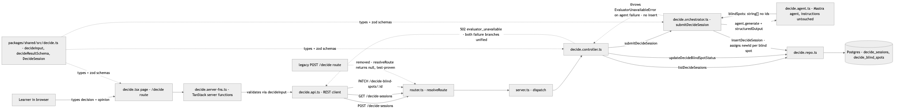

# Architecture Review: decide-mode

## What was reviewed

The `/decide` page lets a learner state a decision and their own opinion before any AI response, then a Mastra agent returns strengths, blind spots, questions, and a verdict. This item added persistence (nothing survived a reload before), and made each blind spot individually actionable (accept/flag or reject/dismiss), replacing the old stateless stub. In scope: `apps/api/src/decide/*`, `apps/api/src/db/schema.ts` and its migration, `apps/api/src/router.ts`/`server.ts`, `packages/shared/src/decide.ts`, and `apps/web/src/decide/*` plus `apps/web/src/routes/decide.tsx`. Reviewed by diffing merge commit `c9835c1` (parents `9303ff4` and `b6229cf`) against `9303ff4`, cross-checked against `.planning/decide-mode/spec.md` and `.planning/LOG.md`'s 10:15 entry.

## Documentation found

`.planning/decide-mode/spec.md`, `discussion.md`, `scenarios.md`, `playwright.md`, and `state-fixtures.md` — all confirmed and merged, describing the plan before the build. No drift found: every documented decision (standalone tables, agent/schema split, route rename, 502 unification, caller sweep) matches the shipped code exactly, verified by reading the actual files rather than trusting the docs.

## As-built architecture

The learner's browser hits `decide.tsx`, which calls TanStack Start server functions (`decide.server-fns.ts`) that validate input via the shared `decideInput` zod schema before making a REST call (`decide.api.ts`) to the API. `router.ts` resolves three noun-based routes — `POST /decide-sessions`, `GET /decide-sessions`, `PATCH /decide-blind-spots/:id` — dispatched by `server.ts` to `decide.controller.ts`. The controller either delegates to a new `decide.orchestrator.ts` (agent call + persistence) or straight to `decide.repo.ts` (list/update). The orchestrator calls the untouched `decide.agent.ts` Mastra agent, which still returns bare `blindSpots: string[]`; the orchestrator assigns each one a server-generated id and writes one `decide_sessions` row plus N `decide_blind_spots` rows via the repo. On any agent failure (thrown error or missing/invalid structured output) the orchestrator throws a single `EvaluatorUnavailableError`, which the controller maps to HTTP 502 — and, verified by reading `decide.repo.ts` and `decide.orchestrator.test.ts`, neither failure path ever reaches `insertDecideSession`, so no partial or junk row is ever persisted. The legacy `POST /decide` route no longer resolves at all — confirmed by a router unit test that asserts `resolveRoute("POST", "/decide")` returns `null`, and independently by my own repo-wide grep finding no other caller.

## Verdict

**Sound.** This is a clean, additive port of an already-proven pattern (`domain_priority_suggestions`' accept/reject shape and `writing-check`'s controller/orchestrator/repo split) onto a genuinely new persistence need, and every one of the three flagged risk areas holds up under direct code inspection:

**Backward compatibility of removing `POST /decide`:** no real concern. I independently re-verified the spec's caller sweep — grepped the entire repo (including `apps/bot`, `apps/mobile`) for the old route and for `decide(...)` calls. The only caller was `apps/web/src/curriculum/api-client.ts`'s `decide()` function, which was moved (not duplicated) into the new `decide/decide.api.ts`, and `curriculum/api-client.ts`/`curriculum.api.ts`/`curriculum/model.ts` are clean of any leftover decide references. There is no bot, mobile, or third-party integration depending on the old shape. The removal is also test-locked, not just documented: `router.test.ts` asserts the old route returns `null`.

**Standalone (no subject attachment) design:** holds up well now that the actual code is visible. `decide_sessions`/`decide_blind_spots` have no `subjectId`/`topicId` column, and nothing in the shipped controller, orchestrator, repo, or frontend reaches for subject context anywhere — there's no half-wired subject picker or dead branch waiting for one. The reasoning in spec.md (a decision like "should we move off JWTs" isn't tied to one subject's pedagogy, and this codebase already has a cheap precedent — `curricula.domainNodeId` — for bolting on a nullable attachment column later if a real cross-linking need appears) is consistent with how the rest of this codebase actually behaves, not just asserted. The one real tradeoff: if a future feature wants to filter or group decide-sessions by topic, that requires a migration plus a backfill decision for existing standalone rows — acceptable now, since no such consumer exists today.

**The `server-fn-response.ts` base64URL fix (lives in `verification-repo`, not `post-anki` — this is why it isn't visible from a `post-anki`-only search):** I read the regex and decode logic directly rather than trusting the commit log's description. The capture regex `/\/_serverFn\/([A-Za-z0-9\-_]+)/` uses the full base64url alphabet, so it no longer truncates at a `-`/`_`. The `-`→`+`, `_`→`/` substitution is the correct reverse mapping from base64url to standard base64. The padding formula `'='.repeat((4 - (base64.length % 4)) % 4)` is the standard, correct base64-padding computation (0/2/1 padding characters for length-mod-4 of 0/2/3; length-mod-4 of 1 never occurs in valid base64). This is a genuinely correct general fix, not a fix that happens to work for the one descriptor string that exposed the bug — it would decode any base64url-encoded `/_serverFn/` segment correctly, not just decide-mode's. The one real gap: there is no dedicated unit test for `decodeServerFnUrl`/`isServerFnResponse` in isolation — it's only exercised indirectly through e2e scenarios that happen to hit the `/_serverFn/` matching path, so correctness here rests on my own manual trace of the logic plus the fact that it's shared infrastructure exercised by every TanStack-Start-driven e2e action.

No other architectural concerns cross the bar for escalation. The unbounded `SELECT * FROM decide_blind_spots` in `listDecideSessions()` (no filter, no pagination) is explicitly accepted in spec.md for this app's current personal-use scale, matching `writing_checks`' own unpaginated GET — not flagged as a new problem.

## Questions a reviewer would ask

1. `decide.tsx`'s `handleSubmit` has no try/catch — a failed submission just re-enables the button silently, with no error shown. This matches an existing house-style gap already noted in a prior debrief (`check-my-writing-mode`), but should it finally be fixed here now that a second occurrence exists, or is a shared error-toast mechanism worth building once rather than patching per-feature?
2. `insertDecideSession` inserts the session, then does a separate `SELECT` to re-fetch the row it just wrote instead of using Drizzle's `.returning()` on the insert directly (as the blind-spots insert already does). Is that a deliberate choice, or just an inconsistency worth tightening?
3. The `source: "decide"` discriminator on `decide_blind_spots` is described as the seam for #57 (generalized gap-tracking). Has anyone sketched what the actual migration/fold-in query looks like when #57 ships, or is that still purely aspirational?
4. `listDecideSessions()` has no pagination and fetches every blind spot row on every call. What's the actual expected ceiling on session count before this becomes a real cost, and is there a planned trigger point (row count, latency) rather than just "small personal-use scale" as the ongoing justification?
5. The 502-unification decision collapses "agent threw" and "agent returned no/invalid structured output" into the same `EvaluatorUnavailableError`. Is there any operational value lost by not distinguishing a transport/API failure from a schema-validation failure in logs or alerting, given they're logged under different messages (`decide_agent_call_failed` vs `decide_agent_returned_no_structured_output`) but surfaced identically to the client?
6. `server-fn-response.ts`'s `decodeServerFnUrl`/`isServerFnResponse` have no dedicated unit test of their own — correctness currently rests on this review's manual trace plus indirect e2e coverage. Given this is now shared infrastructure for every TanStack-Start-driven e2e action, is a small standalone unit test (a handful of known base64url descriptors, including ones that produce `-`/`_`) worth adding directly?
7. The blind-spot accept ("Flag as a gap to revisit") button doesn't yet do anything beyond setting `status: "accepted"` on the row — there's no #57 gap created yet. Is the UI copy ("Flag as a gap to revisit") setting an expectation the current build doesn't fulfill, or is that intentionally deferred and understood as such?

## For the business-stakeholder Q&A that closes the BMAD cycle, run /debrief-qa.
