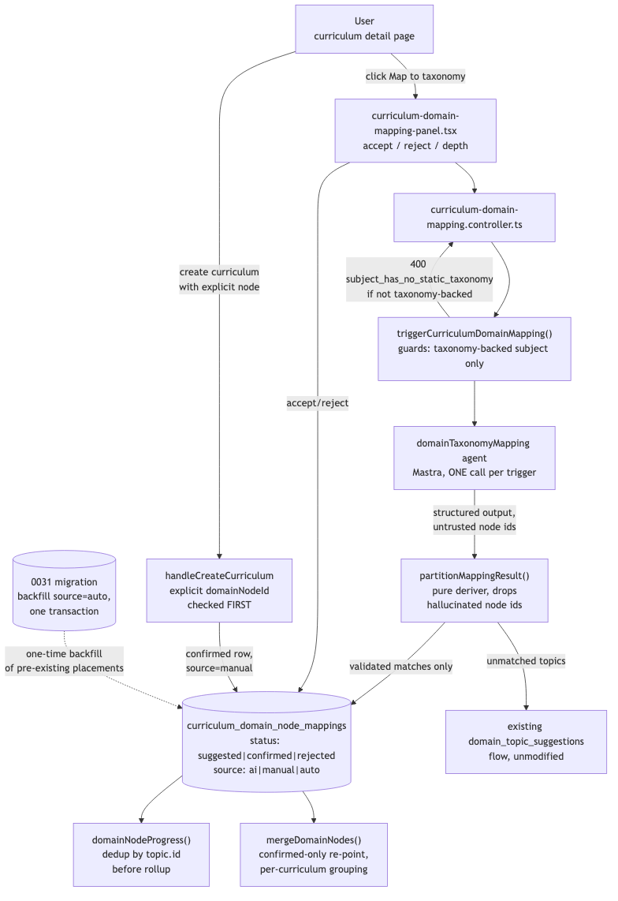

# Architecture Review: decouple-curricula-from-domain-nodes

## What was reviewed

The core structural change underpinning post-anki's static-knowledge-map foundation: curricula now
attach to domain-tree nodes through a many-to-many `curriculum_domain_node_mappings` table instead
of a single `curricula.domain_node_id` column. For taxonomy-backed subjects, an AI agent suggests
mappings once per trigger and a human accepts/rejects them; non-taxonomy subjects keep the existing
auto-placement behavior unchanged. 22 modified files, 10 new files, all uncommitted in an isolated
worktree.

## Documentation found

`.planning/decouple-curricula-from-domain-nodes/architecture.md` documents the intended design in
detail and was written before build — read and cross-checked against the actual code rather than
taken at face value. No drift found: the build matches the documented design, including the six
forks resolved via `fork-classifier` and posted to GitHub issue #84 with recommended defaults.

## As-built architecture

A curriculum reaches a confirmed mapping row one of two ways: an explicit `domainNodeId` at
creation time is checked and honored before any other logic runs (`handleCreateCurriculum`), or a
user triggers AI-assisted mapping from the curriculum detail page, which calls a Mastra agent
exactly once (not a per-topic fan-out), validates every returned node id against the subject's real
tree before trusting it, and routes any topic the agent couldn't match into the existing,
unmodified `domain_topic_suggestions` review flow rather than inventing a new node directly. Two
consumers read the mapping table: `domainNodeProgress()` (deduped by topic id before rollup, so a
curriculum mapped under two nodes sharing an ancestor doesn't get double-counted) and
`mergeDomainNodes()` (re-points mapping rows when two domain nodes merge, now confirmed-status-aware
on both sides after tonight's fix).

## Verdict

**Sound**, after two real bugs were caught and fixed during this same build/review cycle rather than
shipping. The design makes good use of existing patterns instead of inventing new ones: the AI
suggestion flow mirrors the cost/safety discipline already established by
`domain-priority-review.orchestrator.ts` (bounded to one LLM call, foreground and error-propagating
rather than silently falling back), unmatched topics reuse the existing suggestion-review pipeline
instead of a parallel one, and the migration's whole-file transaction wrapping (Drizzle's own
migrator behavior, verified by reading its source during review) makes the schema cutover atomic —
no window where both the old column and the new table exist half-migrated.

The one real tradeoff worth naming: this ticket explicitly left a related, pre-existing bug
unfixed — `mergeSubjects` never reassigns `domain_topic_suggestions.subject_id`, so a suggestion
under a merged-away subject can be rejected but never accepted. This is correctly out of this
ticket's file scope (confirmed via `git diff` showing zero changes to `subject.repo.ts`), and
independently corroborated as pre-existing by one integration test failure that already existed
before this branch started. It's a real gap a user could hit, just not one this ticket created or
was scoped to close — worth a follow-up ticket, not a blocker here.

## Questions a reviewer would ask

1. The AI mapping agent is called with the subject's *entire* domain-node tree serialized into the
   prompt on every trigger — at what tree size does this become a real token-cost or context-limit
   concern, and is there a plan to scope the prompt to a relevant subtree instead of the whole tree
   as the taxonomy grows past its current ~208 seed nodes?
2. `triggerCurriculumDomainMapping` propagates agent failures as a thrown error (502) rather than
   falling back silently, unlike `domain-placement.orchestrator.ts`'s existing pattern — is that
   inconsistency intentional and documented somewhere a future engineer would find it, or does it
   just read as two different philosophies for what's conceptually the same kind of failure?
3. Now that a curriculum can hold multiple *pending* (non-confirmed) mapping rows simultaneously
   (e.g. several AI suggestions awaiting review), is there any UI/API path where a user could
   accidentally confirm more than one — and if so, does anything enforce "at most one confirmed row
   per curriculum," or is that an implicit invariant nothing currently guards?
4. The merge-rewrite fix re-points *all* non-confirmed source rows to the target when no confirmed
   row exists, rather than deleting them — does this mean a curriculum could end up with rows at a
   node it was never actually suggested against by anything user-visible, purely as a side effect of
   an unrelated merge two nodes away in the tree's history? Is that surfaced anywhere a human would
   notice, or does it just sit invisibly until someone queries the raw table?
5. `seed-domain-taxonomy.ts` deviated from the plan's YAML-file framing to an in-file hierarchy,
   matching the existing `seed-domain-nodes.ts` pattern — was the original architecture.md's YAML
   framing based on a misunderstanding of what already existed in this repo, and if so, is that
   worth correcting in the doc so the next planner doesn't propose the same mismatch?
6. Given how much correctness risk concentrated in `mergeDomainNodes`'s status-aware rewrite
   specifically — two real bugs in one function across two review passes — is there a case for a
   dedicated property-based or fuzz test generating random status/row-count combinations at both
   ends of a merge, rather than relying on hand-picked scenario tests to keep finding the next edge
   case one at a time?
