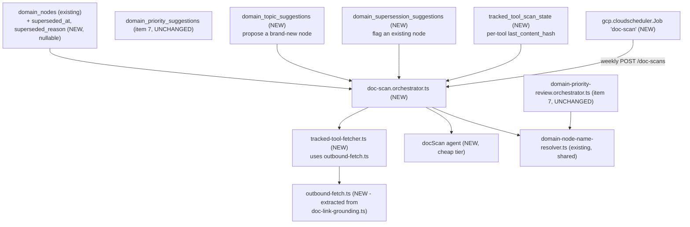
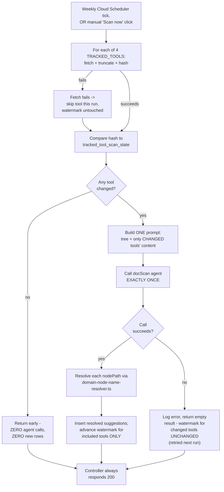
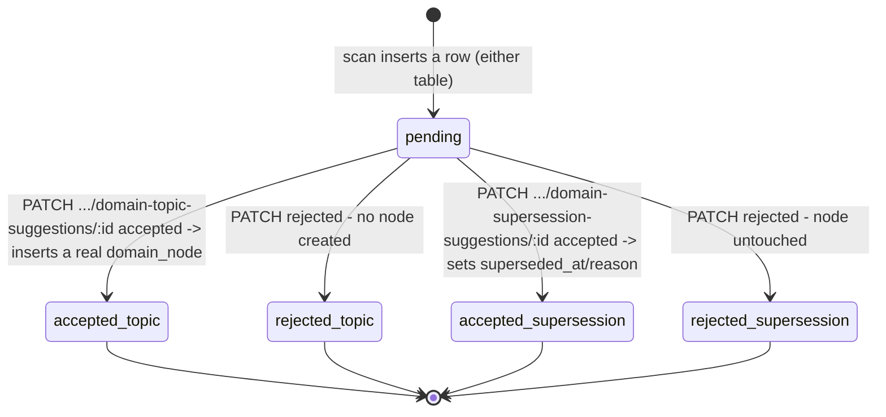
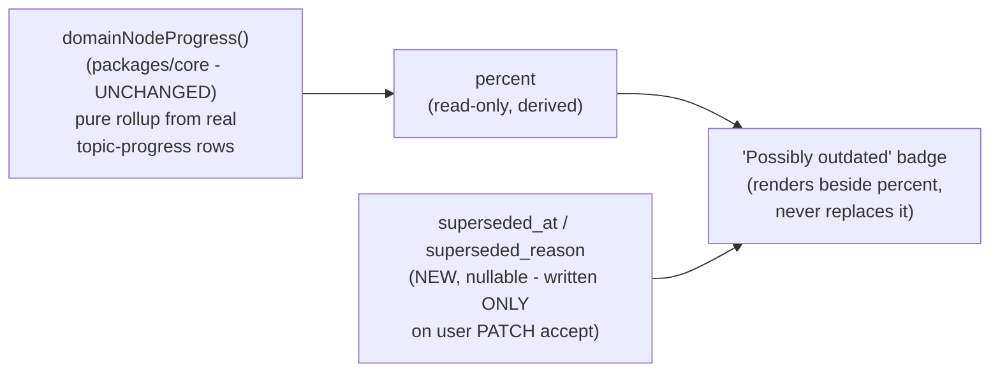

# Periodic doc/changelog scan (issue #49)

A weekly (plus manual "Scan now") scan of a small hardcoded list of real tools' changelog/release
feeds, gated by a persisted per-tool content hash so the same release never re-surfaces twice.
Only when at least one tracked tool's content has genuinely changed since the last run does the
scan call one cheap Mastra agent, which proposes up to a handful of suggestions of two kinds: a
brand-new domain-map node, or an existing node possibly superseded by newer material. See
`.planning/doc-changelog-scan/` for the full plan (`spec.md`, `scenarios.md`, `architecture.md`,
`discussion.md`).

## Where the new pieces sit relative to item 7's shape

`domainNodeProgress()` (item 5's percent rollup) and `domain_priority_suggestions` (item 7) are
untouched — this plan adds two new sibling suggestion tables and one new marker pair on
`domain_nodes`, not a modification to either existing mechanism.

## Scan flow

**The deliberate divergence from `domain-priority-review.orchestrator.ts` (item 7).** Item 7's
trigger is foreground and user-waited-on, so an agent failure there throws visibly (502) — a silent
no-op would look like a bug. This scan's primary trigger is a scheduled background job nobody is
watching in real time; the manual "Scan now" button reuses the identical orchestrator rather than
getting its own contract. An agent failure here is caught, logged, and returns an empty/flagged
result — `200` always — matching `domain-placement.orchestrator.ts`'s existing silent-fallback
posture instead. Verified by `doc-scan.orchestrator.test.ts`'s SCENARIO 10 case: the two changed
tools' watermark stays at their OLD hash on a failed call, so they're retried next run rather than
silently marked "scanned" despite producing nothing.

## Accept/reject — two sibling state machines, not one shared table

Why two tables instead of reusing item 7's `domain_priority_suggestions`: verified by reading the
actual schema — `domain_priority_suggestions.domain_node_id` is `NOT NULL` and its payload column
is `suggested_target_depth`. A new-topic proposal has no existing node id to reference yet; a
supersession flag isn't a target-depth change. Two small, fully-NOT-NULL-where-possible tables
share the exact same `pending|accepted|rejected` + `resolved_at` + `source` shape as a pattern, not
as a literal shared row.

## The "flag, not reduce" boundary

`percent` and the supersession flag are two independent signals rendered side by side — the scan
job itself never writes to either `domain_nodes.target_depth` (item 7's column) or anything that
feeds `domainNodeProgress()`. The only write path to `superseded_at`/`superseded_reason` is the
user's own PATCH accept, which is exactly what keeps this compliant with `.product/PRINCIPLES.md`'s
"no passive maturity decay" rule. Proven at both layers: `doc-scan.orchestrator.test.ts`'s
percent-byte-identical assertion at the backend, and `@doc-changelog-scan.S8`'s equivalent
assertion through the real UI/API round trip.

## Scheduling

`infra/index.ts` gains a second `gcp.cloudscheduler.Job`, `"doc-scan"`, mirroring `dailyPushJob`'s
shape exactly — weekly (`0 9 * * 1`, `Europe/Warsaw` by default), `attemptDeadline: "300s"` (longer
than `dailyPushJob`'s `60s`: worst case 4 tools x 8s fetch timeout + one LLM call), targeting
`POST https://<apiDomain>/doc-scans` with an `Authorization: Bearer <apiSharedSecret>` header. This
introduces one new deploy prerequisite that could not be exercised in the planning/implementation
session (no live `pulumi up` was run, only a `pulumi preview` diff — see
`.planning/doc-changelog-scan/todo.md` for the exact manual steps a human must run once).

## E2E override — the one dependency the e2e stage cannot let reach the real internet

Unlike item 7 — whose review trigger reads only from the database before reaching the mockable LLM
call — `tracked-tool-fetcher.ts` makes real outbound HTTPS calls to GitHub before the agent is ever
involved. `E2E_MOCK_TRACKED_TOOL_CONTENT` (a new optional env var, JSON-encoded
`Record<toolKey, string>`) short-circuits `fetchTrackedTool()` before it ever calls
`fetchWithTimeout` — for every tool, not just the ones present in the mocked map (a tool_key
missing from the map returns `null`/skipped, never a silent fallthrough to a real fetch). Same
shape and rationale as `resolveAgentModel`'s existing `OPENROUTER_BASE_URL` override.

## What this plan does not change

- `packages/core/src/domain-map/domain-map-progress.ts` — `domainNodeProgress()` unchanged; no
  code path in this plan can set `percent`.
- `apps/api/src/domain-map/domain-priority-review.orchestrator.ts` and
  `domain_priority_suggestions` — zero changes, own table, own mechanism, untouched.
- `apps/bot/src/server.ts` — zero changes; no new Telegram push wired.
- Every other Cloud Run service, domain mapping, or service account in `infra/index.ts` — additive
  only; the new `gcp.cloudscheduler.Job` targets the existing `apiService`, no new service.

## Known plan-vs-implementation deviations (discovered while building)

- `doc-link-grounding.ts` has no dedicated test file in this repo at all (confirmed by grep before
  and after the `outbound-fetch.ts` extraction) — the "pure refactor proven by its existing tests"
  claim in `spec.md` has no literal test to point at. The closest available proof is the full
  `apps/api` vitest sweep (220+ tests) and `npx tsc --noEmit` passing unchanged after the
  extraction, plus a byte-for-byte read of the refactored file confirming identical control flow.
- `vitest.config.ts`'s existing comment (inherited from item 7's own file) claims "an explicit CLI
  path bypasses `exclude`, confirmed empirically" — this is not true for the vitest 2.1.9 pinned in
  this repo: `npx vitest run <excluded-path>` reports "No test files found" and the CLI `--exclude`
  flag is additive-only (as `vitest.integration.config.ts`'s own comment separately, correctly,
  documents). `doc-scan.orchestrator.test.ts`'s DoD proof was actually run by temporarily commenting
  out its own exclude-list entry, running it, then restoring the entry — the same latent gap
  applies equally to `domain-priority-review.orchestrator.test.ts`'s pinned command.
- `tracked_tool_scan_state` is a genuinely global table (keyed only by `tool_key`, not per-subject)
  — unlike every other table this feature's e2e suite touches, a fresh subject per test does not
  isolate it. SCENARIO 5's e2e test explicitly clears this table as a precondition
  (`deleteRows('tracked_tool_scan_state')`, a new small helper added to verification-repo's
  `db/pg.ts`) so the test is correct on a repeat run against the same persistent local e2e Postgres,
  not only on a pristine one.
- **The same global-keying is a real correctness bug across multiple gated subjects, not merely a
  performance deferral as `spec.md` originally framed it.** `runDocScanForAllTrackedSubjects()`
  dispatches once per subject from `listSubjectIdsWithDomainNodes()`; the first subject processed in
  a given run genuinely sees changed content and advances the watermark for every tool — every
  subject processed afterward in that same run then sees the identical content as already
  "unchanged," even though it was never itself scanned. Proven deterministically by
  `doc-scan.orchestrator.test.ts`'s `handleTriggerAllDocScans` test (asserts exactly one of N gated
  subjects gets `agentCalled: true` per dispatch). Invisible today (exactly one gated subject
  exists) but becomes a real bug the moment a second subject is gated — see
  `.planning/doc-changelog-scan/todo.md`'s "Before seeding a second gated subject" section for the
  fix (a composite `(subject_id, tool_key)` key), deliberately not applied in this ticket since it's
  a schema change a human should scope explicitly.
- **FIXED 2026-08-01 (migration `0030_groovy_madame_web`).** Both bullets above are now history:
  the table is composite-keyed on `(subject_id, tool_key)`, every gated subject compares against
  its own hashes, and `handleTriggerAllDocScans` asserts that ALL gated subjects get
  `agentCalled: true`. One consequence for the e2e suite: a fresh subject per test now DOES
  isolate this table, so SCENARIO 5's `deleteRows('tracked_tool_scan_state')` precondition is no
  longer required (harmless, just redundant).
