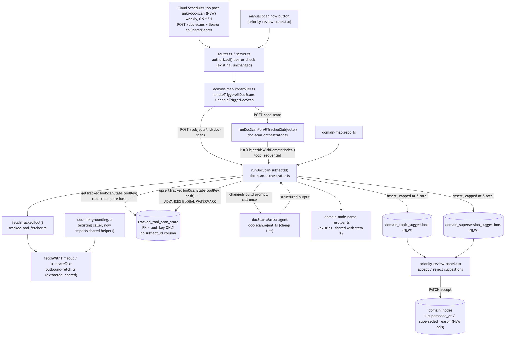

# Architecture Review: doc/changelog scan (issue #49)

## What was reviewed

A weekly Cloud Scheduler job (plus a manual "Scan now" button) that fetches four tracked tools'
changelog feeds, hashes their content against a persisted watermark, and — only when something
actually changed — makes one cheap-tier LLM call proposing new domain-map topics or flagging
existing topics as possibly superseded, surfaced on the existing accept/reject review screen. In
scope: `apps/api/src/domain-map/{doc-scan.orchestrator,tracked-tool-fetcher,tracked-tools}.ts`, the
new `apps/api/src/mastra/doc-scan.agent.ts`, the `apps/api/src/shared/outbound-fetch.ts` extraction
and its effect on `apps/api/src/curriculum/doc-link-grounding.ts`, three new/altered tables in
`apps/api/src/db/schema.ts`, the controller/router wiring, the review-panel UI changes, and the new
`gcp.cloudscheduler.Job` in `infra/index.ts` — the first piece of real cloud infrastructure change
in this run.

## Documentation found

Full plan-backed documentation existed and was read: `.planning/doc-changelog-scan/{spec,scenarios,
architecture,discussion,state-fixtures,todo}.md`, the build-agent's own `docs/architecture/
doc-changelog-scan.md`, and `.planning/LOG.md`'s 13:15 entry. The code was independently verified
against every one of these documents' load-bearing claims rather than trusted at face value — see
below. No drift was found between the documentation and the code paths the documents actually
describe. Two gaps not covered by any of the existing documents turned up while reading the PATCH
accept handlers and the topic/supersession resolution filtering directly (see verdict items 4 and
5) — these are genuinely new findings from this review, not drift from an existing claim.

## As-built architecture

Two triggers (the weekly scheduler tick and the manual button) both land on the same `authorized()`
bearer check and the same controller, which either dispatches to every subject with domain nodes
(`POST /doc-scans`, the scheduler's target) or a single subject (`POST /subjects/:id/doc-scans`).
`runDocScan(subjectId)` fetches all four tracked tools via `tracked-tool-fetcher.ts`, which itself
calls the newly extracted `fetchWithTimeout`/`truncateText` in `outbound-fetch.ts` — the same shared
primitives `doc-link-grounding.ts` now imports instead of keeping private copies. Each tool's content
hash is compared against `tracked_tool_scan_state`, keyed by `tool_key` alone. If nothing changed,
the function returns with zero agent calls. If something changed, one prompt is built from only the
changed tools' content, the `docScan` agent is called exactly once, results are resolved to real node
ids via the existing name resolver, capped at 5 total, and inserted into two new sibling tables. The
watermark is only advanced for tools included in a *successful* call; a failed call leaves it
untouched so the same content is retried next run. Suggestions surface on the existing review panel,
and accepting a supersession suggestion sets new nullable columns on `domain_nodes` — it never writes
to the derived `percent` value.

## Verdict

**Sound.** The design correctly keeps the scan job's failure posture (silent-catch, 200 always,
un-advanced watermark) deliberately opposite to the user-facing priority-review job (throws visibly),
and that divergence is justified by who is watching each trigger. The "flag, not reduce" boundary on
knowledge percentage is real and enforced only through a user-initiated PATCH — confirmed by reading
`resolveDomainSupersessionSuggestion()` and `resolveDomainTopicSuggestion()` in `domain-map.repo.ts`
directly (both accept paths, not just the insert side), plus `schema.ts`. All three specific claims
called out for scrutiny check out under direct code reading, not just the todo.md write-up, and two
further gaps turned up while reading the accept path and the resolution-filtering logic that weren't
part of the original scrutiny list:

1. **Auth header ternary (`infra/index.ts`)** — `apiSharedSecret ? {...} : undefined` is a real
   deploy-time risk. `config.getSecret("apiSharedSecret")` returns `undefined` synchronously if the
   Pulumi secret was never set (todo.md step 1 is exactly this one-time step, not yet run anywhere),
   so `pulumi up` would succeed and silently produce a scheduler job with `headers: undefined` — no
   Authorization header at all, no deploy-time error. At runtime, `server.ts`'s `authorized()`
   (unchanged, applies to every route) **fails open when `API_SHARED_SECRET` is unset** (`if
   (!env.API_SHARED_SECRET) return true`) but **fails closed and returns 401** when it is set and the
   request has no matching header — so a header-less scheduler request against prod (where the
   secret is set) is rejected, not let through. The practical risk is availability, not an auth
   bypass: the feature would silently never produce a suggestion, forever, until someone notices.
   This exact failure mode is already anticipated in `todo.md`'s own step 3 ("a `401` there means
   step 1 was skipped"), so a human verifying the deploy will catch it — but the safety net is a
   documented manual check, not a deploy-time assertion. A `config.requireSecret()` in place of
   `config.getSecret()` would turn this into a `pulumi up`/`preview` failure instead of a silent
   no-op; see the reviewer questions below.
2. **`outbound-fetch.ts` extraction** — confirmed byte-for-byte behavior-preserving by diffing
   `doc-link-grounding.ts` against its pre-refactor version: identical `AbortController`/timeout
   logic, identical control-character regex, identical truncation logic, only parameterized
   (`timeoutMs`, `maxChars`) rather than hardcoded. `CONTROL_CHARS_EXCEPT_WHITESPACE` keeps its global
   (`g`) flag and is now shared across two callers — that would be a real cross-caller `lastIndex`
   hazard if it were driven through `.test()`/`.exec()`, but both callers only ever use it through
   `String.prototype.replace()`, which resets `lastIndex` on every call, so this is safe. The "no
   dedicated test file" claim is also confirmed real — `grep` across `apps/api/src` finds zero test
   files referencing `doc-link-grounding` and no test file for `outbound-fetch.ts` itself; the new
   consumer's test (`tracked-tool-fetcher.test.ts`) mocks both extracted functions at the module
   boundary rather than exercising the real implementation, so it does not independently re-prove the
   extraction's correctness — it was proven by the diff read, not by a test.
3. **`tracked_tool_scan_state` single-subject limitation** — confirmed real by reading the schema
   (`toolKey: text("tool_key").primaryKey()`, no `subject_id` column at all) and the orchestrator
   (`getTrackedToolScanState(tool.toolKey)` / `upsertTrackedToolScanState(tool.toolKey, hash)` take no
   subject argument, and `runDocScanForAllTrackedSubjects()` iterates subjects sequentially against
   that same global watermark). The first subject processed in a scheduled run genuinely advances the
   watermark for every changed tool; every subject after it in the same run then sees that content as
   already-scanned and gets nothing. This is invisible today because exactly one subject
   ("Programming / Web Development") has any `domain_nodes` rows, and becomes a real correctness bug
   — not merely a performance deferral — the moment a second subject is gated. The fix (a composite
   `(subject_id, tool_key)` key) is correctly deferred to a human decision rather than patched
   quietly, since it's a schema change with its own migration and repo-signature implications.
   **Resolved 2026-08-01: the composite key shipped as migration `0030_groovy_madame_web`, proven
   by `doc-scan-subject-watermark.integration.test.ts` (two gated subjects, two agent calls, two
   independent sets of suggestions in one scheduled run).**
4. **No idempotency guard on suggestion accept (found while reading the accept path).**
   `resolveDomainTopicSuggestion()` and `resolveDomainSupersessionSuggestion()` each read the existing
   row, then act on `status` unconditionally — neither checks that the suggestion is still `pending`
   before proceeding. Both are wrapped in a single `db.transaction`, so the row update and the
   side-effect (a new `domain_nodes` insert, or the `superseded_at`/`superseded_reason` write) are
   atomic with each other, which rules out a half-applied write. But nothing stops two overlapping
   PATCH `{accepted}` calls against the same already-resolved suggestion (a double-click, a retried
   request) from running twice: the topic path would insert a second real `domain_nodes` row and
   overwrite `createdDomainNodeId`, orphaning the first inserted node with nothing pointing back to
   it. Also unguarded: `resolveDomainTopicSuggestion()` inserts under `proposedParentNodeId` with no
   existence check at accept time — if that parent node was deleted between scan and accept, the
   insert proceeds anyway (consistent with this schema's existing plain-text-reference convention, no
   `.references()` FK anywhere on these tables, so nothing at the database layer would catch it
   either). Confirmed reachable by a plain double-click, not just a retried network request:
   `priority-review-panel.tsx`'s accept/reject buttons for both new-topic and supersession
   suggestions (unlike the "Scan now" and "Run review" buttons, which use `disabled={scanning}` /
   `disabled={triggering}`) have no per-item pending flag — `resolveNewTopic()`/`resolveSupersession()`
   only remove the suggestion from local list state after the `await` resolves, so nothing disables
   the button or hides the row between the first click and the response.
5. **Topic and supersession suggestions resolve their agent-provided node paths asymmetrically
   (found while reading `doc-scan.orchestrator.ts`'s resolution step against
   `domain-node-name-resolver.ts`).** `resolvedSupersessions` filters strictly on `resolved.fullyResolved
   && resolved.nodeId`, dropping anything the agent's `nodePath` didn't fully resolve against the real
   tree. `resolvedTopics` has no such filter — it takes `resolveNodePathByName(...).nodeId` straight
   through regardless of `fullyResolved`. Per `resolveNodePathByName`'s own contract, a partial match
   returns the deepest ancestor that *did* resolve, not `null`, and a suggestion whose whole path
   fails to match returns `null` (root). Since `proposedParentNodeId` is nullable and `null` means
   "attach at the subject root" (a legitimate case), there's no signal distinguishing "the agent
   genuinely wants this at the root" from "the agent's path didn't match anything, so it landed at
   the root by fallthrough" or "the agent's path partially hallucinated and it landed under a
   plausible-but-wrong ancestor." A human reviewing the suggestion on the accept screen is the only
   backstop.

None of these cross the bar for a critical/high-stakes finding (worst case is an orphaned real
`domain_nodes` row from a double-accepted topic suggestion — surfaces visibly in the domain map, not
silent corruption of anything a human can't see and fix; no security bypass; no runaway cost; no
blocking SPOF against near-term planned work) — they are exactly the kind of tradeoffs and small gaps
a reviewer should surface rather than either rubber-stamp or escalate.

## Questions a reviewer would ask

1. Why does a partial or fully-failed `parentNodePath` resolution silently fall through to "attach at
   subject root" for a new-topic suggestion (`resolvedTopics` in `doc-scan.orchestrator.ts` never
   checks `fullyResolved`), while the equivalent supersession path drops the suggestion outright when
   `fullyResolved` is false? Should topic resolution use the same filter, or is landing an
   unresolved/hallucinated path at the root (rather than dropping it) an intentional choice the review
   screen is expected to catch?
2. `resolveDomainTopicSuggestion()` and `resolveDomainSupersessionSuggestion()` act on `status` with no
   check that the suggestion is still `pending` first, and the accept/reject buttons in
   `priority-review-panel.tsx` have no per-item disabled state while the PATCH is in flight (unlike
   the page-level "Scan now"/"Run review" buttons, which do) — so a plain double-click, not just a
   retried network request, reaches this today. What stops accepting the same suggestion twice (a
   second real `domain_nodes` row for topics, orphaning the first), and is that worth a `WHERE status
   = 'pending'` guard on the update plus a disabled state on the button while the request is in
   flight?
3. The scan's read-compare-write on `tracked_tool_scan_state` (`getTrackedToolScanState` then, after
   all inserts, `upsertTrackedToolScanState`) has no lock and no unique constraint on the new
   suggestion tables to catch a duplicate insert — could a second concurrent trigger (the manual "Scan
   now" button firing while the scheduler's request is still in flight, or a Cloud Scheduler retry —
   `docScanJob` in `infra/index.ts` sets no explicit `retryConfig`, so its actual retry behavior is
   whatever the provider default is) read the same stale hash and produce duplicate pending
   suggestions on the review screen?
4. Why does `infra/index.ts` use `config.getSecret("apiSharedSecret")` + a ternary that falls back to
   `undefined` instead of `config.requireSecret("apiSharedSecret")`, which would fail `pulumi
   preview`/`up` loudly if the one-time secret step was skipped, rather than deploying a scheduler job
   that will 401 forever until someone checks?
5. `runDocScanForAllTrackedSubjects()` dispatches sequentially, in whatever order
   `listSubjectIdsWithDomainNodes()` returns. Is that order stable/deterministic today, and once a
   second gated subject exists, will the "which subject wins the watermark" outcome be predictable or
   effectively random from run to run?
6. `docScanAgentResultSchema`'s structured output caps the agent at 3+3 suggestions, and the
   orchestrator re-caps at 5 total after resolution — what's the operator experience if the agent
   proposes plausible suggestions that get silently dropped by the cap, with no signal that more were
   available?
7. `tracked-tool-fetcher.test.ts` mocks `fetchWithTimeout`/`truncateText` rather than exercising the
   real `outbound-fetch.ts` implementation — is there a plan to add even a thin direct test for
   `outbound-fetch.ts` itself, given it's now shared by two callers and neither one's suite proves it
   independently?
8. Given the single-watermark limitation is already fully understood and its fix already scoped in
   `todo.md`, is there a tracked follow-up ticket, or does this depend on someone re-discovering the
   todo.md note at the moment a second subject is seeded?
