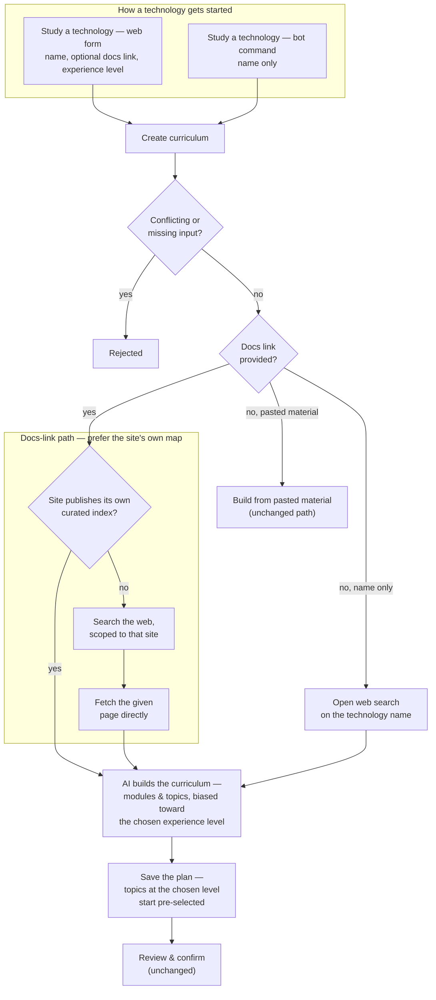
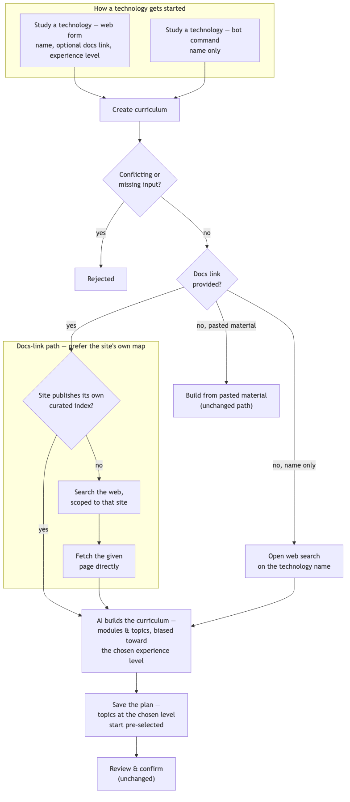

# Architecture: Doc-link technology intake

## What changes structurally

This is an in-place evolution of the already-shipped doc-research pipeline
(`.planning/use-case-study-mode/`), not a new pipeline. Three things change:

1. The web creation form's trigger field moves from a bare technology
   **name** to a **documentation URL** (`docUrl`), with the technology name
   kept as a separate, still-required display field.
2. Pass 1 grounding (`tech-research-grounding.ts` today) gets a new
   first-choice source ahead of web search: a direct fetch of the target
   site's own `llms.txt`/`llms-full.txt`, an emerging convention where a
   docs site publishes a curated, AI-readable map of itself. When present,
   this *is* the grounding — no search call needed at all.
3. A **level** picked at creation biases which tier's topics start
   pre-included on the existing curate/confirm screen, and nudges the
   synthesis prompt to give that tier fuller treatment.

The bot's `/study <name>` command, the curate/confirm lifecycle, and
everything downstream of "modules and topics exist" (probe-session, Socratic,
nav) are untouched — this plan only touches how a doc-research-origin
curriculum gets *seeded*.

## Why a URL, kept alongside a still-required name

The task is explicit that pasting a link is the trigger. A curriculum's
`name` field is display-only, used everywhere in the UI (subject lists, nav,
detail headers) — parsing a reliable display name out of a page title or
hostname is unreliable and not worth building (a `<title>` tag can be
anything; a hostname like `docs.temporal.io` is a worse label than the user
just typing "Temporal"). The form keeps both: a required `name` text field
and a required `docUrl` field. This is the same "cheap, avoids unreliable
parsing" call the task brief itself flagged as the likely right answer.

## The llms.txt-first fallback chain — decision, not left implicit

Fetch order, each step short-circuiting on success:

1. `GET <origin>/llms.txt` (origin = `new URL(docUrl).origin`, so a user
   pasting a deep page link like `docs.temporal.io/dev-guide/typescript`
   still probes the site root, not that subpath).
2. `GET <origin>/llms-full.txt`, only if step 1 didn't yield usable content.
3. Anchored fallback, only if neither well-known file exists: one
   site-restricted `openrouter:web_search` call (query scoped to the URL's
   host) **plus** one direct fetch of the user's own given URL page,
   concatenated together as grounding text.

Reasoning:
- `llms.txt` is, by convention, a short curated index — exactly the "almost
  ready-made map" the task brief describes. When it exists, it is *better*
  grounding than a search, not just a cheaper substitute, so it fully
  replaces the search step rather than supplementing it.
- `llms-full.txt` is the same convention's "give me everything" variant —
  often much larger. It's tried second, not first, because the curated index
  is more directly useful for scoping a Basic/Medium/Advanced map than a raw
  content dump; the full dump is a decent fallback, not the preferred source.
- The final fallback recreates today's shipped search grounding but fixes
  the one real gap this plan's brief called out: today's `researchTopic`
  path searches the open web for a bare name. Anchoring the query to the
  given host, and directly fetching the given page as a second signal,
  keeps the search *on the technology the user actually pointed at* instead
  of whatever the model's training data associates with that name.
- Worst case this chain is still bounded: two cheap HEAD-weight GETs (the
  llms.txt probes), one OpenRouter search call, one more GET. No crawling,
  no per-module fan-out — same cost posture as the already-shipped feature's
  "one broad search, lean on the model's own knowledge" decision.

## Soft-404 defense — `looksLikeLlmsTxtContent`

Many sites return HTTP 200 with their normal HTML shell for any unknown
path instead of a real 404. Trusting any 200 response as "found" would feed
synthesis a site's nav chrome instead of real content. A small pure check
gates both probes: reject if the body is under a minimum length, or if it
contains HTML-document markers (`<html`, `<!doctype html`) in its opening
bytes — a real `llms.txt`/`llms-full.txt` is plain markdown/text, never a
full HTML document. This is a deriver (`looksLikeLlmsTxtContent`), not
inline fetch logic, so it's independently unit-tested against both a real
sample shape and a synthetic soft-404 shape.

## Level picked at creation — pre-selects a tier, not a new selection UI

The already-shipped feature made **all** topics start `included: false`,
turning the existing curate/confirm screen into the "pick one slice" moment.
This plan layers a level preference on top of that same mechanism rather
than building new UI:

- The chosen tier's topics start **pre-included**; every other tier still
  starts excluded, exactly as before. The user still reviews and can
  retoggle anything before confirming — nothing is auto-confirmed.
- The synthesis prompt is also told which tier the learner most wants right
  now, so that tier isn't left thin relative to the others purely by chance.
- "No preference" is a first-class choice (not just an omitted field) and
  reproduces today's shipped all-excluded default exactly — this plan adds a
  head start, it doesn't remove the existing behavior for someone who wants
  to survey the whole map before picking anything.
- The level itself is **not persisted** as a new column — it's only used
  transiently to bias the prompt and compute each topic's initial
  `included` value at insert time. Storing "what level did I pick" for
  later display isn't something any scenario in this plan calls for, and
  skipping it keeps this a zero-migration change. If a future need arises
  (e.g. showing "you asked for Advanced" on the detail page), it's a
  contained follow-up, not a blocker here.

This was chosen over biasing the prompt alone (no pre-selection): a prompt
bias alone would still hand the user a fully-unselected screen, making
"pick a level" feel like it did nothing differently from today. Pre-including
the matching tier is the part that actually saves the user a step.

## Retry-research bug this plan would otherwise inherit

Today's shipped `retryResearch` always re-researches by `curriculum.name` —
correct for the legacy bare-name flow, where name *is* the research input.
For a docs-URL-driven curriculum, re-searching by display name would
silently downgrade every retried curriculum to the anchor-less legacy
fallback and permanently lose the llms.txt-aware behavior on every retry.
Fixed by having retry read back the prior research `sources` row(s) it's
about to delete, and using a small pure check
(`resolveRetryResearchSource`) to tell whether the stored value looks like a
URL (→ re-run the URL pipeline against that same URL) or not (→ fall back to
today's exact name-based retry, unchanged for the legacy path). The chosen
level from the original creation is not recovered on retry — logged as an
accepted limitation below, matching the existing accepted "reparse loses
levels" limitation from the shipped feature.

**A second, adjacent bug this surfaced**: today's shipped
`deleteResearchSources` only deletes rows where `kind = "web_research"`.
Left as-is, retrying an `llms_txt`-grounded curriculum would never clear its
old `llms_txt` audit row — each retry would insert a fresh one on top,
accumulating duplicates and leaving `resolveRetryResearchSource` reading an
ambiguous multi-row history. `deleteResearchSources` must delete both
research-origin kinds (`web_research` and `llms_txt`) before every retry,
not just one — see `spec.md`'s Files to modify.

## Origin/audit tracking — a new `sources.kind`, not a new column

`sources.kind` is a plain `text` column (verified in
`apps/api/src/db/schema.ts:34`) — the same additive-enum, no-migration
pattern the shipped feature already used for `web_research` applies again.
A new `"llms_txt"` value is added to `sourceKindSchema`
(`packages/shared/src/source.ts`), covering both the `llms.txt` and
`llms-full.txt` cases (both mean the same thing provenance-wise: "the site
published its own map," distinguished further only in the row's `title`,
e.g. `"llms.txt: https://docs.temporal.io"` vs.
`"llms-full.txt: https://docs.temporal.io"`). The anchored-search fallback
keeps reusing `"web_research"` — same provenance meaning as the shipped
bare-name flow, just now URL-anchored.

**`value` is always the original `docUrl` for every tier of the docUrl
path** (`llms_txt` via either well-known file, and the `web_research`
anchored fallback alike) — never the sub-path actually fetched (that detail
lives in `title` instead, per the examples above). This is deliberate:
`resolveRetryResearchSource` (below) tells a URL-driven retry apart from a
legacy name-driven retry purely by checking whether the stored `value`
parses as an absolute URL, so every docUrl-path row must store that same
URL consistently regardless of which tier of the fallback chain actually
produced the grounding. Only the legacy bare-name flow's `web_research` row
keeps storing the bare technology name in `value`, exactly as it does
today. `resolveCurriculumOrigin`
(`curriculum-rules.ts`) is extended so both new and old research-kind values
map to the `"research"` origin the "🔎 Researched" badge already keys off —
no change to that badge's logic or copy. The curriculum detail page's
existing per-`kind` Sources list (`curriculum.$curriculumId.tsx`) gets one
more rendering branch for `llms_txt` — this alone satisfies the "distinct
badge/audit-trail" requirement without new UI surface.

## Confirming a Subject is still forcibly assigned at creation

Verified, not assumed: `StudyTechnologyForm` is only ever rendered inside
`SubjectSection` (`apps/web/src/subject/subject-section.tsx:63`), bound to
that subject's `subjectId`, and this plan does not add any route or entry
point that creates a curriculum outside that context. No sub-subject tier,
no restructuring of Subject → Curriculum → Module → Topic — explicitly out
of scope per the task brief, and nothing in this plan touches hierarchy
depth.

## New infrastructure

None. No new service, queue, deploy target, or env var — `docUrl` fetches
use plain `fetch()` exactly like `source-fetch.ts` already does for `link`
sources; the site-anchored search reuses the existing
`OPENROUTER_API_KEY`/`CURRICULUM_MODEL` wiring.

## Data model evolution

- **`sources.kind`**: Zod enum widened from `"link" | "text" | "web_research"`
  to add `"llms_txt"` — additive, no DB migration (the column is already
  `text`, verified above).
- **No new column, no new table.** The chosen `preferredLevel` is not
  persisted (see "Level picked at creation" above).
- `createCurriculumInput` (`packages/shared/src/curriculum.ts`) gains two new
  optional fields: `docUrl` (nullable, must be an absolute `http`/`https`
  URL) and `preferredLevel` (nullable `Level`). The existing `researchTopic`
  field is kept, unchanged in meaning, solely for the bot's legacy path.

## Failure modes

- **`llms.txt`/`llms-full.txt` fetch times out or errors**: treated exactly
  like "not found" — falls through to the next tier of the chain. Same
  short timeout pattern as `source-fetch.ts`'s existing `fetchLink`.
- **Soft-404 (200 OK with HTML shell)**: caught by
  `looksLikeLlmsTxtContent`, falls through the chain — see above.
- **Anchored fallback's search or page fetch both fail**: grounding text is
  empty; synthesis still runs on the model's own trained knowledge, exactly
  as today's shipped feature already handles an empty grounding string
  (`buildResearchPrompt`'s existing "(the web search returned nothing
  usable...)" branch).
- **`docUrl` and `researchTopic` both set**: rejected 400 at the controller
  — mutually exclusive triggers, never silently preferring one.
- **`docUrl` and non-empty `sources` both set**: rejected 400, same rule the
  shipped feature already applies to `researchTopic` + `sources`.
- **Retry on a docs-URL curriculum**: re-derives the URL from source-row
  history rather than re-using `curriculum.name` — see "Retry-research bug"
  above. This is a genuine bug fix relative to what the shipped code would
  otherwise do once URLs exist, not a new edge case introduced by this plan.
- **Retried curriculum loses its original level preference**: accepted
  limitation, consistent with the shipped feature's existing "reparse loses
  levels" limitation — not fixed here.

## Rollout

1. `packages/shared`: widen `sourceKindSchema` with `"llms_txt"`; add
   `docUrl`/`preferredLevel` to `createCurriculumInput`.
2. `apps/api`: new `doc-link-grounding.ts` (fallback chain), extend
   `tech-research-grounding.ts` with an optional site-scope param, extend
   `curriculum-rules.ts` with the new pure derivers, extend
   `buildResearchPrompt`, extend `researchCurriculum`/`retryResearch` in the
   orchestrator, extend `saveCurriculumPlan`'s default-include logic,
   controller precedence/conflict wiring.
3. `apps/web`: `study-technology-form.tsx` gains `docUrl` + level fields,
   drops the `researchTopic`-as-name submission; `curriculum.$curriculumId.tsx`
   gains the `llms_txt` Sources-list branch.
4. `apps/bot`: no changes — verified, not just assumed (SCENARIO 15).
5. Update `docs/architecture/use-case-study-mode.md` (existing doc found —
   see `spec.md`'s Documentation changes) to describe the new grounding
   chain and level behavior; regenerate its diagram.
6. No production activation step beyond the normal deploy — no new env var,
   no new webhook, no migration to run.
