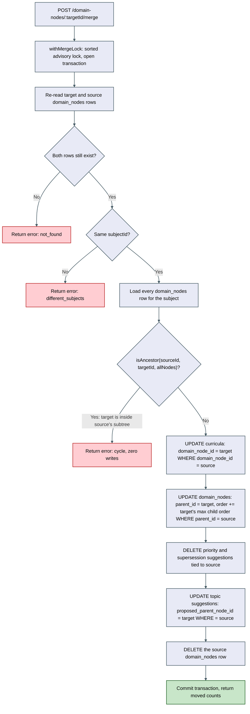
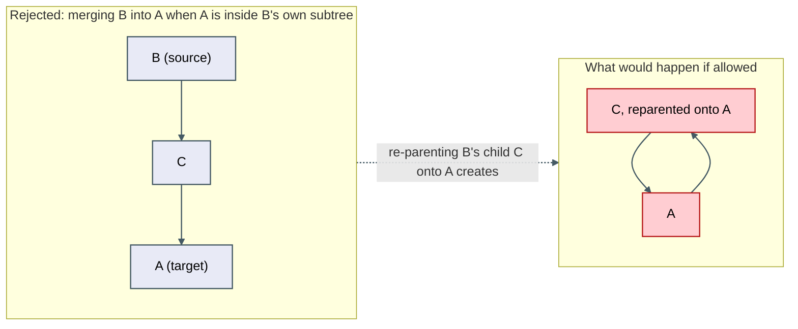

# Architecture: Domain-node merge

## Why this needed its own architecture doc

This is the first write path in the codebase that re-parents an existing `domain_nodes` row. Every
prior merge (`mergeSubjects`, `mergeCurricula`, `mergeTags`) only ever changed a foreign-key-like
column to point at a different owner; none of them altered the self-referential tree structure
itself. That distinction is what makes the cycle guard a genuinely new piece of architecture, not
just another reassignment — closing `docs/architecture/seed-knowledge-map/review.md`'s
previously-flagged gap and the deferred item from `docs/architecture/ontology-split-merge/review.md`.

## Merge procedure

Implemented as `mergeDomainNodes(targetId, sourceId)` in `apps/api/src/domain-map/domain-map.repo.ts`,
wired through `handleMergeDomainNodes` (`domain-map.controller.ts`) and
`POST /domain-nodes/:id/merge` (`router.ts`/`server.ts`). Reuses `withMergeLock`
(`apps/api/src/shared/merge-lock.ts`) unchanged, the same locking preamble as `mergeSubjects`,
`mergeCurricula`, and `mergeTags`.

## Cycle-guard shape — why an ancestor walk, not a descendant walk

`isAncestor(candidateAncestorId, nodeId, nodes)` (`packages/core/src/domain-map/domain-map-progress.ts`,
co-located with `domainNodeProgress`) walks from the target upward via `parentId` — the same shape
`domain-placement.orchestrator.ts`'s `pathFor()` already uses for building display paths — checking
whether the source appears in that chain. Cheaper than enumerating the source's entire subtree
(`domainNodeProgress()`'s shape), and, critically, run with **no depth cap**: a capped walk is
correct for a rollup that can tolerate slight under-counting past 6 levels, but wrong for a
write-blocking correctness check where stopping early means silently allowing a corrupting merge
through. Termination is guaranteed by a visited-`Set` alone. Proven at depth 9
(`apps/api/src/domain-map/domain-node-merge-cycle-guard.integration.test.ts`, `CHAIN_DEPTH = 9`) and
at the pure-function level in `packages/core/src/domain-map/domain-map-progress.test.ts`, including
the argument-order regression pair (`isAncestor(a,b)` vs `isAncestor(b,a)` are not interchangeable).

## What does not change

`getDomainMapForSubject()`'s own tree-assembly recursion (`buildItem()`) is left exactly as-is —
this item does not add a guard there. Once `mergeDomainNodes` is the only write path capable of
re-parenting a node, and it always runs the ancestor-walk check before any write lands, no cycle
can ever exist in the data `buildItem()` reads. Proven directly: the concurrency integration test
calls `getDomainMapForSubject()` after a real merge and asserts the moved child is correctly nested
under the target — the read-path proof this item exists to provide, not an incidental side effect.

`pathFor()` in `domain-placement.orchestrator.ts` still has no visited-set guard of its own. It
remains safe today only because this item's own write-path guard prevents any cycle from ever
existing. A future write path that bypasses `mergeDomainNodes` (a raw migration, a script) would
still expose it — logged as a cheap fast-follow, not fixed here.

## Reassignment mechanics

- Re-parented children get their `order` offset past the target's current max child order (mirrors
  `mergeCurricula`'s own `modules.order` offset), so they never collide with the target's existing
  children in `buildItem()`'s `.sort((a,b) => a.order - b.order)`.
- No matching attempted for same-named siblings — a re-parented child becomes an additional sibling,
  matching every other merge in this codebase (`mergeCurricula`'s own documented precedent).
- `domain_priority_suggestions` / `domain_supersession_suggestions` tied to the source are deleted
  (ephemeral, single-node-scoped advisory rows). `domain_topic_suggestions.proposed_parent_node_id`
  is reassigned (a forward-looking pointer); `created_domain_node_id` is left untouched (a
  historical record).
- Merge-target picker (`apps/web/src/domain-map/merge-domain-node-button.tsx`) offers every other
  node in the subject's tree, not just siblings, labeled by full path (`Frontend > Meta-frameworks >
  Astro`) — flattened client-side from the already-loaded tree, excluding the node itself and its
  own subtree as defense in depth alongside the server's own `cycle` check.

## Verification

- Unit: `packages/core/src/domain-map/domain-map-progress.test.ts` — `isAncestor` (direct/indirect
  ancestor, sibling, unrelated branch, self, dangling pointer, pre-corrupted cycle, depth-9,
  argument-order pair) plus a post-merge merged-shape rollup case.
- Integration (real Postgres): `apps/api/src/domain-map/domain-node-merge-cycle-guard.integration.test.ts`
  (3-level cycle rejected + zero writes, safe "collapse a level" case, 9-level-deep cycle rejected)
  and `apps/api/src/domain-map/domain-node-merge-concurrency.integration.test.ts` (zero-orphan +
  read-path proof, two-concurrent-merges race).
- E2E: `@domain-node-merge.S1` / `@domain-node-merge.S2` in
  `verification-repo/projects/post-anki/post-anki/features/domain-map/tests/`.
