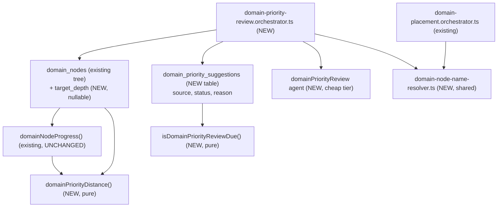
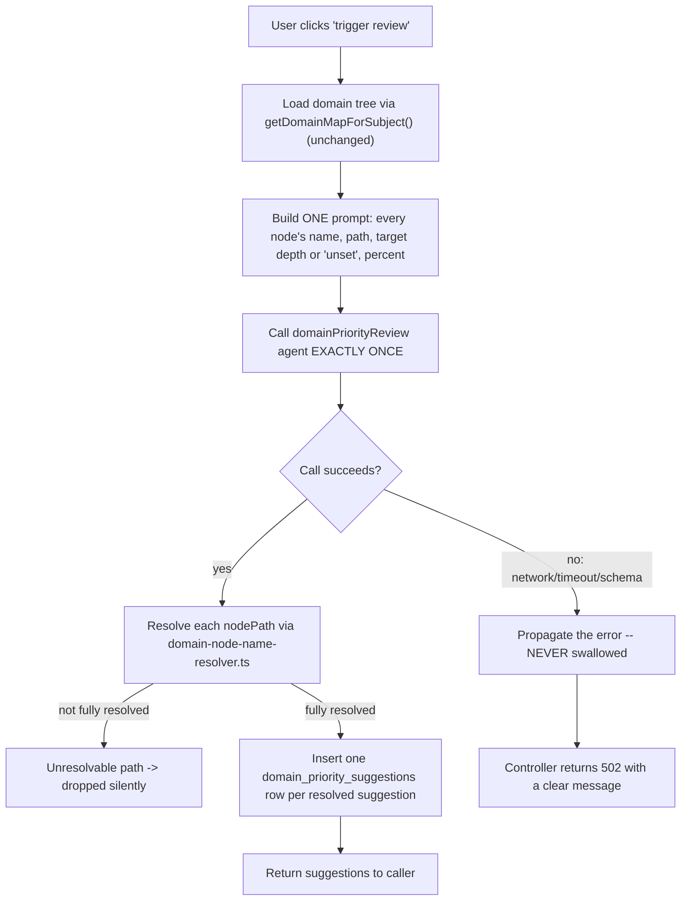
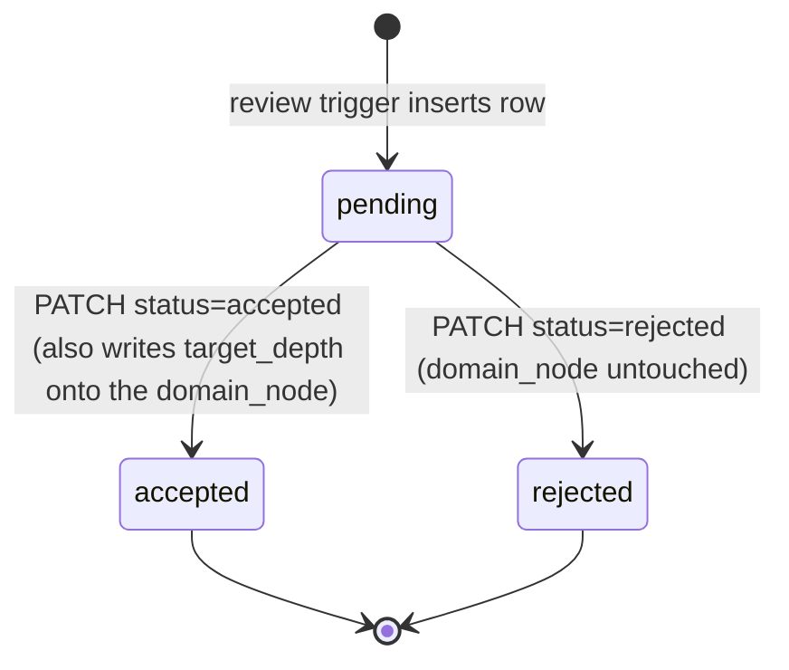

# Domain priority review (issue #52)

Per-domain target depth, priority-distance display, and a manual re-prioritization review that
calls one cheap Mastra agent. See `.planning/domain-priority-review/` for the full plan
(`spec.md`, `scenarios.md`, `architecture.md`, `discussion.md`).

> Note: `spec.md`'s "Documentation changes" section states
> `docs/architecture/seed-knowledge-map.md` already documents the domain-map read path and needs
> no edit. That file does not exist in this repo at the time of writing — the domain-map read path
> (`getDomainMapForSubject()`, the `domain_nodes` self-referential tree) has no prior standalone
> architecture doc. This file documents only the new pieces this plan adds; it does not attempt to
> retroactively document the pre-existing domain-map read path.

## Where the new pieces sit

`domainNodeProgress()` is unchanged — the percentage rollup this plan displays alongside priority
distance is exactly item 5's existing contract. `domainPriorityDistance()` and
`isDomainPriorityReviewDue()` are new, independent pure functions
(`packages/core/src/domain-map/domain-priority.ts`,
`packages/core/src/domain-map/domain-priority-review-due.ts`).

## Review-trigger flow

This is the deliberate divergence from `domain-placement.orchestrator.ts`. Placement's agent call
fails silently (curriculum creation proceeds unplaced) because it is an invisible background step.
The review trigger is an explicit, foreground, user-waited-on action — a silent no-op would look
like a broken button. `apps/api/src/domain-map/domain-priority-review.orchestrator.ts` lets the
error propagate; `handleTriggerDomainPriorityReview` in `domain-map.controller.ts` catches it and
returns HTTP 502 with a message. Proven by `apps/api/src/domain-map/domain-priority-review.orchestrator.test.ts`.

## Accept/reject state machine

Both terminal states are persisted rows, never deletions — a rejected suggestion stays visible as
"handled" rather than vanishing.

## The seam for #49 and #53

`domain_priority_suggestions.source` defaults to `"general-knowledge"` (this plan's one cheap
agent call). It is a plain discriminator column, not a separate table per input — when #49
(doc-scan) or #53 (job-market-scan) land later, they insert rows with a different `source` value
into this same table, and the existing review screen, accept/reject endpoints, and "review due"
derivation all keep working unmodified.

## What this plan does not change

- `packages/core/src/domain-map/domain-map-progress.ts` — unchanged.
- `domain-placement.orchestrator.ts`'s own behavior and its silent-fallback contract — only its
  internal path-resolution logic was extracted into the shared `domain-node-name-resolver.ts` it
  now imports from; its existing test suite passes unmodified, proving the extraction is a pure
  refactor.
- `apps/api/src/curriculum/gap.ts`, `daily-push.ts`, `apps/api/src/probe-session/replenish.ts` —
  domain-node `target_depth` is not wired into probing-ceiling logic in this pass.
- No cron, scheduler, or cloud infrastructure — the review trigger is a plain HTTP endpoint,
  called manually from `/subject/:subjectId/priority-review`.
