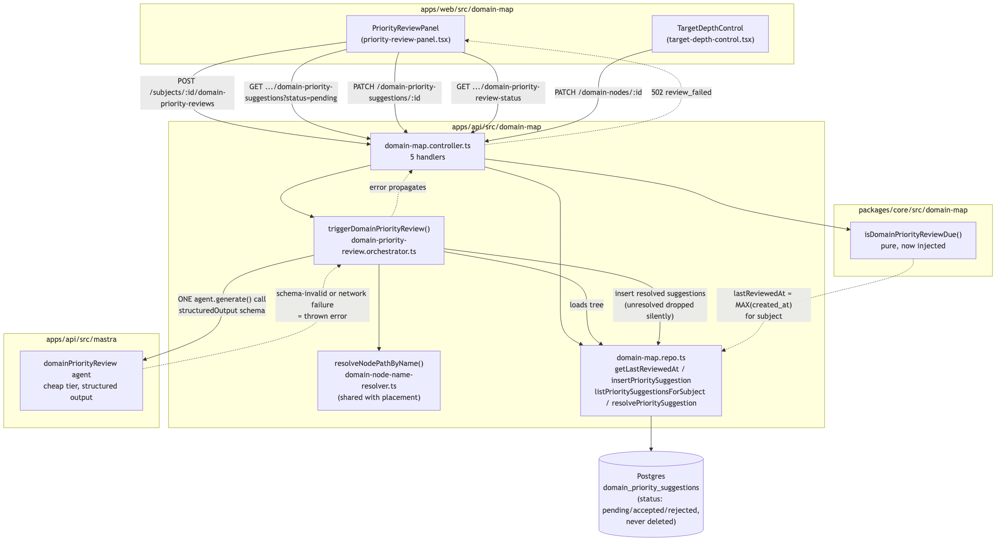

# Architecture Review: domain-priority-review

## What was reviewed

Per-domain target depth on the existing domain map, a manual "trigger review" action that makes
exactly one AI call over the whole subject tree and proposes up to 5 re-prioritization suggestions,
an accept/reject flow that writes the target depth on accept, and a 30-day "review due" banner.
Scope: `apps/api/src/domain-map/*`, `apps/api/src/mastra/domain-priority-review.agent.ts`,
`packages/core/src/domain-map/domain-priority*.ts`, `packages/shared/src/domain-map.ts`, and the
`apps/web/src/domain-map/priority-review-panel.tsx` / `target-depth-control.tsx` frontend, all
merged in `3dd5071` (parent `0d9e73a`, feature commit `a034038`).

## Documentation found

`docs/architecture/domain-priority-review.md` already exists (written by the build agent) and is
accurate against the merged code — its mermaid diagrams for the review-trigger flow and the
accept/reject state machine match what's actually implemented, including the deliberate divergence
from `domain-placement.orchestrator.ts`'s silent-fallback pattern. `.planning/domain-priority-review/`
(spec.md, scenarios.md, architecture.md, discussion.md, playwright.md, state-fixtures.md) is the
confirmed plan; `.planning/LOG.md`'s 09:05 entry is the build record, including one already-logged
residual gap this review was asked to re-examine.

## As-built architecture

Two entry points: `PriorityReviewPanel` (trigger, list-pending, accept/reject, due-status) and
`TargetDepthControl` (direct depth edits, independent of the review flow), both talking to
`domain-map.controller.ts`. The review trigger flows through
`domain-priority-review.orchestrator.ts`: load the tree via the existing unmodified
`getDomainMapForSubject()`, build one prompt for the whole tree, call the `domainPriorityReview`
agent exactly once with a Zod-validated structured-output schema, resolve each returned `nodePath`
via `domain-node-name-resolver.ts` (extracted from and shared with the placement orchestrator — a
real, verified refactor, not a duplicate), and insert one row per resolved suggestion. Unresolved
paths are dropped silently, matching the existing placement orchestrator's posture. Any agent
failure (network, timeout, schema-invalid) throws, the controller turns it into a 502 — the
deliberate opposite of placement's silent-fallback contract, and this is the correct call since the
trigger is a foreground, user-waited-on action. `isDomainPriorityReviewDue()` is a pure function
taking `now` as an explicit parameter (no internal wall-clock read), computed from
`getLastReviewedAt()` = `MAX(created_at)` over the subject's suggestion rows. Accept writes
`target_depth` onto the domain node and resolves the suggestion in one transaction; reject only
resolves it — both are persisted rows, never deleted.

## Verdict

**Sound.** The design correctly reuses the existing tree-read path, correctly isolates the one
AI call behind a pure orchestrator with real error propagation (verified directly: one
`await agent.generate(...)`, no loop, no retry), and the resolver extraction removes what would
otherwise have been a second near-duplicate name-matching implementation. The `source` discriminator
on `domain_priority_suggestions` is a genuinely good seam for #49/#53 to plug into later without a
schema change. Routes are RESTful and match the codebase's existing conventions.

Two things were flagged for closer inspection — both real, neither crosses this review's bar for a
critical/high-stakes finding (no data loss, no security exposure, no outage/cost-loop risk, no
single point of failure for something load-bearing, nothing blocking near-term planned work):

**1. The "always return ≥1 suggestion" instruction has no code-level floor, and I traced a second,
sharper consequence beyond the one already logged.** The agent's own instructions
(`domain-priority-review.agent.ts`) say "always return at least one suggestion... never return an
empty list," but `domainPriorityReviewAgentResultSchema` only enforces `.max(5)`, not `.min(1)`.
If the model returns a schema-valid empty array, or every returned suggestion fails path resolution
(all dropped as unresolvable), `triggerDomainPriorityReview()` returns `[]` — a legitimate 200, not
an error, no rows inserted. `.planning/LOG.md`'s logged version of this gap describes the
server-side consequence correctly: `lastReviewedAt` doesn't advance, so the due banner would remain
"due" on the next real page load — a loud, not silent, failure mode.

But `priority-review-panel.tsx`'s trigger handler doesn't only rely on that. It does
`setSuggestions((prev) => [...fresh, ...prev]); setDue(false)` unconditionally on any successful
call — `due` is optimistically cleared even when `fresh` is empty. So within the same browser
session, a zero-suggestion response makes the banner disappear as if the review completed
successfully, while the server's own source of truth (`lastReviewedAt`) never moved — the two only
resync on a page reload. That is the concrete way this specific gap could look like exactly what
the build's own accepted-gap note worried about ("silently make the whole review-reminder mechanism
useless with no error") for the duration of one session, not just "stuck due forever." No test
exercises the schema-valid-empty-array path — `domain-priority-review.orchestrator.test.ts` only
covers rejected calls and schema-invalid responses, both of which correctly throw.

This stays a UX/consistency gap on an optional, low-frequency reminder feature (not spaced-repetition
data, not billing, not auth) reachable only through an already-low-probability edge case (a
structured-output model contradicting an explicit, simple instruction, or every one of up to 5
suggestions failing to resolve). It doesn't meet this review's escalation bar, but it is cheap to
close for good rather than leaving it as an accepted gap: add `.min(1)` to
`domainPriorityReviewAgentResultSchema` so a genuinely empty response fails Zod parsing and takes
the same already-correct 502 path as any other malformed agent response, and stop the frontend from
setting `due: false` on an empty result (either gate it on `fresh.length > 0`, or just re-fetch the
review-status endpoint after a trigger instead of predicting it client-side). Both are small,
targeted diffs, not a design change.

**2. Rejected suggestions persisted forever is a defensible design choice with one real, non-urgent
growth angle.** `domain_priority_suggestions` has no index beyond the primary key — no index on
`subject_id` or `(subject_id, created_at)`. Every review trigger inserts up to 5 rows; rejected and
accepted rows are never deleted (`resolvePrioritySuggestion` only flips `status` and sets
`resolved_at`). The `getLastReviewedAt()` query (`ORDER BY created_at DESC LIMIT 1 WHERE subject_id = ?`)
runs on every review-status page load and will do a growing unindexed scan-and-sort per subject as
rows accumulate. The good news: the only live caller of `listPrioritySuggestionsForSubject()` today
(`priority-review-panel.tsx`) always passes `status: 'pending'`, so the panel's own payload stays
bounded by unresolved suggestions, not full history — the genuinely unbounded "all suggestions ever,
no pagination" query path exists in the repo but nothing currently exercises it. Given this is a
manual, human-paced trigger (not a cron, not per-node fan-out — capped at 5 rows per call) in a
personal-scale app, this is a real but low-urgency item: add a `(subject_id, created_at)` index
if/when this graduates past personal scale, or before any future feature calls
`listPrioritySuggestionsForSubject()` without a status filter (e.g. a suggestion-history/audit view).
Not worth blocking on now.

## Questions a reviewer would ask

1. `domainPriorityReviewAgentResultSchema` allows `suggestions: []` even though the agent's own
   prompt says never to return that — was `.min(1)` intentionally left off, or is this a genuine gap
   between the prompt contract and the code contract?
2. The frontend sets `due: false` immediately after any successful trigger call, regardless of how
   many suggestions came back — should the "review completed" signal come from the server's
   `lastReviewedAt`/`due` recomputation instead of being predicted client-side?
3. `resolveNodePathByName()` matches names case-insensitively via `normalizeTagName()` with no
   fuzzy/typo tolerance — if the model paraphrases a node name even slightly, the whole suggestion
   for that node silently disappears with no visibility to the user that something was dropped. Is
   silent dropping still right for a foreground, user-waited-on action, or should the response
   surface "N suggestions returned, M could not be matched"?
4. `getLastReviewedAt()` has no supporting index on `subject_id`/`created_at` — is there a plan to
   add one before this table grows past trivial size, or is personal-scale usage expected to stay
   small enough indefinitely?
5. Two of the five inserted-suggestion fields (`currentTargetDepth`, `suggestedTargetDepth`) are
   read from the tree snapshot taken at prompt-build time — if a user changes a node's target depth
   via `TargetDepthControl` while a review call is in flight, could an inserted suggestion's
   `currentTargetDepth` go stale relative to the node's real current value by the time the user acts
   on it?
6. Why does `MAX_SUGGESTIONS = 5` live as a magic number in the orchestrator while the schema
   independently enforces `.max(5)` — is there a shared constant, or could the two silently drift if
   one changes without the other?
7. `resolve()` in the panel has no try/catch around `await resolveSuggestionStatus(...)` — unlike
   `trigger()`, which does catch and shows `priority-review-trigger-error`. If that PATCH fails
   (network blip, stale suggestion already resolved elsewhere), the row stays in the list with no
   error shown and no obvious way to tell the user what happened — was this an intentional scope cut
   versus the trigger button's error handling?

For the business-stakeholder Q&A that closes the BMAD cycle, run /debrief-qa.
