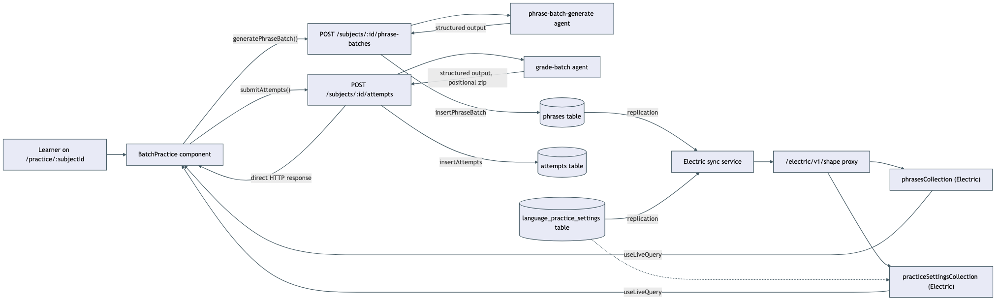
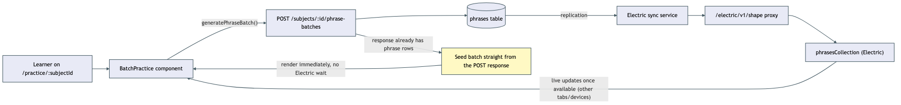

# Architecture Review: English batch-practice

## What was reviewed

A new subject-scoped practice loop: a learner opens `/practice/:subjectId`, gets an
auto-generated batch of 10 Russian→English translation phrases, answers them in chunks of 5,
submits for LLM grading, and gets a score/verdict/feedback per phrase. In scope: the four backend
endpoints and their orchestrators (`apps/api/src/practice/*`), the two Mastra agents
(`language-practice.agent.ts`), the shared schemas (`packages/shared/src/practice.ts`), and the
frontend (`apps/web/src/practice/*`, `routes/practice.$subjectId.tsx`).

## Documentation found

None found under `docs/` or `.bmad/` for this specific feature — it was built via
`/grand-loop`/`/moonshine` rather than the standard plan/implement/review flow. Reconstructed
from the code directly. `.planning/LOG.md`'s entries for tonight (the merge, plus three real bugs
found and fixed while getting its e2e suite green) stand in as the review-equivalent record of
what was found during the build.

## As-built architecture

A learner action calls one of two REST endpoints (`POST .../phrase-batches`,
`POST .../attempts`), each backed by a Mastra agent producing structured output, each writing to
its own Postgres table (`phrases`, `attempts`). Grading's response is consumed directly by the UI
for immediate feedback. Generation's response is not: the frontend discards everything but the
`batchId` and waits for the new phrase rows to arrive back through Electric sync
(`phrasesCollection`, `practiceSettingsCollection`) — a separate replication path from Postgres,
through the Electric sync service, through an API proxy route, into a TanStack DB collection the
UI subscribes to via `useLiveQuery`. There is no fallback read path if that pipeline is slow or
down.

## Verdict

The grading half of this feature is sound: direct request/response, immediate rendering, a
documented and tested guard against retry storms on the generate path. The endpoint guards
(subject-kind checks, input validation) are consistent with how the rest of the app does this.

The generation half has a real single-point-of-failure gap. **The `POST .../phrase-batches`
response already contains the full phrase rows** (confirmed by reading `practice.controller.ts`),
but the frontend throws that away and waits exclusively for Electric to redeliver the same data
before it will render anything. Tonight's own build log confirms this is not theoretical: the e2e
suite failed repeatedly with exactly this symptom (grading completed and persisted correctly per a
direct DB check, but the UI never reflected it) until a local Electric instance was wired into the
test stack. In production, `ELECTRIC_SERVICE_URL` reaching Neon is still an explicitly deferred,
manual step (`.planning/local-first-electric-sync/todo.md`) — meaning this exact failure mode
will hit production the moment this feature ships there, not just in theory. Nothing built tonight
has been pushed or deployed, so this isn't live for real users yet — but it will break on day one
once it is, unless the deferred Electric step happens first. If Electric is unconfigured, slow, or
has any outage, a learner who opens this page sees "Generating your next batch of phrases…" forever, even though generation
already succeeded server-side, with no error message and no fallback. The board feature that
introduced Electric sync earlier already solved this exact problem with an SSR fallback
("renders even with Electric down" per its own todo.md) — batch-practice doesn't follow that
established pattern, so it's a real inconsistency, not just a missing nice-to-have.

A second, smaller tradeoff worth naming (not escalated to its own diagram): `grade-attempts`
attaches each graded result back to its phrase by **array position**, not by echoing the
`phraseId` back through the schema. If the grading agent ever reorders, drops, or duplicates an
entry in its structured output, a score/feedback would attach to the wrong phrase, silently and
permanently. Cheap to close (add `phraseId` to the graded-answer schema, match by id instead of
index) — worth doing, but on its own doesn't rise to the SPOF bar the way the generate path does.

## Proposed alternative

Seed the UI directly from the `POST .../phrase-batches` response — the data is already there —
and treat Electric purely as a live-update layer on top (useful for a second tab/device seeing the
same batch), not the only path to a first render. This mirrors the board's own SSR-fallback
pattern instead of introducing a second one. Cost: the frontend needs to reconcile a
locally-seeded batch with whatever Electric later delivers for the same `batch_id` (dedupe by
row id, which the collections already key on) — a small amount of merge logic, not a rewrite.

## Questions a reviewer would ask

- Why does grading return its result directly while generation requires a full Electric round
  trip for the same kind of write — was that an intentional split, or did generation just follow
  the board's existing pattern without checking whether it needed to?
- What happens today, in production, right now, for the first real user who opens `/practice/...`
  before `ELECTRIC_SERVICE_URL` is wired up? (Per the current architecture: an infinite loading
  state, no error.)
- Is positional matching in `grade-attempts.orchestrator.ts` something you're willing to bet on
  indefinitely, or is including `phraseId` in the graded-answer schema cheap enough to just do now
  before it ships to real users?
- The retry-storm guard on `usePracticeBatch` is per-tab (`useRef`) — does a learner with the page
  open in two tabs risk two simultaneous `generatePhraseBatch` calls creating two batches?
- `recentRussianForSubject` caps "avoid repeating" at the last 40 phrases — at what phrase-count
  per subject does that window start allowing visible repeats, and is that an acceptable tradeoff
  long-term or just a launch-scale shortcut?
