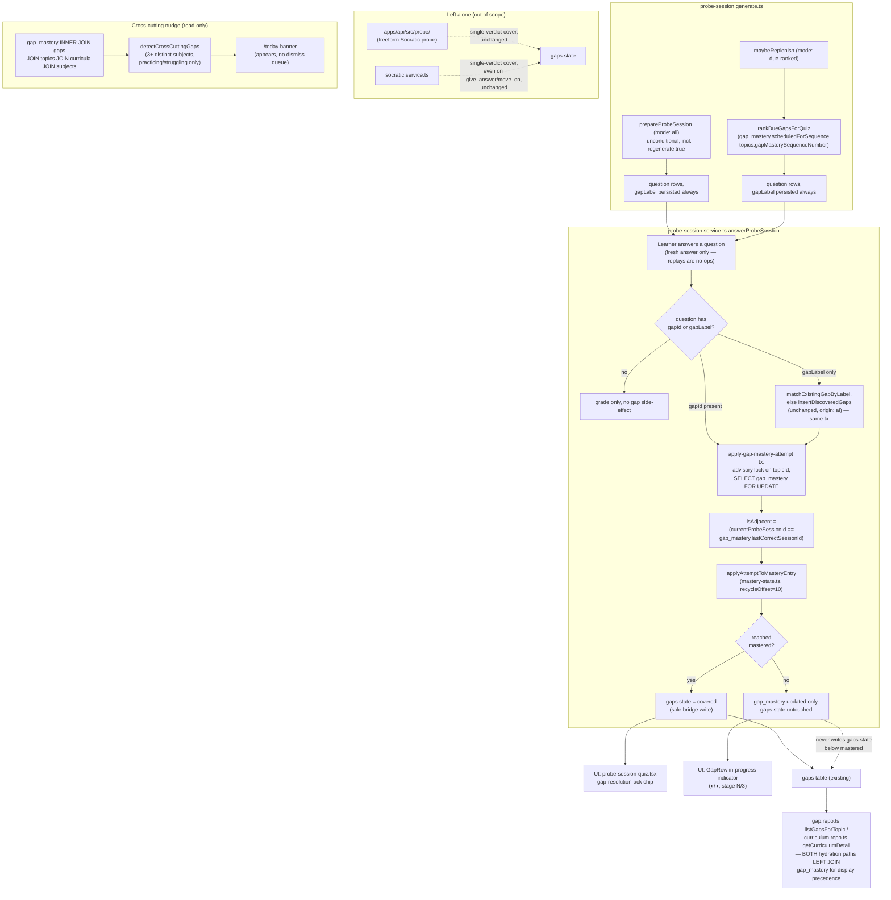

# Architecture: Generalized recall-gap mastery tracking

## What changed

A missed probe-session quiz question used to do nothing to a topic's `gaps` row (it just sat there
"open"), or — for the single existing writer inside `probe-session.service.ts` — flipped straight
to `"covered"` on the very first correct guess, with no distinction between a lucky first try and a
concept genuinely demonstrated. This mirrors the phrase-bank's recall-recycling state machine
(missed it → recycle it → archive as mastered after 3 non-adjacent corrects) onto any subject's
probe-session quiz gaps, not just English phrase drills.

The generic transition logic itself was extracted, unchanged in behavior, from
`packages/core/src/phrase-bank/phrase-bank.ts` into `packages/core/src/mastery/mastery-state.ts`.
`phrase-bank.ts` now keeps a thin wrapper around the generic functions — same exported names, same
field names, same test suite passing with a zero-line diff to the test file itself — so this item's
one behavior-relevant change to the already-shipped phrase-bank code path is a single new line: its
repo layer computes `isAdjacent` the same way it always has (the immediately-next sentence
position) and passes it in explicitly, since the generic function now takes `isAdjacent` as a
caller-supplied boolean instead of deriving it internally. Gap-mastery's own repo layer computes
`isAdjacent` differently — by comparing `probe_sessions.id` values — because "was this basically an
immediate repeat" means something structurally different for a gap than for a phrase (see
"Mastery-stage advancement" below).

A new sidecar table, `gap_mastery`, carries the mastery state 1:1 with a `gaps` row. `gaps.state`
itself is completely untouched in shape and meaning — the three pre-existing single-verdict writers
(the freeform Socratic probe, `socratic.service.ts`'s give-up path, and probe-session's own former
single-verdict cover) are none of them read or gated by the new table. Only
`probe-session.service.ts`'s `answerProbeSession` was rewritten to consult `gap_mastery` for gaps it
touches, and it is the sole writer allowed to flip `gaps.state` to `"covered"` for a mastery-tracked
gap — and only once `masteryStage` reaches the threshold.

## As-built design

## Mastery-stage advancement is gated on session identity, not sequence arithmetic

The obvious port of phrase-bank's "answered-count + fixed offset" schedule does not actually force
cross-session spacing for probe-session: `maybeReplenish` auto-chains indefinitely within one
sitting, so a naive offset-only design lets a gap go new→mastered inside a single 10-16-question
session. Two separate mechanisms do two separate jobs instead:

1. **Question-cadence anti-spam** (unchanged in spirit from phrase-bank): `topics.gap_mastery_
   sequence_number` increments once per answered gap-tagged question; a struggling/practicing gap's
   `scheduledForSequence = counterAtAttempt + 10` gates when it becomes eligible for `due-ranked`
   selection again — but this offset is applied ONLY to `generateReplenishBatch`'s candidate list,
   never to the initial/regenerate `"all"` mode's unconditional list, because a brand-new session's
   very first batch (via `regenerate: true`) must reliably resurface a struggling/practicing gap
   regardless of how far the shared per-topic counter has advanced between two sessions that each
   only answer one question.
2. **Whether a correct answer counts as a genuine demonstration**: gated on `gap_mastery.
   lastCorrectSessionId` (plain-text, references `probe_sessions.id` by value, no FK — matching this
   schema's existing convention) compared against the CURRENT `probe_sessions.id`. A same-session
   repeat (a replenish re-serving the gap within the sitting that already counted a correct) does
   not advance `masteryStage`; a genuinely different session, however far apart, does.

## Data model additions (additive migration only)

- `gap_mastery`: `id`, `gap_id` (unique index — real 1:1 backstop), `status`, `mastery_stage`,
  `correct_count_in_cycle`, `incorrect_count_in_cycle`, `last_correct_at_sequence`,
  `scheduled_for_sequence`, `last_correct_session_id`, `created_at`, `updated_at`, `mastered_at`.
- `topics.gap_mastery_sequence_number` (integer, default 0).
- `probe_session_questions.gap_label` (nullable text) — persists the AI-tagged concept label even
  unmatched at generation time, so a miss on a never-before-seen concept can spawn a gap at answer
  time.

No existing column is removed or renamed; `gaps.state`'s existing readers (`gapMaturity`,
`progressFromGaps`, `topic-row.tsx`'s covered/total counts) are unchanged.

## Display precedence (a real gap found during implementation)

Both hydration paths that surface `gaps` to the frontend — `gap.repo.ts`'s `listGapsForTopic` and
`curriculum.repo.ts`'s `getCurriculumDetail` (which had its own, independently-duplicated gap
fetch/mapping, `toGap`) — needed the `gap_mastery` LEFT JOIN added, or a mastery-tracked gap would
have rendered correctly on one page (`/topics/:id/gaps`) but shown its stale legacy open/covered
flag on the curriculum detail page specifically. `curriculum.repo.ts`'s duplicate `toGap` was
removed in favor of calling `gap.repo.ts`'s `rowToGap` directly, closing the divergence rather than
patching both copies. `GapRow` (`apps/web/src/curriculum/topic-row.tsx`) renders a gap's `mastery`
sub-object status whenever present, never falling back to the legacy `status` field for display.

## Concurrency design

Mirrors `phrase-bank-concurrency.integration.test.ts`'s proven pattern: `pg_advisory_xact_lock
(hashtext(topic_id)::bigint)` acquired before any `SELECT ... FOR UPDATE` on `gap_mastery`, inside
one transaction that also match-or-creates the gap (when only a `gapLabel` resolved, no `gapId`) and
increments `topics.gap_mastery_sequence_number` — every DB call in the write path takes the same
`tx` explicitly. Verified empirically, not just by code review: with the advisory lock temporarily
removed, `gap-mastery-concurrency.integration.test.ts` fails deterministically (a duplicate-key
violation on `gap_mastery`'s unique index, from two concurrent transactions both reading "no row
yet"); with the lock restored, it passes consistently across repeated runs.

## Cross-cutting nudge

A read-only, on-demand aggregation (`detectCrossCuttingGaps`,
`packages/core/src/gap-mastery/cross-cutting-nudge.ts`) — no new "nudges shown" persistence table,
matching the "silent on non-response" / no-nagging product principle. Scoped to gaps that carry a
`gap_mastery` row at `practicing` or `struggling` only; a gap discovered exclusively through the
untouched freeform Socratic flow (no mastery row at all) never counts toward the 3-subject
threshold, even if several such gaps happen to share a label.
