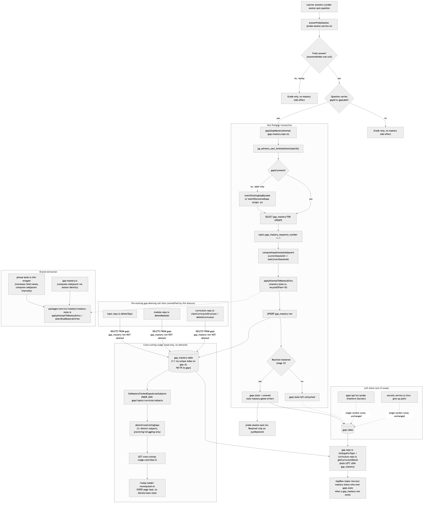

# Architecture Review: Generalized recall-gap mastery tracking

## What was reviewed

Merge commit `9092ec0` (feature commit `eb9ffbc`) against parent `11f5a02`. This item widens the
phrase-bank recall-recycling state machine (missed → recycle → mastered after 3 non-adjacent
corrects) so that probe-session quiz misses on any subject go through the same mastery lifecycle,
instead of the old binary open/covered flag. In scope: the new `gap_mastery` sidecar table and its
write path (`apps/api/src/gap/gap-mastery.repo.ts`), the rewritten `answerProbeSession`
(`apps/api/src/probe-session/probe-session.service.ts`), the extracted shared deriver
(`packages/core/src/mastery/mastery-state.ts`) and its two callers (phrase-bank's thin wrapper,
gap-mastery's own selection/matching logic), the cross-cutting nudge aggregator and endpoint, and
the display-precedence fix across both gap-hydration paths (`gap.repo.ts`, `curriculum.repo.ts`).

## Documentation found

`docs/architecture/generalize-gap-tracking.md` already exists (published by the build agent) and is
detailed and accurate — every claim in it was checked directly against the merged code (schema,
migration, `gap-mastery.repo.ts`'s transaction body, the shared deriver's contract, the display-
precedence join in both repos, and the frontend's precedence check in `topic-row.tsx`) and held up.
`.planning/generalize-gap-tracking/{spec,architecture,discussion}.md` were also read in full; the
three self-directed adversarial passes recorded in `discussion.md` (the single-session mastery bug,
the display-precedence gap, the cross-cutting nudge scope) are real, and the fixes described are the
fixes actually in the code — not just claimed.

## As-built architecture

Entry point is a learner answering a probe-session quiz question. A fresh, gap-tagged answer runs
through one Postgres transaction: `pg_advisory_xact_lock(hashtext(topicId))`, then match-or-create
the gap if only a label resolved, then `SELECT gap_mastery ... FOR UPDATE`, then the shared
`applyAttemptToMasteryEntry` deriver decides the next stage, then an UPSERT into `gap_mastery`, and
only on reaching stage 3 a bridge write flips `gaps.state` to `"covered"`. Both UI hydration paths
(`gap.repo.ts`, `curriculum.repo.ts`) now LEFT JOIN `gap_mastery` and the frontend prefers the
mastery sub-object over the legacy `state` field whenever one exists. A separate read-only aggregator
joins `gap_mastery` across subjects and surfaces a nudge banner on `/today` when the same normalized
label is practicing/struggling in 3+ subjects. The three pre-existing single-verdict writers
(freeform Socratic probe, `socratic.service.ts`) are untouched and never read or write `gap_mastery`.

## Verdict

**Sound.** The core data-integrity mechanism this item was built to fix — a gap "resolving" on one
lucky guess or because the system gave up — is genuinely closed for the probe-session path, and the
concurrency proof (advisory lock before `FOR UPDATE`, unique index as a real DB-level 1:1 backstop,
verified by temporarily removing the lock and reproducing a real duplicate-key failure) is not just
claimed but independently confirmed by reading the write path directly. The shared
`mastery-state.ts` extraction is a safe refactor, not a risky indirection: `phrase-bank.ts`'s wrapper
translates field names and computes phrase-bank's own `isAdjacent` internally, so the wrapper's
contract is exactly the same input/output shape phrase-bank always had, and its own 29-test suite
runs through the real (unmocked) generic function — a future change to `mastery-state.ts` that
changes phrase-bank's behavior will fail phrase-bank's existing tests directly, not silently pass
through an untested indirection layer.

Three real, non-blocking findings, none crossing the critical bar (no data loss, no corruption of
anything currently reachable, no security exposure, no outage/cost-runaway path, nothing blocking
already-planned work):

1. **The sidecar has no FK/cascade to `gaps`, and it doesn't need one for correctness — but four
   pre-existing gap-deleting call sites now silently leave orphaned rows behind.**
   `topic.repo.ts`'s `deleteTopic`, `module.repo.ts`'s `deleteModules`, and `curriculum.repo.ts`'s
   `clearCurriculumStructure`/`deleteCurriculum` all do `DELETE FROM gaps WHERE topic_id = ...`, none
   of them touch `gap_mastery`. This was true of the design intentionally — the sidecar is deliberate
   app-level discipline, matching this schema's dominant plain-text-id convention, not a bug. It
   doesn't corrupt anything visible: every read of `gap_mastery` either joins from `gaps` (so a
   dangling row is simply unreachable, never displayed wrong) or INNER JOINs through `gaps` for the
   cross-cutting nudge (same effect). The cost is an unbounded, invisible accumulation of orphaned
   rows in a table that will never be cleaned up by any existing code path — a small, silent leak
   rather than a live bug. Worth a follow-up (delete `gap_mastery` alongside `gaps` at the same four
   call sites) but not urgent.

2. **The cross-cutting nudge is not actually "appear-once" the way the architecture doc and code
   comments describe it.** The doc and `today.tsx`'s own comment call it "a passive, appear-once
   banner" with "no dismiss-tracking queue... matches silent on non-response/no-nagging" — accurate
   in that there's no growing count or persistent queue, but the aggregation is recomputed fresh on
   every single `/today` page load with no "already shown" state anywhere. A learner with a genuinely
   stubborn cross-cutting gap (one that stays practicing/struggling in 3+ subjects for weeks, which
   the mastery mechanism's own recycling design makes plausible for a hard concept) will see the
   identical banner every time they visit `/today`, for as long as the condition holds. That's a real
   product-language mismatch with the design intent recorded in `discussion.md`'s Round 2 ("could
   this become a nagging queue... resolution: read-only, on-demand... no queue affordance") — it
   avoided the queue-count failure mode but didn't avoid a simpler one, repeat-on-every-visit. Not a
   data-integrity issue, and easily fixed later (e.g., dismiss state or a longer recompute interval)
   if it turns out to bother users in practice.

3. **The plan named `phrase-bank.repo.ts` as getting a one-line change; the actual zero-diff outcome
   is stronger than planned, not weaker.** The real caller of `applyAttemptToPhraseBankEntry` is
   `grade-attempts.orchestrator.ts`, and it needed no new line at all — the wrapper computes
   `isAdjacent` internally rather than requiring the caller to supply it, so the diff to any existing
   phrase-bank caller is genuinely empty. This is a documentation/plan drift, not a functional gap,
   but worth noting so nobody goes looking for a call-site change in `phrase-bank.repo.ts` that was
   never made because it was never necessary.

## Questions a reviewer would ask

1. Now that `gap_mastery` rows can outlive their `gaps` row (topic/module/curriculum deletion never
   cascades), is there a periodic cleanup job planned, or is unbounded orphan growth accepted
   indefinitely for a table that's currently small?
2. If the cross-cutting nudge is meant to be genuinely "appear-once" rather than "recomputed every
   visit while the condition holds," should that be reconciled now (a dismissed/seen-at column) or is
   repeat-on-every-visit the actually-intended behavior and the doc's wording should just be
   corrected instead?
3. `applyGapMasteryAttempt`'s advisory lock is keyed on `hashtext(topicId)` — if two different gaps
   on the *same* topic are answered concurrently (two different quiz questions, same topic, same
   request wave), do they serialize correctly through the same lock, or could that create contention
   that wasn't sized for?
4. The mastery-tracked "resolved" bridge write (`gaps.state = "covered"`) and the untouched Socratic
   flow's single-verdict cover both still write to the same `gaps` row with no ordering guarantee
   between them — was the accepted pre-existing race (same-topic, cross-mechanism writers) re-verified
   against the actual shipped code, or only reasoned about in the plan?
5. `computeGapAttemptIsAdjacent` compares against `probe_sessions.id` by stored plain text with no
   FK — if a `probe_sessions` row is ever deleted (no such deletion exists today), would a stale
   `lastCorrectSessionId` silently behave as "never adjacent," artificially helping a gap advance
   faster than it should?
6. Is `listMasteryTrackedGapsAcrossSubjects` (a full INNER JOIN across `gap_mastery`/`gaps`/`topics`/
   `curricula`/`subjects`, unfiltered, on every `/today` load) expected to stay cheap as the number of
   mastery-tracked gaps grows across many subjects, or does it need a status/index-scoped WHERE
   clause before that becomes a real cost?
7. Was `weak-strong-spots` (the existing e2e test Decision 6 flagged as reading different numbers now
   that mastery-tracked gaps resolve later) actually re-run and confirmed either unaffected or
   updated, or only reasoned about as an accepted consequence?
