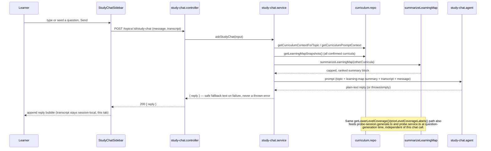
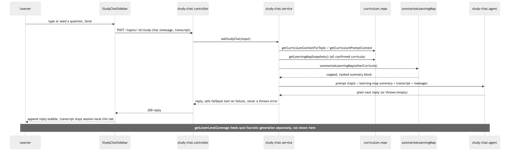

# Architecture: Learning-map sidebar chat

## What changes structurally

**A new, distinct chat surface — not a repurposing of the Socratic turn API.** The sibling
`topic-study-experience` plan wires `SocraticChat` to `startSocraticSession`/`answerSocraticSession`,
which is a turn-graded, one-gap-at-a-time API (`SocraticEval` → `degree`/`action`, advancing
through `gaps` deterministically). The sidebar chat this plan builds is free-form — "explain
that differently," "how does this compare to Next.js," "what did you mean" — with no grading,
no gap advancement, no fixed turn sequence. Bending the graded API to also answer arbitrary
questions would either break its gap-advancement invariants or require a parallel ungraded
branch bolted onto a schema that assumes every answer gets a `degree`. A new, smaller surface
is the correct boundary: one new `apps/api/src/study-chat/` module (controller + service, no
repo — this feature persists nothing server-side, matching the sibling plan's own decision that
the web Socratic transcript is session-local) and one new Mastra agent, `study-chat.agent.ts`.

**Component reuse is a presentation-layer question, not a backend one — split the answer.**
Backend: not reusable, per above (different contract, different invariants). Frontend: the
bubble list / message input / typing-indicator chrome `SocraticChat` will contain is generic
chat UI with no coupling to turn-grading — that part is reusable in principle. But
`SocraticChat` does not exist in `main` yet (it is mid-flight in a parallel worktree at spec
time), so its actual internal decomposition cannot be inspected here. Default: build this
plan's `study-chat-sidebar.tsx` as its own component now (a small amount of duplicated
bubble/input JSX is an acceptable, cheap cost). At implementation time, if `SocraticChat` has
already landed and its presentational pieces are cleanly extractable (a `chat-bubble-list.tsx`
/ `chat-input.tsx` the sibling component already isolates), extract and share them instead of
building a parallel copy — implementer's call, not blocking, logged in `todo.md`.

**One shared aggregation query serves both this plan and the `study-stats-dashboard` sibling.**
Both need a compact, non-token-exploding view of progress across *all* the learner's curricula:
this plan for the chat's "personal learning map" and the level-aware generation context;
`study-stats-dashboard` for its weak-spot/strong-point view and its next-step recommender. That
aggregation is defined once here — `getLearningMapSnapshots()` in
`apps/api/src/curriculum/curriculum.repo.ts` — returning, per curriculum: id, name, subject
name, learning status, and a per-module breakdown (`level`, `ModuleProgress`, and per-topic
`{ id, title, TopicProgress }`). This reuses the existing `moduleProgress`/`curriculumProgress`
derivers (`packages/core/src/curriculum/progress.ts`) rather than re-deriving mastery math — the
new work here is purely *fetching everything in one query* and shaping it, not computing
percentages a second way. `study-stats-dashboard` consumes this exact function and type; it
does not define its own aggregation query. This is the one cross-plan coupling in either spec —
noted in both `todo.md` files as a build-order dependency (this plan's repo function must exist
before `study-stats-dashboard`'s recommender can compile against it).

**The chat's context is a summary, never a transcript dump.** A new pure deriver,
`summarizeLearningMap(snapshots: LearningMapSnapshot[]): string`
(`packages/core/src/curriculum/learning-map.ts`), reduces the raw snapshot list to a compact,
budgeted block: one line per curriculum (`name — percent% mastered, level reached`), ranked by
relevance (in-progress first, then most-recently-interacted, then highest-mastery), truncated to
a fixed count (10 curricula) and a fixed character budget (1,200 chars) — both constants live
next to the deriver so they're visible and testable. Below the cap, the deriver includes
everything; above it, it drops the lowest-ranked entries rather than truncating mid-sentence.
This is fed into `study-chat.agent.ts`'s system-prompt assembly alongside the current topic's
own detail (title, summary, curriculum/subject name) and the client-supplied session transcript.

**Level-aware generation is prompt-context injection, not a new generation pipeline.** Per the
already-shipped `use-case-study-mode` design, a curriculum's Basic/Medium/Advanced modules (and
their topics) are all created together at research-synthesis time, with only a chosen tier's
topics pre-`included` — so "unlocking Medium" is already just the learner flipping `included` on
existing topics (an existing capability, not new here). What's actually missing is that
`probe-session.generate.ts`'s `buildPrompt` and the Socratic turn prompt built via
`buildProbeQuestionForGap`/`mentor.agent.ts` have no idea a lower level exists. A new deriver,
`priorLevelCoverageLabels(currentLevel, modulesInCurriculum): string[]`
(`packages/core/src/curriculum/level-context.ts`), takes the current topic's module `level` and
the curriculum's other modules (each with its own `level` and covered-gap labels) and returns
the covered concept labels from strictly lower-rank levels. A new repo helper,
`getLowerLevelCoverage(topicId): string[]` (`apps/api/src/curriculum/curriculum.repo.ts`), joins
`topics.moduleId → modules.level` and `gaps` for the topic's curriculum to supply that deriver's
input in one query (not per-gap). When the list is non-empty, both `probe-session.generate.ts`
and the Socratic turn-prompt path append a line: "Already covered at a lower level: X, Y, Z —
build on these, don't re-teach them." When empty (no `level` on the module, or nothing below it),
neither prompt changes — today's behavior is preserved exactly.

**Mastery/review semantics: verified as already correct, nothing new built.** Read
`answerProbeSession`/`answerSocraticSession` directly: a correct answer on an open gap already
flips it to `covered` (counts toward `gapMaturity`); a wrong answer leaves the gap exactly as it
was (`open` by default for an unattempted gap), and `nextGapToProbe`/`openGaps` already surface
open gaps first in the next session. This is the entire "7 right count, 3 wrong go to review"
requirement, already shipped. The one thing genuinely absent — demoting an already-`covered` gap
back to `open` after a later wrong answer (a forgetting/regression mechanic) — is deliberately
**not** built: it was never asked for, `isStale`/`selectDailyPush` already provide a time-based
staleness refresh, and silently changing what "covered" means would alter already-shipped
scoring behavior for every existing curriculum. Logged as a judgment call in `todo.md`, not
built.

## Flow

## New infrastructure

None. One new Mastra agent (in-process, same pattern as every other agent in
`apps/api/src/mastra/`), no new external services, no new async boundary beyond the existing
"web app calls API, API calls OpenRouter" shape already used by Socratic/probe-session.

## Data model evolution

None. This plan is entirely additive read-aggregation (`getLearningMapSnapshots`,
`getLowerLevelCoverage`) over existing `curricula`/`modules`/`topics`/`gaps` tables, plus one new
stateless chat call path. No new tables, no new columns, no migration.

## Failure modes

- **Chat LLM call fails or times out.** Same shape as `probe-grounding.ts`'s existing `webGround`
  failure handling: catch, log, return a safe fallback reply ("I couldn't reach the tutor right
  now — try again") rather than throwing into the UI. No transcript entry is recorded for a
  failed call so retry doesn't duplicate messages.
- **Cross-curriculum summary grows unbounded as the learner accumulates curricula.** Handled by
  `summarizeLearningMap`'s hard cap (10 entries / 1,200 chars) — verified by SCENARIO 7's test,
  not just documented.
- **Level-aware context references a module `level` that's `null` (curriculum wasn't created via
  the research pipeline, or predates it).** `priorLevelCoverageLabels` short-circuits to an empty
  list whenever `currentLevel` is `null`, leaving generation exactly as it is today — the guard is
  a single early return, not a fallback heuristic that could misfire.
- **Seeded "ask about this wrong answer" context conflicts with an in-flight free-form message.**
  The seed only pre-fills the chat's next outgoing message with structured context (question,
  options, correct answer) as visible, editable text — it never silently injects hidden context
  the learner can't see, so there's no invisible-state class of bug here.

## Rollout

Single deploy, no feature flag — personal single-user app, additive-only backend surface (new
agent + new read-only repo query), no existing behavior removed. The one existing-code discovery
during design (mastery/review already works) required zero rollout since nothing changes there.
