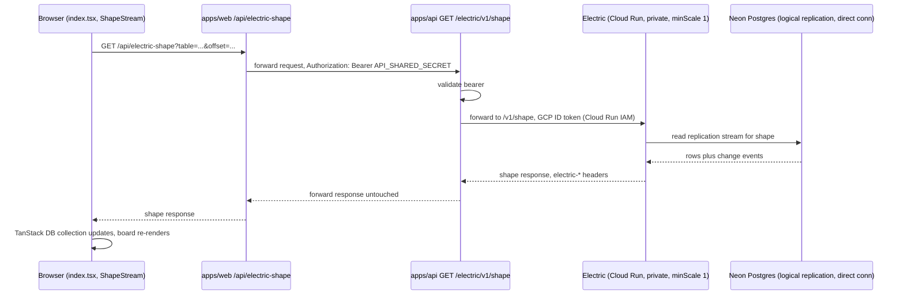

# Architecture: Local-first sync (proof-of-concept slice)

## What changes structurally

**Reads for one screen — the subjects/curricula board (`apps/web/src/routes/index.tsx`) — move
from request/response fetch to a synced local-first read path.** Instead of the loader fetching
a snapshot from `apps/api` on every navigation, the browser holds a live TanStack DB collection
backed by an Electric shape; updates stream in over HTTP long-polling instead of requiring a
refetch. This is a proof-of-concept: only this one route's reads are converted. Writes on this
screen (create/delete subject, which live elsewhere) and every other route — dashboard,
curriculum tree, stats, probe/quiz sessions, chat — stay on the existing fetch-through-`apps/api`
path unchanged.

**`apps/api` stays the single gatekeeper the browser and any future client talk to — it never
talks to Electric directly from the browser.** A new `GET /electric/v1/shape` route on `apps/api`
authenticates the existing `API_SHARED_SECRET` bearer (the same check every other `apps/api`
route already uses), then proxies 1:1 to Electric's own `/v1/shape` endpoint, forwarding shape
params (`table`/`offset`/`handle`/`live`/`cursor`) and Electric's `electric-*` response headers
back untouched. This is deliberate, not incidental: `API_SHARED_SECRET` must never reach the
browser (existing invariant in `api-client.ts`), so something server-side has to hold it — and
making that something `apps/api` (rather than a one-off) means this is the exact contract a
future mobile client reuses as-is, the same way it already reuses every other `apps/api` route.

**`apps/web` only adds a thin same-origin forwarding route, `GET /api/electric-shape`.** The
browser's `ShapeStream` client points at this same-origin path (avoiding CORS and keeping the
secret off the wire to the browser); the route does nothing but forward to `apps/api`'s
gatekeeper with the shared secret attached server-side.

**Electric runs as its own private Cloud Run service, kept warm, talking to Neon directly.**
Self-hosted (not Electric Cloud) on Cloud Run, but configured differently from this app's other
three services in two ways:
- `minScale: 1` instead of `minScale: 0` — Electric holds a persistent Postgres logical
  replication connection; scale-to-zero would drop that connection on every idle period and pay
  a cold-start replication-resync cost on every wake, which defeats the point of a live sync
  service. The other three services are fine at zero because they're stateless per-request.
- **Private** (no `allUsers` invoker), authorized via Cloud Run IAM rather than app-level auth —
  Electric has no auth of its own to check a bearer token against, so the only place to enforce
  "only `apps/api` may call this" is the platform's own invoker policy. Only `apps/api`'s service
  account gets `roles/run.invoker` on it; `apps/api` calls it with a minted GCP ID token per
  request.

Electric reads Postgres via logical replication, which requires a **direct (non-pooled)**
connection string to Neon — the pooled connection this app's other services use does not support
replication slots.

**No per-user scoping in the shape query.** The app is single-user today (same precedent as
`user_streaks`), so the gatekeeper's job is authentication only, not multi-tenancy. A future
mobile client is just a second client for the same one user, not a new tenant, so this isn't
deferred complexity — it's a non-issue for this app's actual shape.

**TanStack DB is beta software as of this writing.** Accepted as a known risk for a personal
project at this scope; not a concern that blocks a one-screen proof of concept.

## Flow

## New infrastructure

One new Cloud Run service (Electric), private, `minScale: 1` — the only one of this app's four
Cloud Run services that isn't scale-to-zero. One new `apps/api` module (`electric/`) with no new
database table of its own; it's a pure proxy. `apps/api`'s service account gets `run.invoker` on
the Electric service. Neon's connection string used for replication must be the direct
(non-pooled) one, configured separately from the pooled string the rest of the app uses.

## Scope boundary

This is a proof-of-concept slice, not a migration:
- **Converted:** only the subjects/curricula board's reads (`apps/web/src/routes/index.tsx`).
- **Unconverted, on purpose:** every other route (dashboard, curriculum tree, stats,
  probe/quiz sessions, chat) and all writes anywhere in the app, including create/delete subject
  on this same board — all keep using the existing fetch-through-`apps/api` path.
- **Not built yet:** optimistic-write wiring through TanStack DB (deferred to whichever future
  slice tackles a write-heavy route), Electric Cloud (self-host was chosen instead), and the
  mobile client itself (only the reusable `apps/api` contract is being built now).
- **Not deployed in this pass:** the Cloud Run/IAM changes are written as Pulumi source and
  typechecked, but `pulumi up` is not run, and the Neon direct-connection string is not yet
  provisioned in the console — both are a live-deploy follow-up.

Whether to convert a second route follows from how this first slice behaves in production, not
from a predetermined rollout plan.
